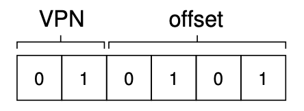
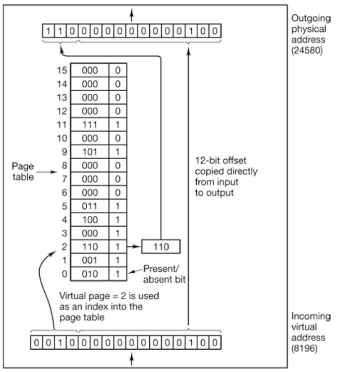
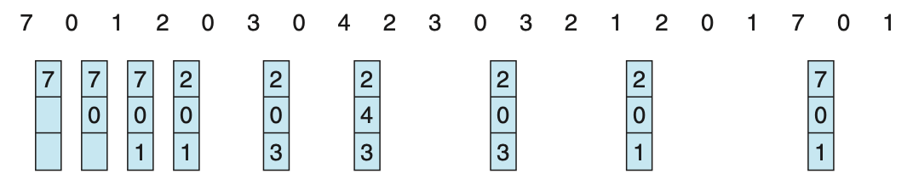
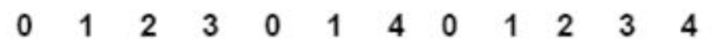
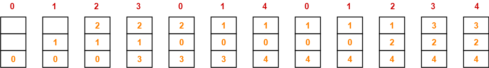
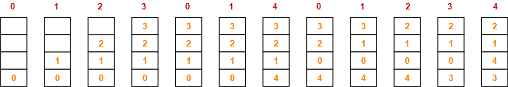
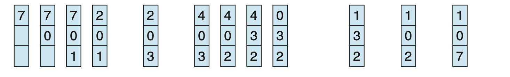
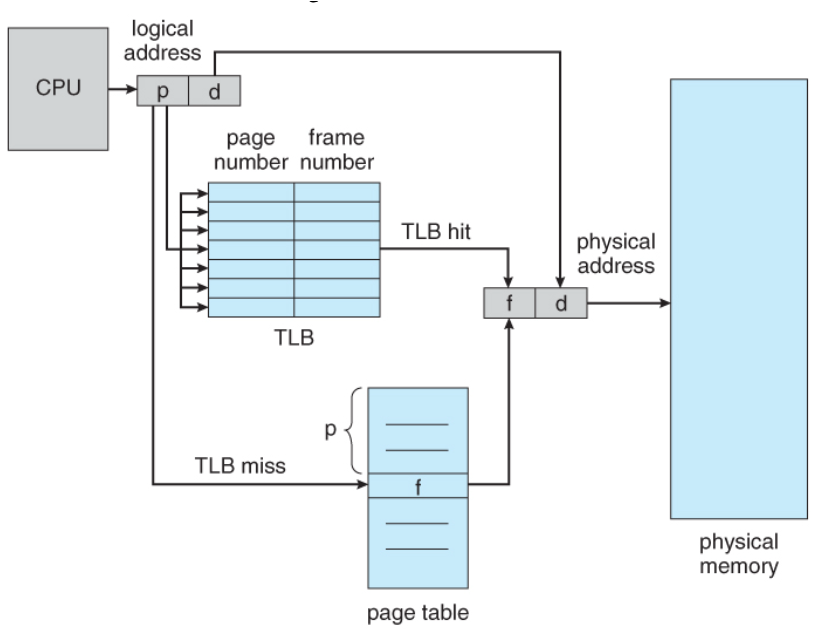

## Admin
:::{.nonincremental}
- Assignment 3 due next week
- Lab due Thursday
- Exam 2 next Thursday, May 21
:::

# Paging {background-color="#40666e"}

## Questions to consider
:::{.nonincremental}
- How does paging eliminate external fragmentation while supporting multiple processes?
- How does the hardware (MMU) translate virtual addresses to physical addresses?
- What information must the OS maintain to support paging?
:::

## Paging
- Contiguous allocation schemes have many issues (particularly with finding / managing places to put processes), what should we do?
  - Be non-contiguous!
    - Of course this introduces many new challenges, but alas
- To completely eliminate external fragmentation, we can use [paging]{.alert}
  - Non-contiguous memory allocation scheme that divides memory into fixed-size blocks called pages
  - Requires hardware support (MMU) to translate virtual addresses to physical addresses using a page table

## Paging (cont'd)
- Jargon!
  - Physical memory is broken into fixed-sized regions: **frames**; logical memory is broken into fixed-sized regions: **pages**; backing store is also addressed as fixed-sized blocks
- The paging system handles the mapping of pages to frames
- Pages may be logically contiguous, whereas the backing frames and blocks are not
- ~Typically |frames| = |pages| = |blocks|; between 512B-16KB (huge pages can go to 2MB or 1GB)
  - Most common size is 4KB these days

## Paging (cont'd)
:::: {.columns}
::: {.column width="58%"}
- Addresses are divided into two parts: [page number]{.alert} and [page offset]{.alert}
  - Page number is simply an index to a page
  - Offset is for addressing within the given page
- Recall that the process point of view is using virtual addressing
  - This means we need to bolt address translation into this. What part of the address should we translate?
  - Page number only. Offset remains the offset
:::
::: {.column width="2%"}
:::
::: {.column width="38%"}

:::
::::

## Paging (cont'd)
- Now we need a directory to convert between virtual page numbers and physical page frames… The [page table]{.alert}
  - Can be any of a number of different data structures
  - The MMU uses the page table to perform address translation on every memory access
- Mapping is completely transparent to the user / process. OS is in control of the page table
- Page tables are kept by OS *for each process*
  - Where should it be stored?
  - Pointer held in the PCB; more to deal with on context switch

## Page tables
:::: {.columns}
::: {.column width="58%"}
- $2^m$ is the size of the address space (in bytes), and page size is $2^n$ bytes, then the higher $m-n$ bits designate page number; $n$ low-order bits are page offset
  - $2^4$ (this example) = 16 pages; page size $2^{12}$ = 4K
  - 32-bit?
    - $2^{20}$ pages (1M), 4K pages = max 4GB RAM
  - 64-bit?
    - We'll touch on it later, it isn't (currently) $2^{52}$

:::
::: {.column width="2%"}
:::
::: {.column width="38%"}

:::
::::
- Using n offset bits, we can address all 4096 bytes within the page

## Examples
- A system uses a 32-bit virtual address and 8 bits are used for the offset within a page. How many pages? Size of each page? Total size?
  - $2^{24}$ pages (~16M), 256 byte pages, 4GB total
- Virtual address is 24 bits long. If 10 bits used for the page index.
  - $2^{10}$ = 1024 pages, $2^{14}$ = 16KB pages, 16MB total size
- A system has 256 pages and each page is 8 KB.
  - 8 bits for index ($2^8$ = 256), 13 bits for offset ($2^{13}$ = 8KB), 21 bit total space = $2^{21}$ = 2MB
- A system uses a 36-bit virtual address. If the page size is 4 KB
  - $2^{24}$ pages (16M), 12-bit offset, ~64GB total

## Page tables (cont'd)
- Page Size
  - Depends greatly on system usage
  - Smaller provides granularity, but a larger page table, more overhead
  - Larger increases throughput and minimizes disk I/O
- How do pages affect fragmentation?
  - **No external frag**
  - But now we have [internal fragmentation]{.alert}; unless a process happens to use exactly some multiple of the page size
  - On average: $1/2$ page size per process

## Page table entries
- Page table entry:  what goes into one?
  - Page frame number (obvi)
  - [Present/absent]{.alert} bit: is the page frame number valid?
  - [Protection bits]{.alert}: What kinds of access are permitted
  - [Modified/Dirty]{.alert} bit: Has this page been modified, perhaps needing to get written to disk before eviction
  - [Referenced]{.alert} bit: Has the page been referenced; used for eviction
  - [Caching disable]{.alert} bit: Is cache disabled for this page (for direct I/O)
- What doesn't go into one?
  - Backing store addresses: managed by the file system
  - We only want things needed for address translation by hardware

## Size the page table
:::{.nonincremental}
- Assume 4 KB pages and 4-byte page table entries. How big is a single, flat page table for...
  1. A 32-bit address space?
  2. A 64-bit address space?
- 100 processes on the 32-bit machine — total memory just for page tables?
  - What does this tell you about storing page tables in RAM?
:::

:::{.notes}
Expected answers:

- 32-bit: $2^{32}/2^{12} = 2^{20}$ entries × 4 B = **4 MB per process**
- 64-bit: $2^{64}/2^{12} = 2^{52}$ entries × 4 B = **16 PB per process** (absurd — motivates why real 64-bit systems don't use the full 64 bits and why we need multi-level / inverted page tables)
- 100 processes × 4 MB = **400 MB** just for page tables

What this tells us about storing page tables in RAM:

- 4 MB per process is already painful — it's contiguous physical memory, can't be paged out the same way (the MMU needs it to *do* paging), and most of it is empty for typical processes (sparse address space).
- Scales with process count, not memory use. A process that touches 1 page still pays for the full 4 MB table.
- 64-bit is impossible flat — the table itself wouldn't fit in any machine. Forces a smarter structure.
- Conclusion: don't store the whole table densely. Use multi-level (only allocate the levels you need), inverted (size by physical RAM, not virtual), or hashed page tables.
:::

## Paging summary
- Pages allow us to:
  - Load processes at a finer granularity
  - Not experience external fragmentation
  - Swap at page granularity (often termed "paging" rather than "swapping")
- But leads us to have some questions:
  - How do I know which pages are in memory, and which are not?
  - When I need to swap page, which go and which stay?
  - How do I know which pages contain modified data, and I need to write to disk?

## {background-color="#6E404F"}
::: {.r-fit-text}
What isn't clear?

Comments? Thoughts?
:::

# Page replacement {background-color="#40666e"}

## Questions to consider
:::{.nonincremental}
- What makes a good page replacement strategy, and why?
- How can we approximate optimal page replacement without knowing the future?
- What are the practical implementation challenges for different page replacement algorithms?
:::

## Page replacement policies
- When a running process needs a page, but physical memory is full, we must evict a frame to make room; this is [page replacement]{.alert}
- Which frame do we evict?
- The frame to evict is called the **victim**
  - In some cases, victims may be simply overwritten in memory. When would that make sense?
    - If they are read-only or haven't been modified
  - Or may need to be written to swap (because they have been modified)

## Page replacement
- Keep in mind: Page replacement is a costly operation: at least two I/O operations, so its important to minimize
  - If we're not careful in how we select our victims, we may further delay the system
- [Clean pages are preferred victims]{.alert}: they can be evicted by simply overwriting the frame — no disk write needed
  - Dirty pages require a write-back to disk before the frame can be reused, adding I/O cost to an already expensive operation
- Potential downside of evicting dirty pages?
  - Forces the write at the worst possible time (process is stalled waiting); batching dirty writes during idle time would be more efficient
  - Dirty pages are also indicative of recent activity, making them likely to be needed again soon

## Page replacement algorithms: OPT
- Optimal Page Replacement (OPT)
  - We really want to evict the page that *will not be used longest*
  - Each page could be labeled with the number of instructions that will be executed BEFORE page is referenced
  - Of course, this is impossible (akin to SJF as optimal), but useful as a benchmark
  - Example: RAM with 3 slots, following reference pattern:

{.fragment}

## Page replacement algorithms: FIFO
- First-In-First-Out (FIFO)
- Simple: first page in (oldest) will be evicted
- Downsides?
  - Indiscriminate of use: might throw out important pages
- Can lead to [Belady's anomaly]{.alert}: adding more frames can lead to more page faults
  - Why? Because it doesn't consider use at all (the stack property)
  - Try this reference pattern with 3 frames and then 4 frames to see the anomaly:

## Belady's anomaly
- Without the stack property, we can have more page faults with more frames because we are ignoring use
{.fragment}
- Number of page faults with 3 frames = 9
{.fragment}
- Number of page faults with 4 frames = 10

## Page replacement algorithms: LRU
- We can't tell the future, what should we do?
  - Look at the past
- Least Recently Used (LRU)
  - Each page has some age with respect to use; replace page that hasn't been used in the longest time
  - Like OPT, but only looking backwards
    - Unfortunately, there is a chance that the page you evict is needed immediately
{.fragment}
{.fragment}

## LRU (cont'd)
- LRU does not exhibit Belady's anomaly
- How can we implement LRU?
  - Counters: each entry has an associated clock
    - No, waste of space, takes time to search
  - Ordered queue
    - Less space wasted, but a lot more memory accesses (pointers) to keep up-to-date
  - Both are impractical without specialized hardware
  - We can *approximate* LRU with a single bit in the page table entry: **reference bit**
    - Bit set when page is referenced
    - Bits set to zero initially and cleared periodically (e.g., via timer interrupt)

## Page replacement algorithms: others
- Second Chance
  - Use a FIFO queue and a reference bit
    - If bit is 0, replace the page
    - If bit is 1, set to 0 and move to the end of the queue
  - Downside?
    - Moving pages around is expensive
- Clock
  - Page frames in a circular list, and have a clock "hand" point to the oldest page (next replacement candidate)
  - When evicting, look at page pointed to by hand
    - If reference bit is 0, replace page
    - If bit is 1, set to 0, and advance hand
  - A nice approximation of LRU

## Page replacement algorithms: others (cont'd)
- Least Frequently Used
  - Keep / increment counter for each page
  - One with lowest value
  - Downside?
    - If something is used a lot at program startup, then no longer. Answer to this is aging
- Most Frequently Used
  - Same as above only evict the page with highest value
  - Downside?
    - One with the smallest value just arrived, yet to be used
- Both are bad ideas. They do not approximate OPT and they are expensive

## Page replacement algorithms: summary
- OPT is optimal but impossible. LRU is a good approximation.
- Many different page replacement algorithms (many not covered here), with different performance characteristics and hardware requirements
- e.g., Linux: LRU 2Q
  - Two lists (active/inactive), each simulating the reference bit state
  - No hardware requirement
- Note that the concept of page replacement is seen at all interfaces of the memory hierarchy, just at different time scales; and, within certain applications
  - We focus on the disk/RAM interface because the difference in access time is so great

## {background-color="#6E404F"}
::: {.r-fit-text}
What isn't clear?

Comments? Thoughts?
:::

# Page tables {background-color="#40666e"}

## Questions to consider
:::{.nonincremental}
- Why is page table size a critical concern for memory efficiency?
- How can hardware support (like the TLB) improve address translation performance?
- How does context switching interact with the TLB, and what mechanisms address the correctness and performance problems it creates?
:::

## Page table size
- If we have a 32-bit address space and 4KB pages, we have:
  - $2^{20}$ pages (1M)
  - Each page table entry is typically 4 bytes
  - Total page table size = 4MB *per process*
  - If we have 100 processes, that's 400MB just for page tables. *Yikes*
- We'll come back to this later. Bottom line: we do not use linear page tables (what we've talked about so far, e.g., the page table as an array)

## Page table size (cont'd)
- To be efficient: we're going to require some hardware support and clever structures
- Why do we care?
  - Reason 1 (Speed): Translations must be done on every memory reference
  - Reason 2 (Cost): memory is getting larger:
    - 32-bit words, 4K page: 1 million entries at 4 bytes each = 4MB per process;
    - 64-bit words, 4K page: $2^{52}$ entries at 8 bytes each = 30M GB (32 PB)

## Page table access
- Where should the page table be stored?
  - Old solution: registers and special hardware (not scalable)
  - Real answer: in main memory
    - PCB holds pointer to page table; context switch needs to account for this
  - See any downsides to this?
    - If the page table is large, it can consume a lot of memory
    - Requires two memory accesses for each actual memory access (one for the page table, one for the data)
    - How do we speed this up?
      - Hardware

## Translation lookaside buffer (TLB)
- Use [associative memory]{.alert}
  - Can someone tell me what's special about associative (a.k.a. content-addressable) memory?
    - *Parallel search*: All key values can be queried at once; if found, value is returned
- Comprised of key(tag)-value pairs
  - Ultimately it is a cache for the page table
- **Expensive**, so TLB only contains a small number of entries

## TLB (cont'd)
:::: {.columns}
::: {.column width="58%"}
- How it works: logical address from CPU (say, a process is looking to load a variable stored at address 100 in its address space)
- If it's a **miss** (not in TLB); we must fetch the entry from the page table, perhaps replacing an existing entry
  - *soft miss*: page is in main memory
  - *hard miss*: page is on disk (swapped, also known as a page fault)
:::

::: {.column width="2%"}
:::
::: {.column width="38%"}

:::
::::

## TLB (cont'd)
- If it's a **hit** (in TLB), we can directly get the physical address and access memory
  - TLB is fast enough that a hit results in one memory access (for the data), while a miss results in two memory accesses (one for the page table, one for the data)
- Hit ratio determines [effective access time]{.alert}
- Example: 80% hit rate; 10ns to access memory
  - A hit = 10ns; a miss = 20ns
  - EAT = $(.8 * 10) + (.2 * 20) = 12ns$
  - 99% hit? = $(.99 * 10) + (.01 * 20) = 10.1ns$
- What about process page entries that we'd like to keep in the TLB? (kernel)
  - "Wired down" i.e., cannot be replaced

## TLB (cont'd)
- Wait, we have multiple processes with virtual addressing and one small TLB. What happens on a context switch?
  - E.g., virtual page 1 for process one != virtual page 1 for process 2
- Could **flush**: empty on context switch
  - Downside?
    - You lose a lot of the goodness of caching. Needs to be rebuilt every time
- Other idea?
  - [Address-space identifiers]{.alert} (ASIDs) will bind TLB entries to a particular process
    - Preventing a process from access a page that doesn't belong to it, but allowing pages from multiple processes to coexist in the TLB

:::{.notes}

:::

## {background-color="#6E404F"}
::: {.r-fit-text}
What isn't clear?

Comments? Thoughts?
:::