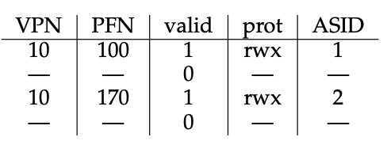
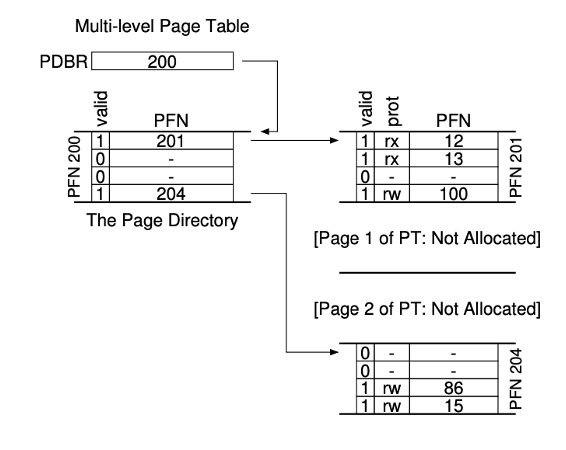
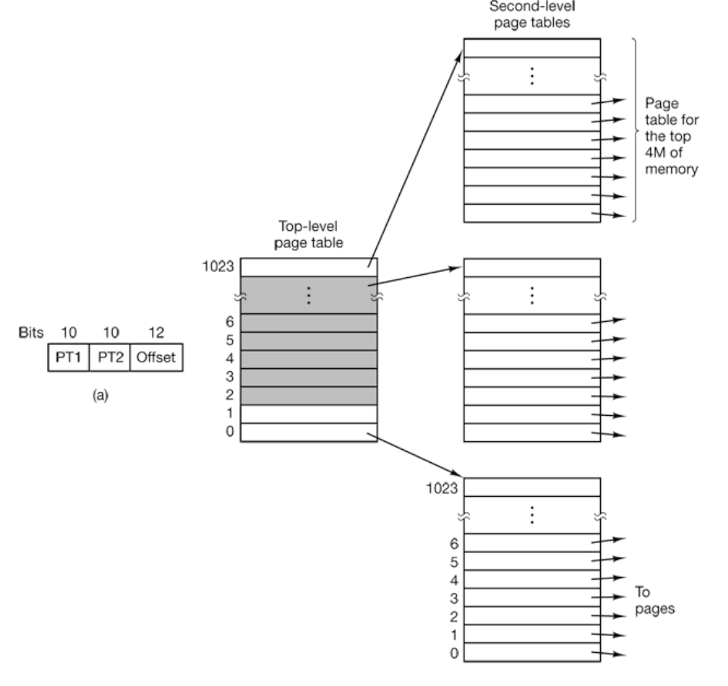
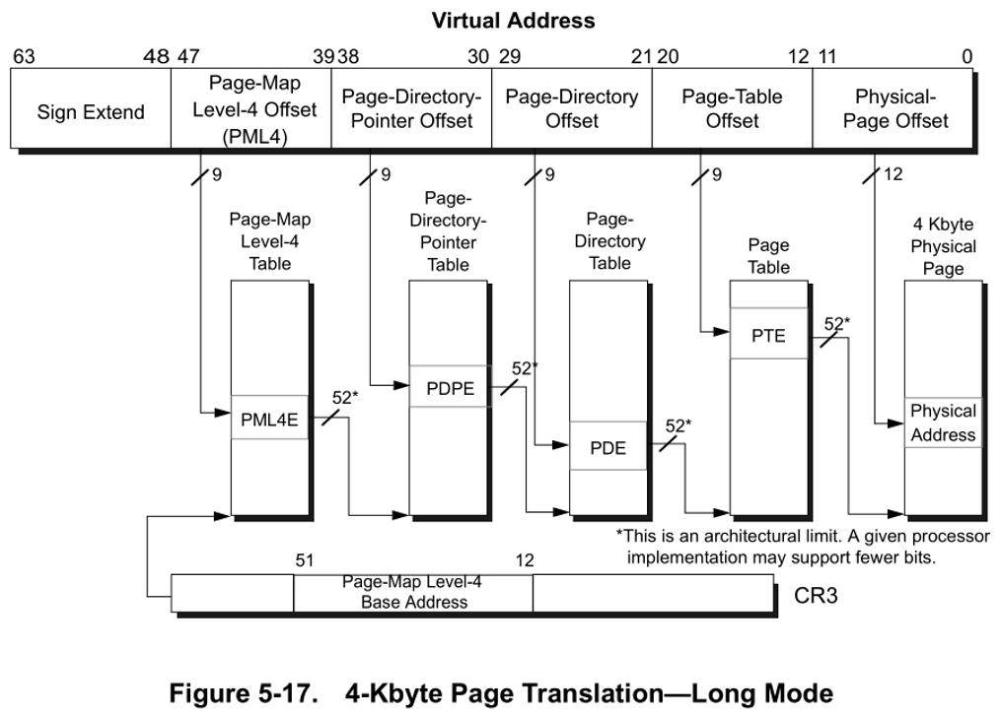
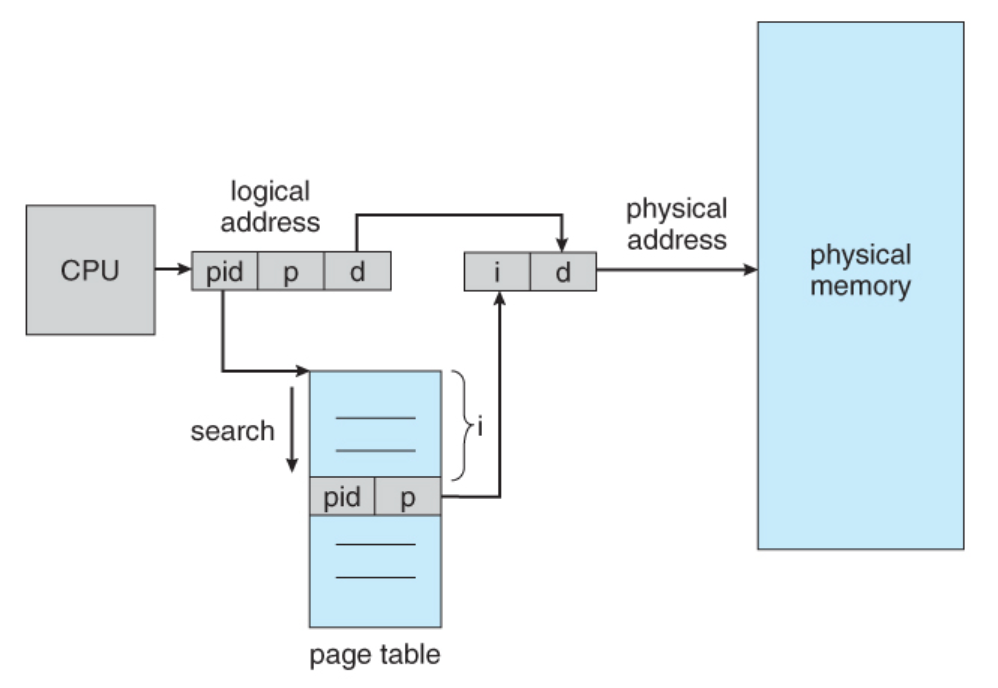
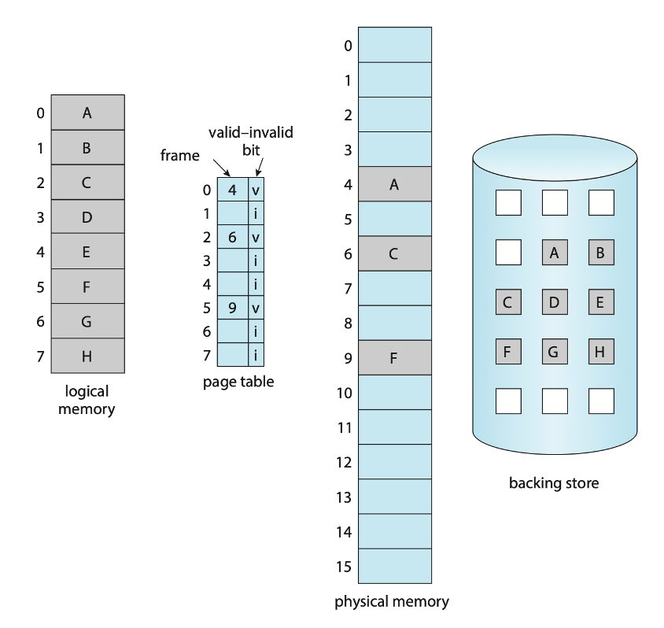
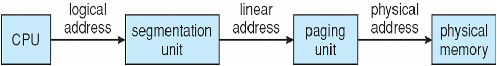
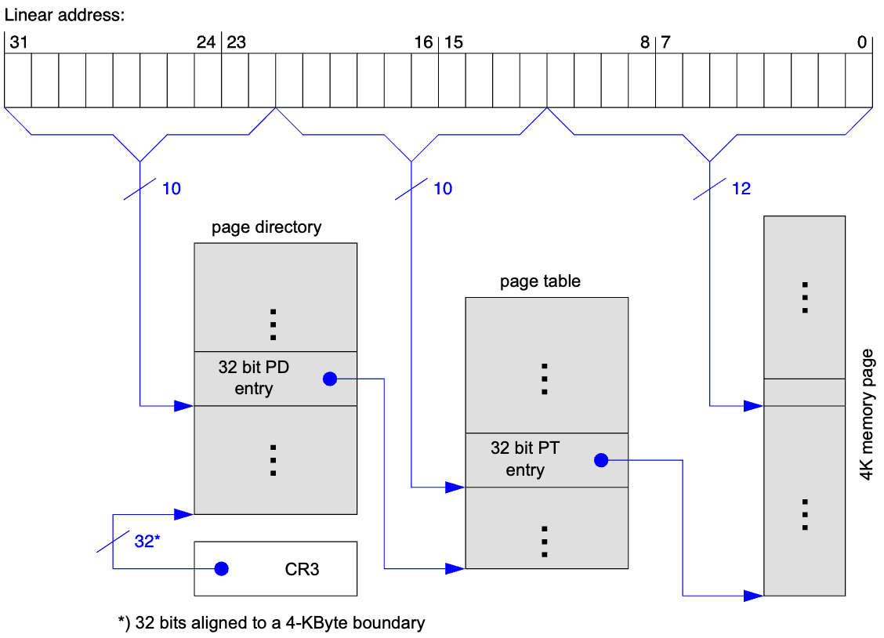
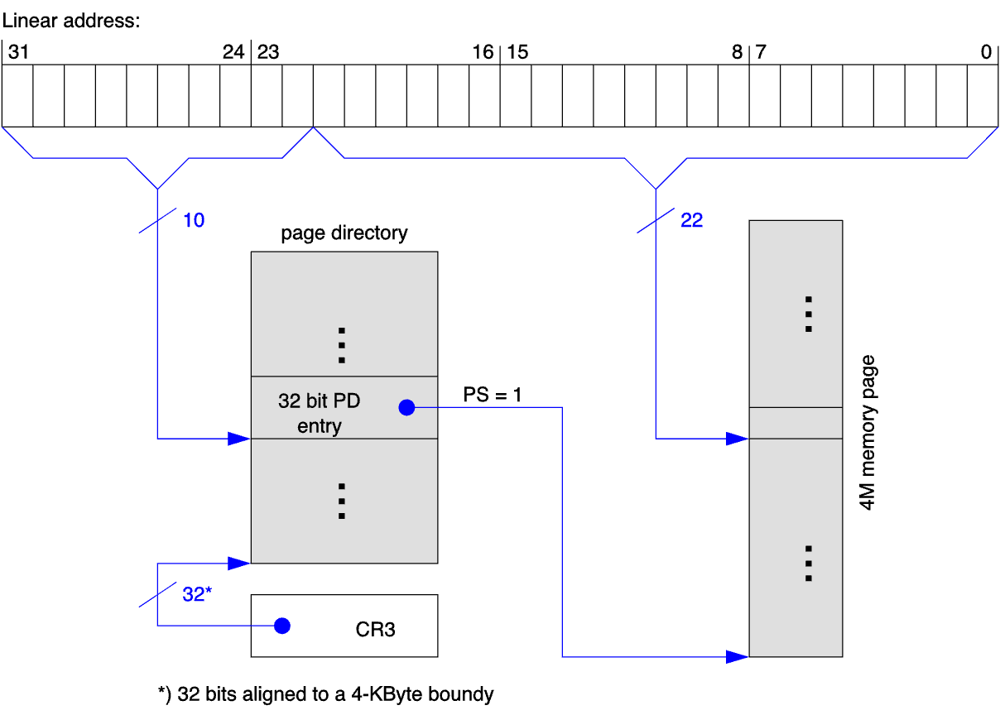

## Admin
:::{.nonincremental}
- Quiz due Monday
- Assignment 3 due next week
- Exam 2 in one week
:::

# Page tables {background-color="#40666e"}

## TLB (cont'd)
- If it's a **hit** (in TLB), we can directly get the physical address and access memory
  - TLB is fast enough that a hit results in one memory access (for the data), while a miss results in two memory accesses (one for the page table, one for the data)
- Hit ratio determines [effective access time]{.alert}
- Example: 80% hit rate; 10ns to access memory
  - A hit = 10ns; a miss = 20ns
  - EAT = $(.8 * 10) + (.2 * 20) = 12ns$
  - 99% hit? = $(.99 * 10) + (.01 * 20) = 10.1ns$
- What about processes that we'd like to keep in the TLB? (kernel)
  - "Wired down" i.e., cannot be replaced

## TLB (cont'd)
- Wait, we have multiple processes with virtual addressing and one small TLB. What happens on a context switch?
  - E.g., virtual page 1 for process one != virtual page 1 for process 2
- Could **flush**: empty on context switch
  - Downside?
    - You lose a lot of the goodness of caching. Needs to be rebuilt every time
- Other idea?
  - [Address-space identifiers]{.alert} (ASIDs) will bind TLB entries to a particular process
    - Preventing a process from access a page that doesn't belong to it, but allowing pages from multiple processes to coexist in the TLB

:::{.notes}

:::

## {background-color="#6E404F"}
::: {.r-fit-text}
What isn't clear?

Comments? Thoughts?
:::

# Page table structures {background-color="#40666e"}

## Questions to consider
:::{.nonincremental}
- How can we organize page tables to handle large address spaces efficiently?
- What are the trade-offs between space overhead and lookup complexity?
- When and why would we choose alternative page table designs?
:::

## Page table structures
:::: {.columns}
::: {.column width="50%"}
- Linear page tables are wasteful; particularly if you have a number of unused pages (likely)
- Answer?
  - Multilevel page tables
:::
::: {.column width="2%"}
:::
::: {.column width="48%"}
{.fragment}
:::
::::

## The rule that drives everything

- [Each page table fits in one page]{.alert}
  - A page table is just another data structure stored in memory
  - Every individual page table (page directory, second-level table, etc.) occupies exactly **one page-sized** (4 KB) chunk of memory
  - There are many of them — one page directory per process, plus a second-level table for each valid directory entry
  - Why this size? So page tables themselves can be managed by the paging system — no special-case allocator needed
- This constraint propagates to everything else:
  - entry size → number of entries per table → bits consumed per level

## Multilevel page tables
:::: {.columns}
::: {.column width="50%"}
- Example: Two-level page table: Split the page table address into two
  - 10-bit PT1, 10-bit PT2, and 12-bit offset field
- Top level page table references 1024 2nd tier page tables
- Each 2nd tier page table references 1024, 4K pages
:::
::: {.column width="2%"}
:::
::: {.column width="48%"}

:::
::::
- Benefit?
  - 2nd tier tables need not be resident in memory if unused
  - $2^{20}$ addressable, with only 4 tables resident (16KB rather than 4MB)

## Two-level page table: address breakdown

| Field | Bits | Meaning |
|-------|------|---------|
| PT1 (dir index) | 10 | which page table |
| PT2 (page index) | 10 | which entry in that table |
| Offset | 12 | byte within page |

- Each entry is **4 bytes** → entries per table = $4096 / 4 = 1024 = 2^{10}$ → **10-bit index**
- $2^{10}$ entries × 4 bytes = 4,096 bytes = **exactly one page** — no accident, this is the rule from before
- If a Page Directory entry is marked invalid, its entire Page Table **need not exist in memory** at all

## Multilevel page tables (cont'd)
:::: {.columns}
::: {.column width="40%"}
- This is expandable to more levels
  -  Note that 64-bit doesn't use the full 64-bit
    - 48-bits allow us to address 256TB
:::
::: {.column width="2%"}
:::
::: {.column width="58%"}

:::
::::

## Inverted page tables
:::: {.columns}
::: {.column width="50%"}
- What we've seen so far: one page table per process
- Alternative: one page table for the entire system, with an entry for each frame of physical memory (**inverted page table**)
  - Each entry contains the virtual address of the page stored in that frame, along with information about the process that owns that page
  - Entry holds which pid owns the frame, and its virtual address
:::
::: {.column width="2%"}
:::
::: {.column width="48%"}

:::
::::

## Inverted page tables (cont'd)
- Reduces size, but increases lookup complexity
  - must do a full search of the page table (slow)
- We can use a hash table to index into page table, or combine with a TLB to speed up frequent lookups
- Not commonly used in practice
  - Once RAM became cheaper, the size of page tables became less of an issue, and the complexity of inverted page tables outweighed their benefits

## {background-color="#6E404F"}
::: {.r-fit-text}
What isn't clear?

Comments? Thoughts?
:::

# Virtual memory {background-color="#40666e"}

## Questions to consider
:::{.nonincremental}
- How does virtual memory enable processes to use more memory than physically available?
- What strategies can we use to determine which pages should be in memory at any given time?
- What problems occur when memory contention is too high, and how can we detect and prevent them?
:::

## Virtual memory summary
- Previous (naïve) discussions assumed that all of a process's pages are present in memory when running
- Virtual Memory is system built around the main ideas supported by paging
- Allows the system to present a large, logically contiguous memory to every process, while being non-contiguous in physical memory
- Supported by pages + swap

## Virtual memory summary (cont'd)
- Many advantages
  - Processes see the same logical, contiguous address space, making programming easier
  - Logical memory may be sparse; i.e. a hole in the logical space does not (necessarily) mean a hole in the physical space
  - Pages may be shared among processes (shared libraries, shared memory or fork()'d processes)
- Logical memory (for a single or many processes) may actually be bigger than physical memory

## Memory residency
- Not all process pages can reside in memory at once; further, we many not need all pages in memory at once
- But… we need a page to be in main memory to be accessed
- We've talked about choosing victims to replace in memory, How do we select pages to be in main memory?

## Demand paging
:::: {.columns}
::: {.column width="50%"}
- We can load pages into memory only when they are needed, which is called [demand paging]{.alert}
- Here we see why the valid bit is useful
  - Valid implies "allocated and in memory"
  - Invalid implies "not allocated or not in memory"
:::
::: {.column width="2%"}
:::
::: {.column width="48%"}

:::
::::

## Demand paging (cont'd)
- If process has a **page fault**, we trap to the OS, which
  1. interrupts the process
  2. finds a free frame (if one exists)
  3. requests the block from the backing store or swap space
  4. brings the page into memory
  5. updates the page table
  6. restarts the processes
- Non-resident pages may have never been in memory (so in the file system) or were once resident and swapped out (to swap space)

## Pure demand paging
- Most extreme scheme
- In pure demand paging, all pages are non-resident at the start of execution
- This is not common in practice, as it can lead to a large number of page faults at the start of execution, which can significantly degrade performance

## Frame allocation
- Page replacement answers *which page to evict*; frame allocation answers *how many frames does each process get?*
- Minimum frames per process: set by the instruction set architecture
  - Some instructions span multiple pages or reference many addresses (e.g., indirect addressing)
  - A process must hold enough frames to execute a single instruction without page-faulting indefinitely; otherwise it can make no progress at all

## Global vs. local replacement
- [Local replacement]{.alert}: a process can only evict one of its own allocated frames
  - Predictable per-process performance; one process cannot steal frames from another
- [Global replacement]{.alert}: a process can evict any frame in the system
  - Higher overall throughput: frames naturally flow to where they are needed most
  - But a process's page-fault rate now depends on other processes' behavior
  - Most general-purpose OSes use global replacement with [working-set]{.alert} guidance

## Working set
- To mitigate the performance issues of pure demand paging, we can use the concept of a [working set]{.alert}
- Takes advantage of the principle of locality: processes tend to access a relatively small set of pages over a short period of time
- Working-set model:
  - Define a window $\Delta$ (most recent page references)
  - If a page is referenced within the window, it's in the working set; otherwise, it's not
- Allows for **prepaging** pages that are likely to be used soon, improving performance by reducing page faults
  - *just* outside of the working set, the OS can see "the working set is expanding in this direction, so let's prefetch some pages in that direction"

## Thrashing
- If the working set of a process exceeds the available physical memory, the process will experience a high rate of page faults, leading to a condition called [thrashing]{.alert}
- When the page fault time exceeds the time spent executing, we are said to be thrashing
- Problem: CPU scheduler sees the decreasing CPU utilization and increases the degree of multiprogramming; makes thrashing *worse*
- Solutions?
  - [Local replacement algorithm]{.alert} (each process can only select victims from its set of allocated frames)
  - i.e. cannot steal frames from another process and cause the latter to thrash as well
  - [Decrease the degree of multiprogramming]{.alert} (reduce the number of processes)

## Optimizing shared pages
- Remember how fork() and exec() work?
  - Fork leads to a copy of the parent's address space
  - … but exec() means that a lot of children immediately replace, making a copy wasteful
- What should we do?
  - Share the pages initially
  - If either the parent or the child writes to the shared page, then you actually make a copy ([copy-on-write]{.alert})
  - Copy-on-write significantly speeds up fork operation; particularly if they will soon exec

## {background-color="#6E404F"}
::: {.r-fit-text}
What isn't clear?

Comments? Thoughts?
:::

# Real-World Memory {background-color="#40666e"}

## Questions to consider
:::{.nonincremental}
- How can we increase TLB reach without making the TLB itself larger?
- What memory security features does the OS and hardware provide to protect against attacks?
- How do real architectures (IA-32, x86-64) handle multiple page sizes and the transition beyond 32-bit addressing?
:::

## TLB reach
- We've talked about the hit ratio of a TLB
  - Influenced by the size of the TLB
- Another metric: [TLB reach]{.alert} (i.e., how much memory is addressable from the TLB)
  - Num TLB entries * page size
  - Ideal world: entire working set for a process fits in the TLB
- It'd be great to simply grow the TLB, but that's expensive
- What else can we do?

## Huge pages
- As we discussed, page tables can be large, and TLBs are small. This can lead to a high TLB miss rate, which can significantly degrade performance.
- One solution is to use larger page sizes, known as [huge pages]{.alert}
- By using huge pages (e.g., 2MB instead of 4KB [can go up to 1GB]), we can reduce the number of pages, and thus the size of the page table, and increase the TLB hit rate
- Newer kernels support transparent huge pages, which automatically use huge pages when possible without requiring changes to applications
- Danger: internal fragmentation can be much worse with huge pages, so they are not ideal for all workloads

## Linux memory security
- Linux provides several features to enhance memory security, such as:
  - [Address Space Layout Randomization (ASLR)]{.alert}: randomizes the memory addresses used by a process, making it more difficult for attackers to predict where code or data is located
  - [Kernel Address Space Layout Randomization (KASLR)]{.alert}: randomizes the memory addresses used by the kernel
  - [Data Execution Prevention (DEP)]{.alert}: marks certain areas of memory as non-executable, preventing code from being executed from those regions (e.g., the stack)
    - NX bit: hardware support for DEP held in the page table entry

## Intel IA-32 architecture
- Supports both segmentation and segmentation with paging
  - Each segment can be 4GB
  - Up to 16K segments per process
  - Divided into two partitions
    - First partition of up to 8 K segments are private to process (kept in [local descriptor table]{.alert} (LDT))
    - Second partition of up to 8K segments shared among all processes (kept in [global descriptor table]{.alert} (GDT))

## Intel IA-32 architecture (cont'd)
- CPU generates logical address
  - Selector given to segmentation unit
    - Which produces linear addresses

  - Linear address given to paging unit
    - Which generates physical address in main memory
    - Paging units form equivalent of MMU

  {.fragment}

## Intel IA-32 architecture (cont'd)
- 4KB and 4MB pages
  - 4KB pages follow what we have talked about
- How do we do 4MB, and why?
  - 4MB pages are directly pointed to by the page directory (top level in the page table hierarchy)
  - Benefits?
    - Avoids an extra memory access

## IA-32 4KB pages (as we've seen)

## IA-32 4MB pages (only top-level of page table used)

## IA-32 architecture (cont'd)
- Recall that using a classic 32-bit address space we are limited to 4GB addressable space
  - Fine in the 90s, became decidedly not fine long ago
- How can we fix this?

## 32-bit Physical Address Extension (PAE): the problem

- Classic 32-bit: max physical memory = 4 GB
  - Page table entries only hold a 20-bit physical frame number (PFN)
  - Servers needed more RAM — hardware could address 36 bits (64 GB), but the PTE couldn't hold it
- Fix: **widen each PTE from 4 bytes → 8 bytes**
  - Now the PFN field can hold 36-bit physical addresses
- But remember the rule: **page tables must be page-sized (4 KB)**

## PAE: why 9-bit indices?

- Entry size doubled → table capacity halved:
  $$4096 \text{ bytes} \div 8 \text{ bytes/entry} = 512 \text{ entries} = 2^9$$
- So each level now uses a **9-bit index**, not 10-bit
- Accounting for a 32-bit virtual address:
  - 12 bits: page offset (unchanged)
  - 9 bits: Page Directory index
  - 9 bits: Page Table index
  - **2 bits left over** → used as index into a tiny new top level: the **Page Directory Pointer Table (PDPT)**
    - PDPT has only 4 entries (2 bits) and fits in 32 bytes — not even a full page

## 32-bit PAE

## PAE: side-by-side

:::: {.columns}
::: {.column width="48%"}
**Classic 32-bit (no PAE)**

| Field | Bits |
|-------|------|
| Page Directory | 10 |
| Page Table | 10 |
| Offset | 12 |

- Entry size: **4 bytes**
- Entries per table: **1024**
- Max physical: **4 GB**
:::
::: {.column width="4%"}
:::
::: {.column width="48%"}
**PAE (36-bit physical)**

| Field | Bits |
|-------|------|
| PDPT index | 2 |
| Page Directory | 9 |
| Page Table | 9 |
| Offset | 12 |

- Entry size: **8 bytes**
- Entries per table: **512**
- Max physical: **64 GB**
:::
::::

- [Same rule, different entry size → different bit split]{.alert}

## PAE: what changed, what didn't

- **Changed**
  - PTE size: 4 → 8 bytes (holds 36-bit PFN)
  - Entries per table: 1024 → 512 (10-bit → 9-bit index)
  - Added PDPT level (uses the 2 leftover bits)
  - Total *system* physical address space: 4 GB → 64 GB
- **Unchanged**
  - Virtual address is still 32 bits
  - Each *process* is still limited to 4 GB virtual address space
  - Page size: still 4 KB
  - Page tables are still exactly one page each (4 KB)

## How do we get 36-bit physical addresses with only 32-bit virtual addresses?
- The virtual address space is still 32 bits, so each process can only address 4 GB of memory
- Total *system* physical address space: 4 GB → 64 GB
  - How? The OS effectively **adds 4 extra bits** to every physical address
  - A process issues a 32-bit virtual address; the OS translates it through page tables whose entries store **36-bit** physical frame numbers
  - The process has no access to those upper 4 bits — only the OS decides where in physical memory a page lands
  - Different processes can be mapped to completely different 4 GB regions of the 64 GB physical space

## PAE (cont'd)
:::: {.columns}
::: {.column width="50%"}
- Problem solved?
  - For linux, yes. Problem solved
  - Windows? Of course not, Microsoft decided that you should pay extra for the privilege of using the hardware you own
:::
::: {.column width="2%"}
:::
::: {.column width="48%"}
{.fragment}
:::
::::

## 32-bit PAE question
- You're working with a 32-bit IA-32 system that has PAE enabled. The system uses:
  - 2-level paging: PDPT → Page Directory → Page
  - Page size: 2 MB
  - Each page table entry (PTE) is 8 bytes
- How many entries are in the PDPT, page directory?
- Break the virtual address into its components (PDPT index, page directory index, page offset)
- How many total pages can be addressed by this system?
- What is the maximum addressable physical memory for a single process?
- What is the maximum addressable physical memory for the entire system?

## 32-bit PAE question
::::{.nonincremental}
- How many entries are in the PDPT, page directory? **4**, **512**
- Break the virtual address into its components (PDPT index, page  directory index, page offset) **2 bits**, **9 bits**, **21 bits**
- How many total pages can be addressed by this system? **2048** (4 * 512)
- What is the maximum addressable physical memory for a single process? **4GB**
- What is the maximum addressable physical memory for the entire system? **64GB**
:::

## x86-64 architecture
- 64 bits is enormous (> 16 exabytes)
- In practice only implement 48 bit addressing (256 TB)
  - Page sizes of 4 KB, 2 MB, 1 GB
  - Four levels of paging hierarchy
- Can also use PAE-like mechanism ("long mode") so virtual addresses are 48 bits and physical addresses are 52 bits (4 PB)

## {background-color="#6E404F"}
::: {.r-fit-text}
What isn't clear?

Comments? Thoughts?
:::

# Kernel memory management {background-color="#40666e"}

## Questions to consider
:::{.nonincremental}
- Why does the kernel need physically contiguous memory, and how does this differ from user-space allocation?
- How does the buddy system handle allocation and deallocation, and what are its trade-offs?
- Why is a slab allocator useful for small, frequently used kernel objects?
:::

## Linux kernel memory management
- Treated differently from user memory
  - Often allocated from a free-memory pool
  - Kernel requests memory for structures of varying sizes
  - Some kernel memory needs to be contiguous
    - i.e., for device I/O

## Linux kernel memory management (cont'd)
- Main idea: allocate memory from fixed-size segment consisting of physically-contiguous pages
- Buddy system allocator
  - Memory is allocated in blocks of size $2^k$ (for some integer $k$)
  - When a request for memory of size $s$ is made, the allocator finds the smallest block of size $2^k$ that can accommodate $s$
  - If the block is larger than needed, it is split into two "buddies" of size $2^{k-1}$ each
  - When a block is freed, the allocator checks if its buddy is also free; if so, they are coalesced back into a larger block

## Buddy system allocator (cont'd)
- Advantages?
  - Simple and efficient for allocating memory of varying sizes
  - Can quickly coalesce free blocks
- Disadvantages?
  - Fragmentation
    - Internal fragmentation: if a request is for 5KB, we need to allocate an 8KB block, wasting 3KB
    - External fragmentation: over time, as blocks are allocated and freed, we can end up with many small free blocks that cannot be coalesced into larger blocks, making it difficult to satisfy larger allocation requests
  - Not ideal for all workloads, particularly those with many small allocations

## Slab allocator
:::: {.columns}
::: {.column width="45%"}
- Linux also uses a slab allocator for small objects
- Slab allocator maintains caches of pre-allocated memory chunks for frequently used, fixed-size objects (e.g., file descriptors, process control blocks)
- When an object is needed, the allocator can quickly provide a chunk from the appropriate cache, reducing fragmentation and improving performance for small allocations
:::
::: {.column width="2%"}
:::
::: {.column width="53%"}
{width=80%}
:::
::::

## {background-color="#6E404F"}
::: {.r-fit-text}
What isn't clear?

Comments? Thoughts?
:::

