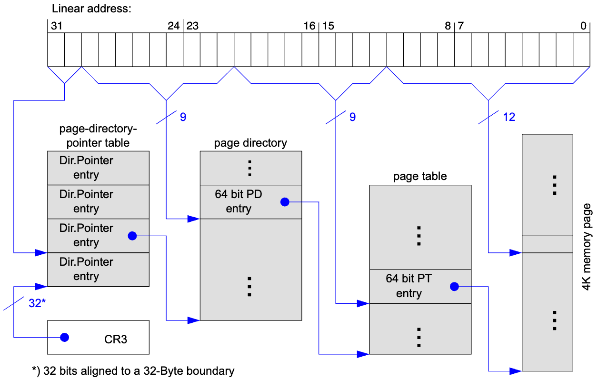
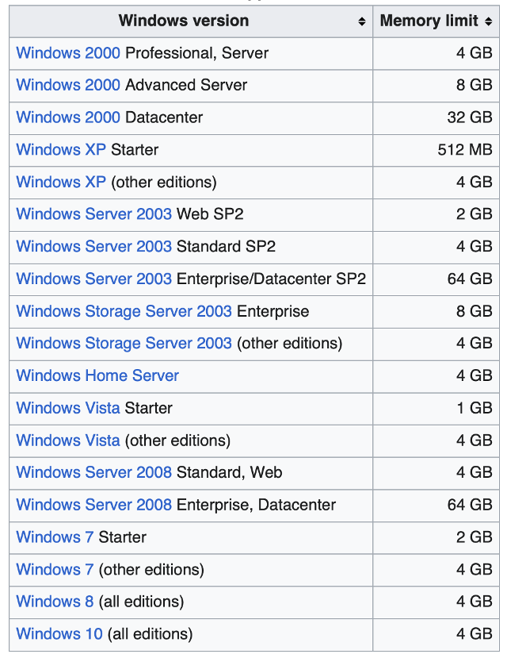
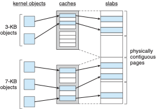

## Admin
:::{.nonincremental}
- Exam 2 Thursday
- No lab this week
:::

# Real-World Memory {background-color="#40666e"}

## IA-32 architecture (cont'd)
- Recall that using a classic 32-bit address space we are limited to 4GB addressable space
  - Fine in the 90s, became decidedly not fine long ago
- How can we fix this?

## 32-bit Physical Address Extension (PAE): the problem

- Classic 32-bit: max physical memory = 4 GB
  - Page table entries only hold a 20-bit physical frame number (PFN)
  - Servers needed more RAM — hardware could address 36 bits (64 GB), but the PTE couldn't hold it
- Fix: **widen each PTE from 4 bytes → 8 bytes**
  - Now the PFN field can hold 36-bit physical addresses
- But remember the rule: **page tables must be page-sized (4 KB)**

## PAE: why 9-bit indices?

- Entry size doubled → table capacity halved:
  $$4096 \text{ bytes} \div 8 \text{ bytes/entry} = 512 \text{ entries} = 2^9$$
- So each level now uses a **9-bit index**, not 10-bit
- Accounting for a 32-bit virtual address:
  - 12 bits: page offset (unchanged)
  - 9 bits: Page Directory index
  - 9 bits: Page Table index
  - **2 bits left over** → used as index into a tiny new top level: the **Page Directory Pointer Table (PDPT)**
    - PDPT has only 4 entries (2 bits) and fits in 32 bytes — not even a full page

## 32-bit PAE

## PAE: side-by-side

:::: {.columns}
::: {.column width="48%"}
**Classic 32-bit (no PAE)**

| Field | Bits |
|-------|------|
| Page Directory | 10 |
| Page Table | 10 |
| Offset | 12 |

- Entry size: **4 bytes**
- Entries per table: **1024**
- Max physical: **4 GB**
:::
::: {.column width="4%"}
:::
::: {.column width="48%"}
**PAE (36-bit physical)**

| Field | Bits |
|-------|------|
| PDPT index | 2 |
| Page Directory | 9 |
| Page Table | 9 |
| Offset | 12 |

- Entry size: **8 bytes**
- Entries per table: **512**
- Max physical: **64 GB**
:::
::::

- [Same rule, different entry size → different bit split]{.alert}

## PAE: what changed, what didn't

- **Changed**
  - PTE size: 4 → 8 bytes (holds 36-bit PFN)
  - Entries per table: 1024 → 512 (10-bit → 9-bit index)
  - Added PDPT level (uses the 2 leftover bits)
  - Total *system* physical address space: 4 GB → 64 GB
- **Unchanged**
  - Virtual address is still 32 bits
  - Each *process* is still limited to 4 GB virtual address space
  - Page size: still 4 KB
  - Page tables are still exactly one page each (4 KB)

## How do we get 36-bit physical addresses with only 32-bit virtual addresses?
- The virtual address space is still 32 bits, so each process can only address 4 GB of memory
- Total *system* physical address space: 4 GB → 64 GB
  - How? The OS effectively **adds 4 extra bits** to every physical address
  - A process issues a 32-bit virtual address; the OS translates it through page tables whose entries store **36-bit** physical frame numbers
  - The process has no access to those upper 4 bits — only the OS decides where in physical memory a page lands
  - Different processes can be mapped to completely different 4 GB regions of the 64 GB physical space

## PAE (cont'd)
:::: {.columns}
::: {.column width="50%"}
- Problem solved?
  - For linux, yes. Problem solved
  - Windows? Of course not, Microsoft decided that you should pay extra for the privilege of using the hardware you own
:::
::: {.column width="2%"}
:::
::: {.column width="48%"}
{.fragment}
:::
::::

## 32-bit PAE question
- You're working with a 32-bit IA-32 system that has PAE enabled. The system uses:
  - 2-level paging: PDPT → Page Directory → Page
  - Page size: 2 MB
  - Each page table entry (PTE) is 8 bytes
- How many entries are in the PDPT, page directory?
- Break the virtual address into its components (PDPT index, page directory index, page offset)
- How many total pages can be addressed by this system?
- What is the maximum addressable physical memory for a single process?
- What is the maximum addressable physical memory for the entire system?

## 32-bit PAE question
::::{.nonincremental}
- How many entries are in the PDPT, page directory? **4**, **512**
- Break the virtual address into its components (PDPT index, page  directory index, page offset) **2 bits**, **9 bits**, **21 bits**
- How many total pages can be addressed by this system? **2048** (4 * 512)
- What is the maximum addressable physical memory for a single process? **4GB**
- What is the maximum addressable physical memory for the entire system? **64GB**
:::

## x86-64 architecture
- 64 bits is enormous (> 16 exabytes)
- In practice only implement 48 bit addressing (256 TB)
  - Page sizes of 4 KB, 2 MB, 1 GB
  - Four levels of paging hierarchy
- Can also use PAE-like mechanism ("long mode") so virtual addresses are 48 bits and physical addresses are 52 bits (4 PB)

## {background-color="#6E404F"}
::: {.r-fit-text}
What isn't clear?

Comments? Thoughts?
:::

# Kernel memory management {background-color="#40666e"}

## Questions to consider
:::{.nonincremental}
- Why does the kernel need physically contiguous memory, and how does this differ from user-space allocation?
- How does the buddy system handle allocation and deallocation, and what are its trade-offs?
- Why is a slab allocator useful for small, frequently used kernel objects?
:::

## Linux kernel memory management
- Treated differently from user memory
  - Often allocated from a free-memory pool
  - Kernel requests memory for structures of varying sizes
  - Some kernel memory needs to be contiguous
    - i.e., for device I/O

## Linux kernel memory management (cont'd)
- Main idea: allocate memory from fixed-size segment consisting of physically-contiguous pages
- Buddy system allocator
  - Memory is allocated in blocks of size $2^k$ (for some integer $k$)
  - When a request for memory of size $s$ is made, the allocator finds the smallest block of size $2^k$ that can accommodate $s$
  - If the block is larger than needed, it is split into two "buddies" of size $2^{k-1}$ each
  - When a block is freed, the allocator checks if its buddy is also free; if so, they are coalesced back into a larger block

## Buddy system allocator (cont'd)
- Advantages?
  - Simple and efficient for allocating memory of varying sizes
  - Can quickly coalesce free blocks
- Disadvantages?
  - Fragmentation
    - Internal fragmentation: if a request is for 5KB, we need to allocate an 8KB block, wasting 3KB
    - External fragmentation: over time, as blocks are allocated and freed, we can end up with many small free blocks that cannot be coalesced into larger blocks, making it difficult to satisfy larger allocation requests
  - Not ideal for all workloads, particularly those with many small allocations

## Slab allocator
:::: {.columns}
::: {.column width="45%"}
- Linux also uses a slab allocator for small objects
- Slab allocator maintains caches of pre-allocated memory chunks for frequently used, fixed-size objects (e.g., file descriptors, process control blocks)
- When an object is needed, the allocator can quickly provide a chunk from the appropriate cache, reducing fragmentation and improving performance for small allocations
:::
::: {.column width="2%"}
:::
::: {.column width="53%"}
{width=80%}
:::
::::

## {background-color="#6E404F"}
::: {.r-fit-text}
What isn't clear?

Comments? Thoughts?
:::

# Midterm 2 boundary {background-color="#907845"}

