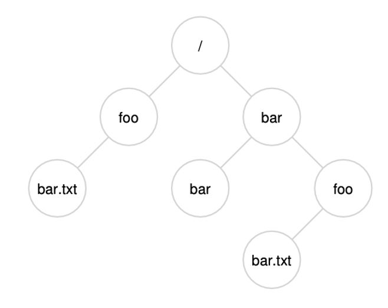
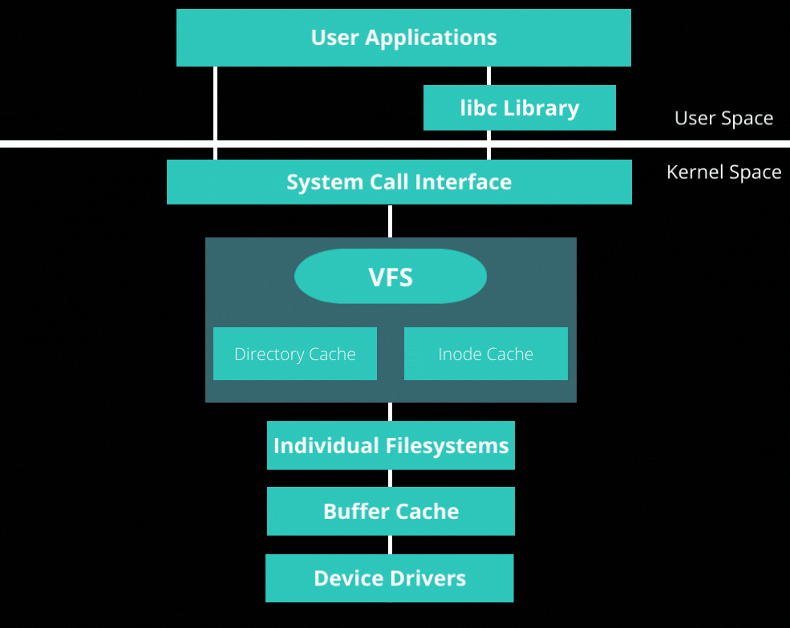

## Admin
:::{.nonincremental}
- Reminder the final is on Tuesday, June 9th in the lab room
:::

# File systems {background-color="#40666e"}

## Questions to consider
:::{.nonincremental}
- Why do we need file systems? What problem do they solve?
- What features must a file system provide beyond just storing raw data?
- How do file systems provide a consistent interface regardless of the underlying hardware?
:::

## Overview
- Why do we care about data persistence?
- It's half of a Turing Machine
- Sometimes machines need to be turned off
- Typically, we're computing on data, and for data
  - Sometimes {a lot, a little bit} of data goes in, {a small, a large} amount of data comes out
    - e.g. Scientific computing: modeling large systems to answering simple questions (how does this protein fold?)
  - In 2009 (yes, this is an old slide):
    - Google processed 24 PB of data per day
    - Facebook claimed to store 1.5 PB of photo data
    - Internet Archive stored 2PB of data, growing 20TB per month
    - Avatar took up 1PB of storage for renderings

## File systems
- We'll talk about actual disks later. But we'll start with files and file systems
- What do you think file systems do?
  - They organize data into files and directories
  - They provide a consistent, simple API for the OS to use, no matter the actual approach that the file system takes or how the disk is organized
  - Other features:
    - Access control (e.g., permissions)
    - Reliability (e.g., journaling)

## File systems (cont'd)
- What do we want from FS?
  - To access, organize, and persist data
  - Provide protection and concurrency of data access
  - Implement optimizations that provide good performance
- File systems provide an object abstraction and interface for data (yet another virtual layer)
  - Object: files, directories, links, metadata
  - Interfaces: lookup, read, write, rename, truncate, position, delete
  - Services: naming, object hierarchies, metadata, locking, allocation, layout, security and optimizations

## {background-color="#6E404F"}
::: {.r-fit-text}
What isn't clear?

Comments? Thoughts?
:::

# Files {background-color="#40666e"}

## Questions to consider
:::{.nonincremental}
- What is a file, and what information does the OS need to track beyond just the raw data?
- How should the OS present a file to a program, and why is a flat byte array the dominant abstraction?
- What types of files does Linux support, and how does this differ from file extensions?
:::

## Files
- What is a file?
- Files are the first-class, logical units of data with which processes interact
  - A file is more than the data that constitutes the file
  - What is a file's name?
    - A reference to the file. A file can have multiple names (links).
  - What is its type? What are its access permissions? Who owns it? When was it created? Or, last accessed?
    - These are all examples of metadata
  - Where does the data live on persistent storage device? How do we make updates to it?
    - The file system's job is to give us the ability to read/write, the physical layout on disk may or may not be the file system's concern

## File naming
- How do you think names can be leveraged?
- Restrictions on how files are named are up to the OS
- As is the enforcement of extensions (e.g. .c, .exe, .txt)
  - UNIX doesn't care: extensions are just hints for and by users
  - Windows does care: extensions hint at the types of accesses and classes of processes allowed

## File structures
- How should the OS present a file to a user / program?
- Most commodity OSes represent files as a logically contiguous array of bytes
  - Both a human-readable name and an OS-level identifier (inode)
  - Very flexible from a user/process perspective
- Some files are more heavily structured
  - Databases only accept records
  - Big Data file systems e.g. may only accept data blobs, or may requires a "document" (XML) structure
- Who decides how a file is structured?
  - OS
  - Program

## Linux file types
- What do you think are some example file types from the OS's perspective? (it's not .c, .txt, etc., but more about the underlying structure and semantics of the file)
- In UNIX, there are a few OS-supported file types
  - Regular file (ASCII, binary)
    - E.g., plaintext, images, executables
  - Directories (more on this later)
  - Character special files (abstraction of a character device)
    - E.g., /dev/tty, /dev/zero, /dev/random
  - Block special files (an abstraction of a block device)
    - E.g., /dev/sda

## File access
- How do we want to access files?
- Early OSes only supported [sequential]{.alert} access (with rewind)
  - This was sensible, because our IO devices (tape, punch cards) were also sequential
- When disks were introduced, this enabled [random]{.alert} access
  - Enables a whole new class of applications and execution models (e.g. databases, virtual memory)

## File operations
- Files carry metadata beyond raw data: permissions, owner, size, timestamps — all must be persistent
- What operations do we want to support on files?
- Common operations:
  - `create`, `delete`, `read`, `write`, `append`, `truncate`, `rename`, position (`seek`), get attributes, set attributes, `link`, `unlink`
- Some of these are straightforward (e.g. read, write), but some are more complex (e.g. rename, link, unlink)
  - E.g., rename: we need to update the directory entry, but the file's data and metadata may not change at all
  - E.g., link: we need to create a new directory entry that points to the same file (inode), but the file's data and metadata may not change at all

## {background-color="#6E404F"}
::: {.r-fit-text}
What isn't clear?

Comments? Thoughts?
:::

# Directories {background-color="#40666e"}

## Questions to consider
:::{.nonincremental}
- Why do hierarchical directories solve problems that flat directories cannot?
- What is the difference between a hard link and a soft link?
- What happens when you delete a file that has multiple hard links? A soft link?
:::

## Directories
- Why don't we use a single (flat) directory for all users?
  - Naming problem: each file must be unique
  - Grouping problem: how to remember what files are mine / relate to my current coding project?
- What if we just had a single directory for each user but stayed flat otherwise?
  - You still have a naming problem. How many `Makefiles` do you have?

## What is a directory?
- [Directories]{.alert} are a special kind of file, whose data are `<name, inode>` pairs, called [directory entries]{.alert} (a.k.a. dirents/dentry)
- Creating a name is adding an entry
- Renaming an object, creates or replaces a name-inode mapping
- Deleting a name, removes or makes inactive the mapping from the parent directory
- Typically a directory only stores direct children inodes
- By default, a directory contains `.` (self reference) and `..` (parent)

## Directory structure
:::: {.columns}
::: {.column width="60%"}
- How do we want to structure directories?
- A common approach is to use a hierarchical structure (tree)
  - UNIX: a tree starting with root ("/")
- Overcomes the problems associated with a single directory
  - Can have multiple files with the same name
  - Can help logically organize
- Paths can be absolute or relative
  - Examples?
    - Absolute: `/home/prs/file.txt`
    - Relative: `./file.txt`
:::
::: {.column width="2%"}
:::
::: {.column width="38%"}
{.fragment}
:::
::::

## Directory operations
- What operations do we want to support on directories?
- Common operations:
  - `create`, `delete`, `opendir`, `closedir`, `readdir`, `rename`, `link`, `unlink`
- Links can be [hard]{.alert} links or [soft]{.alert} links
  - Who can tell me the difference?
  - How do you create them in Linux?
  - What happens when you delete a hard linked file?
  - What happens when you delete a soft linked file?

## {background-color="#6E404F"}
::: {.r-fit-text}
What isn't clear?

Comments? Thoughts?
:::

# Linux VFS {background-color="#40666e"}

## Questions to consider
:::{.nonincremental}
- How does Linux support many different file systems (ext4, FAT32, NTFS) on the same machine simultaneously?
- What does the kernel actually track when a process opens a file?
- How do file descriptors relate to the kernel's internal representation of open files?
:::

## VFS
- We want to support many different file systems on the same system (FAT32, NTFS, ext3, ext4) — solution: [Virtual File System (VFS)]{.alert}, an OO abstraction created by Sun
- System call interface: APIs for user programs
- [VFS]{.alert}: manages the namespace, keeps track of open files, reference counts, file system types, mount points, pathname traversal.
- [File system module]{.alert}: understands how the file system is implemented on the disk. Can fetch and store metadata and data for a file, get directory contents, create and delete files and directories
- [Buffer cache]{.alert}: no understanding of the file system; takes read and write requests for blocks or parts of a block and caches frequently used blocks.
- [Device drivers]{.alert}: the components that actually know how to read and write data to the disk.

## VFS (cont'd)

## File descriptors
- When a process calls `open()`, the OS returns a small non-negative integer: a [file descriptor]{.alert} (fd)
- The fd is just an index into the process's [per-process file descriptor table]{.alert} (stored in the PCB)
- Three fds are always pre-opened for every process:
  - `0` → `stdin`, `1` → `stdout`, `2` → `stderr`
- All subsequent file syscalls take the fd as their first argument:
  - `read(fd, buf, n)`, `write(fd, buf, n)`, `close(fd)`, `lseek(fd, offset, whence)`
- Why return an int instead of a pointer?
  - Safety: the process can't dereference or forge a kernel pointer
  - The kernel remains in control of the underlying state

## Open file table
- The per-process fd table doesn't hold file state directly — it points into a system-wide [open file table]{.alert}
- Each entry in the open file table tracks:
  - [Current offset]{.alert} (position for the next read/write)
  - [Access mode]{.alert} (read-only, write-only, read-write, append)
  - [Reference count]{.alert} (how many fd table entries point here)
  - Pointer to the [inode]{.alert} (the actual file metadata + data block pointers)
- Why two separate tables?
  - Two processes independently `open()` the same file → two open file table entries → [independent positions]{.alert}
  - `fork()` copies the fd table, so parent and child [share]{.alert} the same open file table entry → shared position and reference count incremented

## Three-table model
- Per-process [fd table]{.alert} (in PCB): small, just indices
- System-wide [open file table]{.alert}: one entry per `open()` call
- System-wide [inode table]{.alert}: one entry per file, regardless of how many times it's open
- Key: the *name* of a file lives in a directory; the *file itself* is the inode

