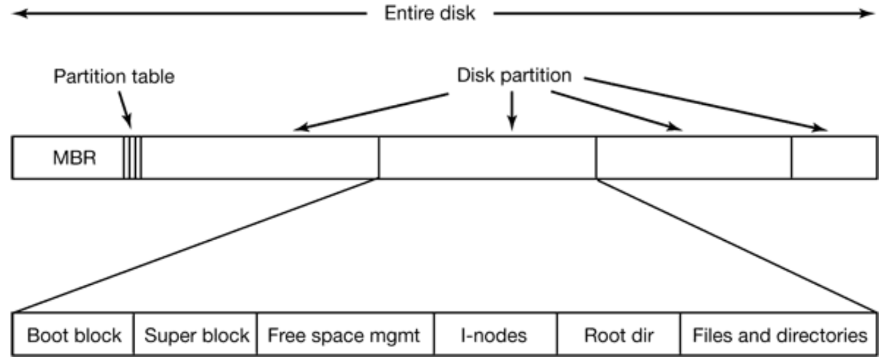
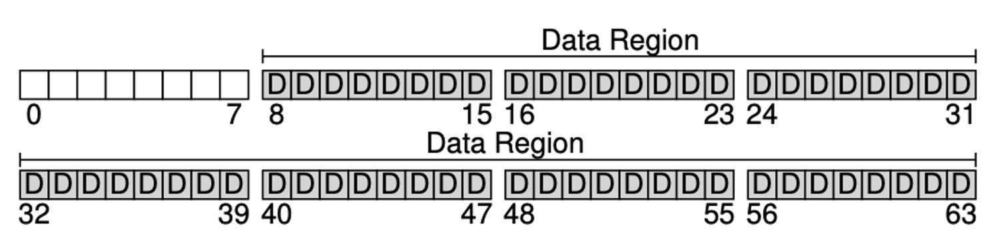
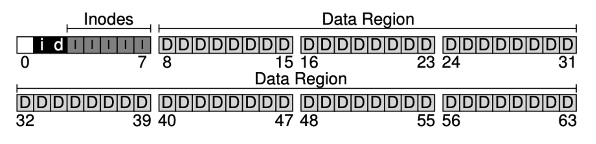
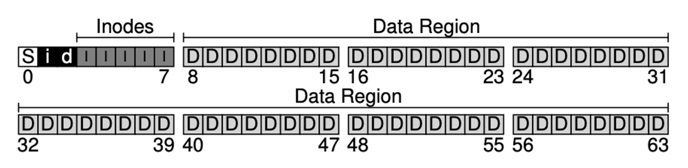
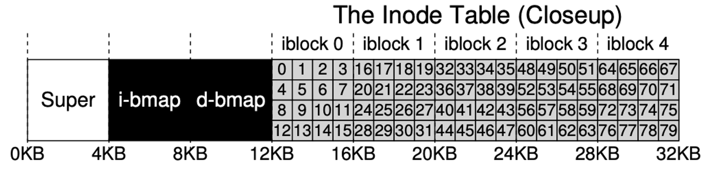
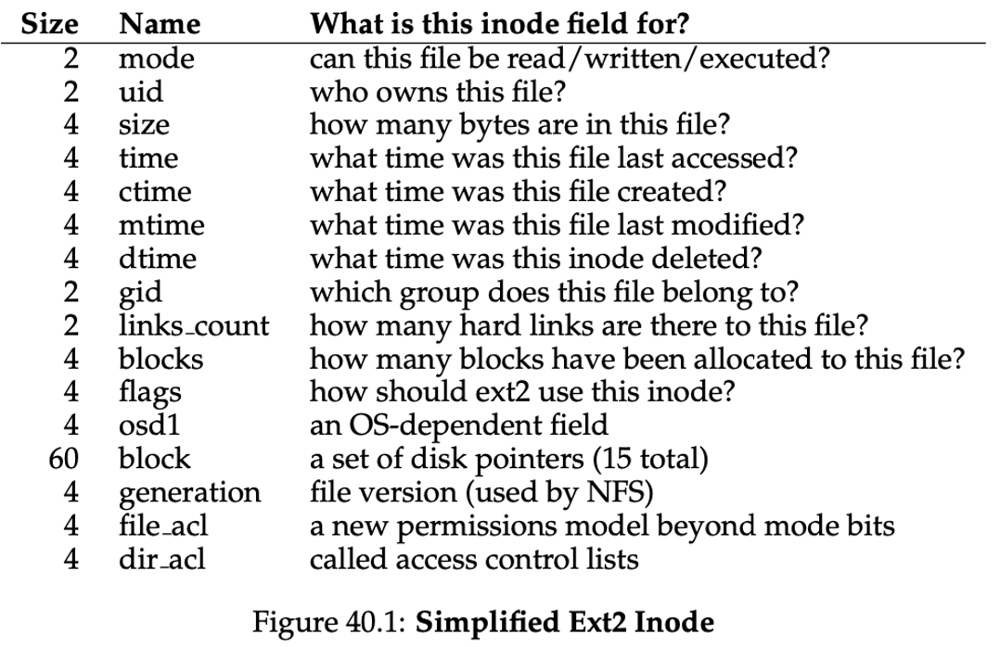

## Admin
:::{.nonincremental}
- Lab due tonight
- Quiz due Monday
- Assignment 4 due next Wednesday
- Reminder the final is on Tuesday, June 9th in the lab room
:::
# Linux VFS {background-color="#40666e"}

## Three-table model
- Per-process [fd table]{.alert} (in PCB): small, just indices
- System-wide [open file table]{.alert}: one entry per `open()` call
- System-wide [inode table]{.alert}: one entry per file, regardless of how many times it's open
- Key: the *name* of a file lives in a directory; the *file itself* is the inode


## Three-table model activity
:::{.nonincremental}
- Process A opens `/etc/passwd`, then calls `fork()` to create Process B
- Separately, Process C opens `/etc/passwd` on its own
- **Draw the three-table model** for all three processes
  - What fd table, open file table, and inode table entries exist?
  - Which entries are shared between which processes?
  - If Process A reads 100 bytes, what happens to Process B's file position? Process C's?
:::

::: {.notes}
**Answer:**

fd tables: A and B each have fd=3 pointing to OFT entry #1. C has fd=3 pointing to OFT entry #2.

Open file table: two entries.
- OFT #1 (shared by A and B): offset=0, refcount=2, → inode for /etc/passwd. fork() copies the fd table, so A and B point to the same OFT entry.
- OFT #2 (C only): offset=0, refcount=1, → same inode.

Inode table: one entry for /etc/passwd. Both OFT entries point to it.

Consequences:
- A and B share OFT #1, so they share the file offset. If A reads 100 bytes, the offset advances to 100 — and B's next read starts at byte 100.
- C has its own OFT entry, so its offset is independent. A's read does not affect C's position.

Key takeaway: fork() shares the open file table entry (shared position), but independent open() calls create separate entries (independent positions).
:::

## Three-table model activity (cont'd)
```
Process A                         Open File Table                    Inode Table
FD table                           system-wide                       system-wide
---------                         ----------------                  ------------
fd 3 --------------------------\
                                \
                                 > OFT entry #1  ----------------\
                                /  file position = 0              \
fd 3 --------------------------/   access mode = read              \
---------                            refcount = 2                   \
Process B                                                             > inode for /etc/passwd
FD table                                                             /  metadata for the file
                                                                    /
Process C                                                          /
FD table                                                          /
---------                         ----------------               /
fd 3 --------------------------->  OFT entry #2  ---------------/
                                   file position = 0
                                   access mode = read
                                   refcount = 1
```

## Three-table model activity (cont'd)


```
A fd 3 ----\
            > OFT #1: file position = 100
B fd 3 ----/

C fd 3 ----> OFT #2: file position = 0
```


## VFS: Four key abstractions
- [Superblock]{.alert}: one per mounted file system; tracks the file system type, size, status, and other info
- [Inode]{.alert}: one per file; tracks file type, permissions, owner, size, pointers to data blocks, etc.
- [Dentry]{.alert}: one per directory entry; tracks the name and pointer to the inode
- [File]{.alert}: one per open file; tracks the current position, pointer to the inode, pointer to the dentry, etc.

## {background-color="#6E404F"}
::: {.r-fit-text}
What isn't clear?

Comments? Thoughts?
:::

# File system structures {background-color="#40666e"}
## Questions to consider
:::{.nonincremental}
- How is a disk partitioned and bootstrapped so the OS can find its file systems?
- What on-disk structures are needed to organize files, and what role does each play?
:::

## Disk layout


## Disk layout (cont'd)
- [Master Boot Record]{.alert} (MBR): sector 0 holds the partition table and boot code
  - BIOS reads MBR, locates the active partition, loads its boot block, and jumps to the OS loader
- File system structures vary by implementation; two major on-disk components:
  - [Metadata]{.alert}: information about files (inodes, bitmaps, superblock)
  - [Data]{.alert}: the actual file contents
- What follows are the **on-disk** structures for a simple example

## Start with a blank disk
- Divided into blocks, let's say 64 blocks that are 4KB each
- Most of the disk is reserved for [data blocks]{.alert} (storing file contents)


## Metadata blocks
- Metadata about files is stored in [inodes]{.alert}, grouped into an inode table
- We also need to track which blocks are in use: [bitmaps]{.alert} (0 = free, 1 = in-use)
  - One bitmap block for inodes, one for data blocks


## How do we bootstrap the file system?
- When the system starts, how do we figure out how to do things with this file system?
  - Superblock


## Superblock
- The superblock contains critical information about the file system, including:
  - File system type (e.g., ext4, FAT32)
  - Total number of used/free blocks
  - Number of inodes
  - Location of the inode table
  - Location of the data blocks
  - Mount status (e.g., clean, dirty)
  - Other file system-specific information (e.g., journaling status, features, etc.)
- Since the superblock is critical for mounting and using the file system, it's typically replicated in multiple locations on disk for redundancy

## {background-color="#6E404F"}
::: {.r-fit-text}
What isn't clear?

Comments? Thoughts?
:::

# Inodes {background-color="#40666e"}
## Questions to consider
:::{.nonincremental}
- What information does an inode store, and why doesn't it include the file name?
- Why can't we just use direct pointers for all files, and how do we solve the problem?
:::

## Inodes
- Each inode tracks metadata about a file, including:
  - Pointers to data blocks associated with the file
  - Reference count (number of directory entries that point to this inode)
  - Permissions (read, write, execute bits)
  - Owner and group IDs
  - File size
  - Timestamps (creation, modification, access)
  - (most things available from `stat()`)
  - Does **NOT** contain the file name

## Inodes (cont'd)
- Inodes are this non-user-facing number / struct used to reason about files from the OS point of view
- Let's imagine inodes are 256 bytes, so we can store 80 in the example 20KB table


## Inodes (cont'd)
:::: {.columns}
::: {.column width="40%"}
- We use the inode to reference the file's data blocks, which are separate from the inode itself
- How should we track the data blocks for a file?
  - One option: direct pointers
    - Any problems with this approach?
    - It limits the maximum file size
:::
::: {.column width="2%"}
:::
::: {.column width="58%"}

:::
::::

## Inodes (cont'd)
- What should we do for larger files?
- Some small number of [direct pointers]{.alert} (e.g., 12 of the 15). Max file size using direct pointers?
  - $12 * 4KB = 48KB$
- [Indirect pointer]{.alert}: point to a block that contains more pointers, each points to data
  - 4KB block and 32-bit addresses, max file size?
  - $(12 + (4096 / 4)) * 4KB = 4144KB$
- [Double indirect]{.alert}: multi-layered indirect:
  - $(12 + 1024 + 1024*1024) * 4KB = \sim4GB$
- [Triple indirect]{.alert}:
  - $(12 + 1024 + 1024^2 + 1024^3) * 4KB = \sim4TB$

## Inodes (cont'd)
- This multi-level pointer structure allows us to support a wide range of file sizes while keeping the inode size fixed
- A lot of systems use this multi-level index approach
  - Ext2, ext3, others
- Do you see any downsides?
  - It's a bit inefficient to walk down these unbalanced trees. So why is this used?
  - Turns out the vast majority of files are *small*, so optimizing for that case is fine

## {background-color="#6E404F"}
::: {.r-fit-text}
What isn't clear?

Comments? Thoughts?
:::

# Lookups and Mounting {background-color="#40666e"}
## Questions to consider
:::{.nonincremental}
- How does the OS resolve a pathname like `/home/prs/foo.txt` into the actual file data on disk?
- Why are path lookups expensive, and how does the OS mitigate this cost?
- How does mounting allow different file system types to coexist in a single directory tree?
:::

## Lookups
- How do we find a file given its name?
- We have the directory structure, but how do we actually look up a file?
- We need to traverse the directory tree, starting from the root ("/") and following the path components until we find the target file
- Each directory entry (dentry) contains a name and inode info, so we can use that to navigate through the file system
- The superblock tells us where the root directory is, so we can start there and work our way down the tree
  - Almost always inode 2 is the root directory in UNIX file systems

## Lookups (cont'd)
- When you access a file, the OS needs to perform a lookup to find the corresponding inode
  - The OS recursively traverses the directory structure, but the starting point depends on the path type:
    - [Absolute path]{.alert} (e.g. `/home/prs/foo.txt`): starts at the root inode (inode 2)
    - [Relative path]{.alert} (e.g. `./foo.txt`): starts at the process's **current working directory** inode, stored in the PCB, no traversal from root needed

## Lookups (cont'd)
- What is the consequence of this recursive lookup?
  - It can be **expensive**, especially for deep paths or large directories
  - To mitigate this, many file systems implement caching mechanisms (e.g., `dentry` cache) to speed up lookups for frequently accessed files
    - i.e. a lookup of `./foo` can be resolved using cache only
  - In Linux, the [VFS]{.alert} maintains this cache

## Path traversal activity
:::{.nonincremental}
- Trace the disk accesses needed to open `/home/prs/foo.txt` with **no caching**
  - Count every inode read and directory data block read
- Now suppose the dentry cache has `/home/prs/` already cached — what changes?
- What is the OS trading off when it decides how much memory to devote to the dentry cache?
:::

::: {.notes}
**Answer:**

No caching — 7 disk reads before touching file data:
1. Read inode 2 (root `/`)
2. Read `/` directory data block → find `home` entry
3. Read inode for `home`
4. Read `home` directory data block → find `prs` entry
5. Read inode for `prs`
6. Read `prs` directory data block → find `foo.txt` entry
7. Read inode for `foo.txt`
Then 1+ reads for the actual file data blocks.

With `/home/prs/` in the dentry cache: steps 1–6 are skipped. The cache maps the path prefix directly to the inode for `prs`, so only steps 7 and the data block reads remain — roughly 2 reads instead of 7+.

Tradeoff: a larger dentry cache means faster lookups for frequently accessed paths, but that memory can't be used for other things (page cache for file data, process memory, etc.). The OS must balance lookup speed against the cost of evicting other cached content.
:::


## Mounting
- How do we support multiple file systems on the same machine?
- We can use the concept of [mounting]{.alert} to attach different file systems to different points in the directory tree
- For example, we might have an ext4 file system mounted at `/` and a FAT32 file system mounted at `/mnt/usb`
- When we access a file under `/mnt/usb`, the VFS will route the request to the appropriate file system module based on the [mount point]{.alert} and the path being accessed

## Mounting (cont'd)
- VFS handles the interface for lookups
- When a file system is mounted, it registers itself with the VFS
  - In Linux: function pointers associated with common IO operations: e.g. `read()`, `write()`, `lookup()`
- VFS has *in-memory* objects for each of the *on-disk* structures
  - superblock
  - `struct inode` for each open inode
  - `dentry` object, for cached directory entries
- These abstractions allow many file system implementations to coexist in the same namespace

## {background-color="#6E404F"}
::: {.r-fit-text}
What isn't clear?

Comments? Thoughts?
:::

# File system component implementations {background-color="#40666e"}

## Questions to consider
:::{.nonincremental}
- What data structures can be used to implement directories, and what are the trade-offs of each?
- What are the trade-offs between contiguous, linked, and indexed data block allocation?
- What are the options for tracking free blocks, and when does each make sense?
:::

## File system component implementations
- What are the objects that need to be implemented?
  - Inodes (already covered)
  - Directories
  - Data blocks

## Directory implementation
- Remember, in UNIX/Linux directories are special files, holding a number of tuples
  - What structures make sense to use?
  - Remember, we need to be able to search, add|delete|rename files, etc.

## Directory implementation (cont'd)
- A simple approach: a linear list of `<name, inode>` pairs
  - Simple to implement
  - Downsides?
    - Lookups are O(n) in the number of entries, which can be expensive for large directories
    - This can be slow and we use directory information frequently, any way to speed it up?
      - Caching: many OSes cache recent directory info
      - Sorted lists / binary trees: though keeping things sorted and balanced introduces new complications
- How can we speed up the list?

## Directory implementation (cont'd)
- Hash table
  - Hash the file name to get an index into a hash table, which points to the corresponding inode
  - Pro:
    - No more linear searching
  - Any complications?
    - Collisions (unlikely unless you make terrible choices)
    - Hash tables are a fixed size, if you go beyond the limit, you need to grow the hash table
  - Why not just use a giant hash table by default?
    - Small hash tables can take advantage of hardware caches, and most* directories don't have millions of files in the general case

## Data block indexing
- How can we allocate data blocks on disk to use space efficiently and access them quickly?
  - No single approach is best; trade-offs depend on workload

## Data block indexing (cont'd)
:::: {.columns}
::: {.column width="50%"}
**Contiguous allocation**

- Pros: excellent sequential performance, simple
- Cons: external fragmentation, can't grow files easily, compaction needed
- *Extents*: a modern variant that allocates in runs and appends more runs as needed
:::
::: {.column width="50%"}
**Linked allocation**

- Pros: no fragmentation, easy to grow
- Cons: terrible random access, pointer-per-block overhead, one corrupt pointer loses the rest of the file
:::
::::

## Data block indexing (cont'd)
- Indexed allocation: use an index block that contains pointers to the data blocks
- Pros?
  - Better random access than linked allocation
  - No fragmentation, since blocks can be anywhere on disk
- Cons?
  - Overhead for storing index blocks
  - If the index block is corrupted, the entire file is lost
- What if the index block is too small for large files?
  - Multi-level indexing: direct, single indirect, double indirect, triple indirect
  - **This is exactly what inodes do**: the inode pointer structure we covered is indexed allocation with multi-level indirection

## Free block tracking
- [Bitmaps]{.alert}: one bit per block (0 = free, 1 = in-use)
  - Space-efficient (32MB for a 1TB drive at 4KB blocks), fast bitwise scanning
  - Used by ext2/3/4, NTFS
  - Con: finding *contiguous* free blocks requires scanning
- Modern large-scale file systems use [extent trees]{.alert} (XFS, Btrfs) or [B-trees]{.alert} (ZFS) that track *runs* of free blocks rather than individual ones

## {background-color="#6E404F"}
::: {.r-fit-text}
What isn't clear?

Comments? Thoughts?
:::