## Admin
:::{.nonincremental}
- Lab due Thursday
- Assignment 4 due Wednesday
- Quiz due next Monday
- Reminder the final is on Tuesday, June 9th at 13:10 in the lab room
:::

# File system consistency {background-color="#40666e"}
## Questions to consider
:::{.nonincremental}
- What can go wrong when a crash interrupts a multi-step file system operation like appending to a file?
- How does `fsck` detect and repair file system inconsistencies, and what are its limitations?
- How does journaling maintain consistency across crashes, and what ordering guarantees matter?
- What is the difference between ordered and journal modes?
:::

## Consistency
- Machines can crash / reboot unexpectedly.
- Example: bitmap + inode + data block. Append operation results in three writes
  - What outcomes are possible from a crash?

## Consistency (cont'd)
- One operation succeeds
  - Just inode is updated
    - Pointing to garbage
    - Inconsistent with bitmap
  - Just the bitmap is updated
    - Inconsistent with inode
    - If we do nothing, we have a space leak
  - Just the data block is written (no inconsistency for FS, still bad)

## Consistency (cont'd)
- Two operations succeed
  - Inode and data, not bitmap
    - Inconsistent FS
  - Bitmap and data, not inode
    - Inconsistent and we have no idea who (inode) owns the data
  - Bitmap + inode done, not data
    - Big problem. FS is consistent, but data is garbage

## Consistency (cont'd)
- What should we do?
 - Atomicity across multiple disk writes isn't guaranteed: a crash between writes leaves the FS in a partial state
- We can allow things to fail, and try to recover from inconsistencies after the fact
- We can use a journal

## Consistency checking
- `fsck`: file system consistency check. Uses up to six passes:
  - Pass 1: scan superblock and all inodes
    - for each inode, ensure metadata makes sense (valid permissions, sensible/valid block numbers)
  - Pass 2 & 3: check directories
    - Do `.` and `..` create a cycle-less namespace?
    - Orphaned directories are placed in `lost+found`
  - Pass 4: Check ref counts
  - Pass 5: check bitmaps
    - Do the in-use bitmaps match the current inode, block state?
  - Pass 6: check sectors (optional)

## Consistency checking (cont'd)
- `fsck` is a powerful tool, but
  - It requires the file system to be unmounted, which can lead to downtime
  - This is a massive operation, can take hours... Should we really take this extreme approach for a potentially small issue?
  - It doesn't fix all problems (bitmap and inode are consistent but point to garbage)
  - Allows things to break then tries to repair
- There has to be a better way to maintain consistency in the first place, which leads us to [journaling]{.alert}

## Journaling
- Like any hard systems problem, we'll steal ideas from others (in this case databases)
- The idea is to write an operation's intent to a journal before performing the actual operation
- If the system crashes, we can replay the journal to complete any operations that were in-flight
- Journaling can be implemented in different ways:
  - [Ordered mode]{.alert}: only journal metadata changes (e.g., inode updates, bitmap changes)
  - [Journal mode]{.alert}: both metadata and data are written to the journal

## Example: ext3
- Ext2 + journaling
  - Organized into block groups
  - Groups sized equal to one or more disk tracks
  - Each group contains
    - a copy of the superblock (although not all are current)
    - a group description (block group metadata)
      - block number of blocks; allocation bitmap
      - block number of inodes; allocation bitmap
      - number of free blocks; inodes and directories in group
    - Inodes
    - Data blocks

## Example: ext3 (cont'd)
- ext3 inodes use a multi-level index
  - 12 direct, 1 single indirect, 1 double indirect and 1 triple indirect
    - 4KB blocks? 48K, 4MB, 4GB, 4TB
- Attempts to allocate related blocks near each other, near their inodes (within a group): within a cylinder group or in nearby cylinder groups
  - All blocks of a file accessed in one track access (ideally)
- Fixed number of inodes per group

## Ext3 journaling
- Transaction begin and end markers in the journal, plus actual data to be written
- Naive order of operations:
  - Write journal entry
  - Write to disk
- What happens if the system crashes in the middle of the journal write (say, Db is not written)?
  - Could write garbage when replaying the transaction upon boot
  - Now what?

## Ext3 journaling (cont'd)
- Ext3 uses ordered mode journaling, which means that only metadata changes are journaled, and data blocks are written directly to their final location on disk
  - We have to be *careful* about the order of operations to maintain consistency
- We need to break the transaction into multiple steps, and write them in a specific order to ensure consistency
  - Write data blocks to their [final disk location]{.alert} (never to the journal)
  - Write metadata blocks to the journal
  - Write transaction end marker to journal (MUST be last, known as a transaction [commit]{.alert})
  - Write (checkpoint) metadata blocks to their final disk location
- The key invariant: data is on disk *before* the journal commit that makes the new metadata visible

<!-- ## Another example: Log-structure File System
- Assumption: memory keeps growing, so writes are most important since reads will be done from memory
- Data are written to circular log, never overwriting data
- Metadata and data are not in fixed positions
- FS is occasionally checkpointed
- Side bonus: implicit versioning... easy to look back to older version of files

## Log-structure File System (cont'd)
- Pros?
  - Fast writes, since we just append to the log
  - Crash recovery reads the checkpoint region to restore a consistent inode map, then scans forward in the log for any newer inode map segments written after the checkpoint
- Cons?
  - Reads can be slow, since data may be scattered across the log
  - Space management can be complex, we need garbage collection to reclaim space from deleted files and old versions
  - Not widely used in practice, but the ideas have influenced modern file systems like `ZFS` and `Btrfs`, which use copy-on-write techniques to achieve similar benefits -->

<!-- ## Copy-on-write file systems
- Traditional write:
  - `[read block] → [modify in memory] → [write back to same disk block]`
- Copy-on-write (COW) write:
  - `[read block] → [modify in memory] → [write to new disk block] → [update metadata to point to new block]`
- Pros?
  - Crash consistency: since we never overwrite existing data, we can always recover to a consistent state
  - Snapshots and versioning: we can easily create snapshots by just keeping references to old blocks -->

## {background-color="#6E404F"}
::: {.r-fit-text}
What isn't clear?

Comments? Thoughts?
:::

# Storage basics {background-color="#40666e"}
## Questions to consider
:::{.nonincremental}
- What are the three components of HDD access time, and which dominates?
- How does RPM affect average rotational latency?
:::

<!-- ## Performance trends
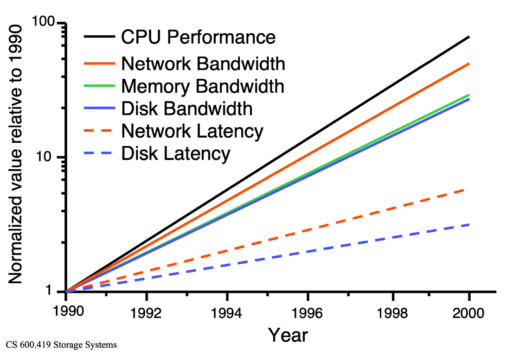

## Consequence: storage performance dominates (in a bad way)
- Assume 50 seconds CPU & 50 seconds I/O
  - 1998 - 1999
    - CPU improves by: $N = 50/25 = 2$
    - Program performance improves by: $N = 100/75 = 1.33$
  - 1999 - 2000
    - CPU performance - factor of 2
    - Program performance $N = 75/62.5=1.2$
  - 2000 - 2001
    - CPU performance - factor of 2
    - Program performance $N = 62.5/56.5 = 1.11$ -->

## HDDs
:::: {.columns}
::: {.column width="50%"}
- Yes, they're still important / around
- Far more cost effective than SSDs
- Sector: (512 bytes) smallest amount of IO you can do to an HDD
- Tracks: 256KB-1MB in size
:::
::: {.column width="2%"}
:::
::: {.column width="48%"}
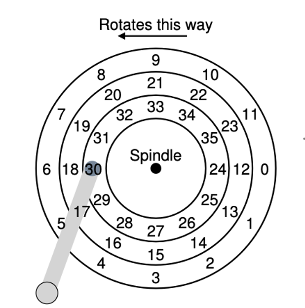
:::
::::

## HDDs (cont'd)
:::: {.columns}
::: {.column width="50%"}
- Actual drives have many platters, are double-sided
- Millions of tracks
- Performance factors?
  - Seek (moving the arm to position the head over the correct sector)
  - Rotation (RPMs)
  - Transfer (time to read/write from the head)
- Which do you think is most burdensome / costly?
:::
::: {.column width="2%"}
:::
::: {.column width="48%"}
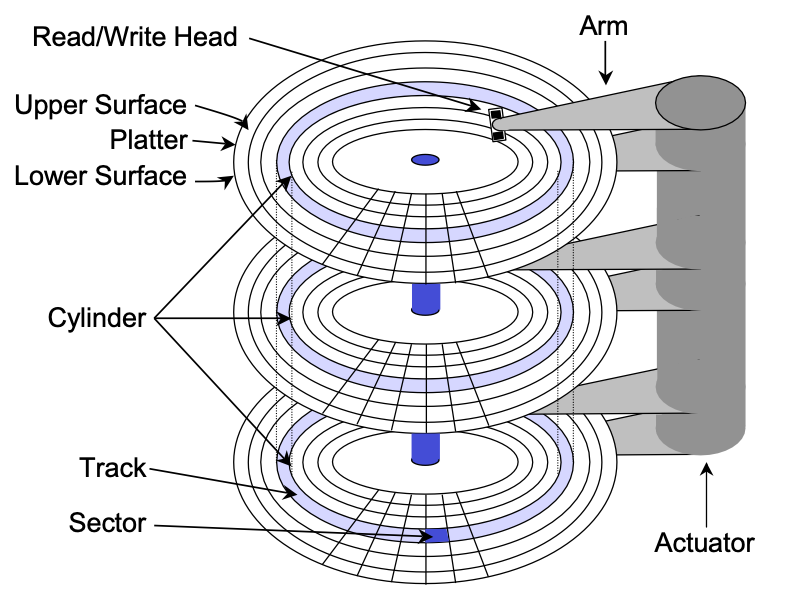
:::
::::

## Seek time
- Seek: accelerate, coast, settle
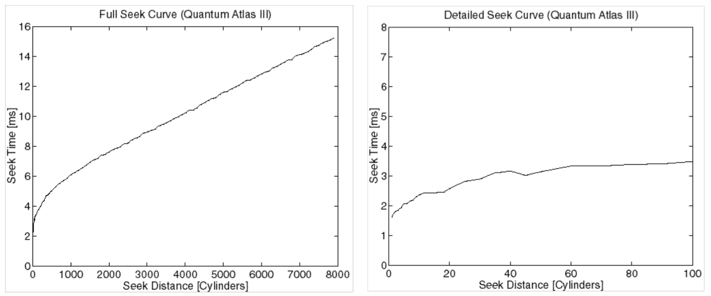

## Rotation time
- a function of RPM; average rot. lat. ½ revolution
  - e.g. 7200RPM = 8.33ms per rotation
    - avg = 4.16ms
- Common HDD speeds:
  - 5400 (yikes, good for cold storage)
  - 7200 (decent middle ground)
  - 10K, 15K (good for a lot of random accesses); use case?
    - DBs

## Transfer time
- simple case (all data in one track):
  - `sectors desired * time for revolution / sectors per track`
- complex case (mult. tracks): above + ? (seeks, track & cyl. switches)

## Where does the time go?
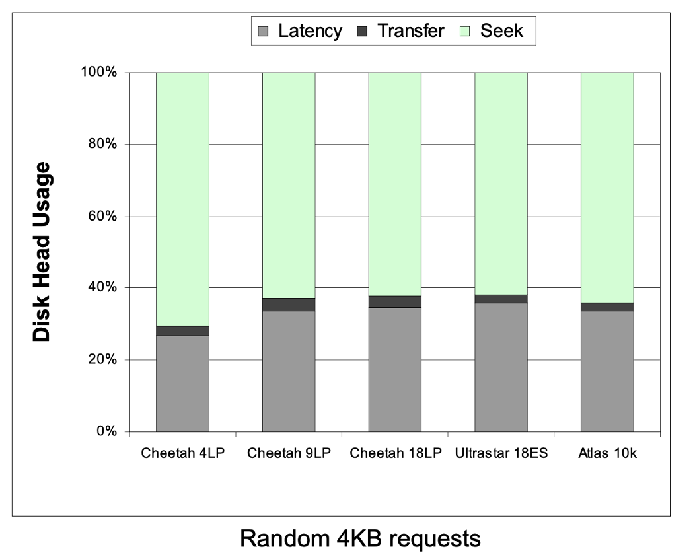

## Where does the time go? It depends.
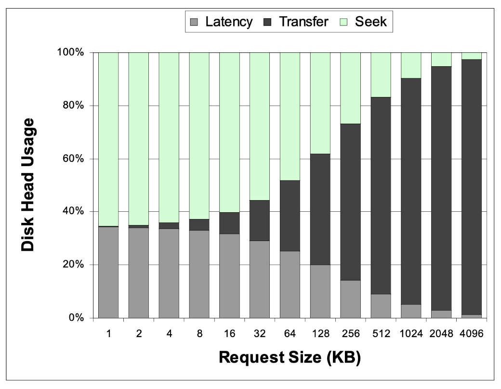

## {background-color="#6E404F"}
::: {.r-fit-text}
What isn't clear?

Comments? Thoughts?
:::

# HDD organization {background-color="#40666e"}
## Questions to consider
:::{.nonincremental}
- What is track skew, and why does it improve sequential read performance across cylinders?
- Why do outer tracks hold more data than inner tracks on a constant-RPM drive, and how does zoning address this?
- When a sector goes bad, what are the two ways a drive can handle it, and what is the trade-off?
:::

<!-- ## Simple organization
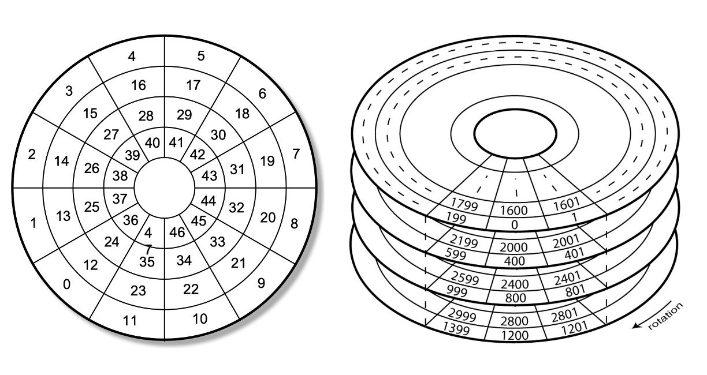 -->

## Simple organization (cont'd)
:::: {.columns}
::: {.column width="50%"}
- What's presented by the disk drive: a linear array of sectors
  - This is a logical abstraction
- Drive must map logical blocks to physical blocks
:::
::: {.column width="2%"}
:::
::: {.column width="48%"}

:::
::::

## Complication: skew
:::: {.columns}
::: {.column width="60%"}
- Sequential reads / write are ideal
- Unfortunately, seeks exist, and sector sequences can cross cylinders / tracks
- E.g., if you are reading sectors 9-12 on the disk you need to seek to a new cylinder
  - What downside does this present?
    - By the time you seek, sector 12 has already spun past the head, you need to wait for it to rotate back around

:::
::: {.column width="2%"}
:::
::: {.column width="38%"}
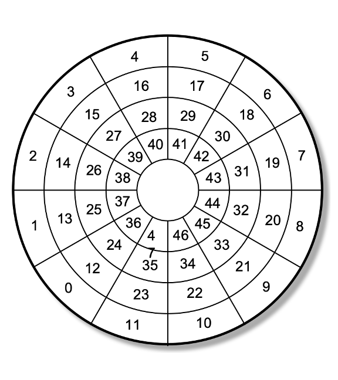
:::
::::

## Complication: skew (cont'd)
:::: {.columns}
::: {.column width="60%"}
- What should we do?
- Reorganize where sectors are located on the physical device
  - Requires tuning based on the specific device characteristics, in this example it's 2 blocks off (to go from sector 23 to sector 24)

:::
::: {.column width="2%"}
:::
::: {.column width="38%"}
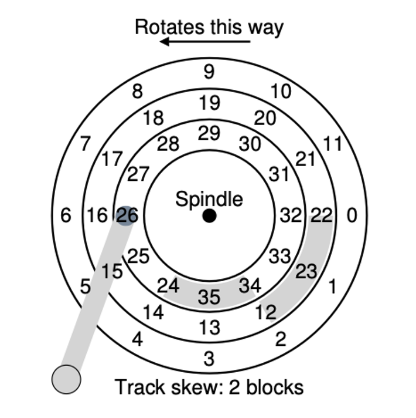{.fragment}
:::
::::

## Complication: zones
- Linear velocity vs. angular velocity
- We talk about drives in terms of constant RPM: what is the consequence of this for tracks?
  - Outer tracks have more space to put data
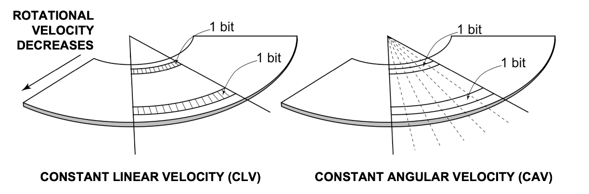{.fragment}

## Complication: zones (cont'd)
:::: {.columns}
::: {.column width="60%"}
- What should we do?
- We could slow the rotation on outer tracks
  - Some older systems did this
- Option 2: (common)
  - Place more sectors per zone on outer tracks
  - Complicates logic

:::
::: {.column width="2%"}
:::
::: {.column width="38%"}
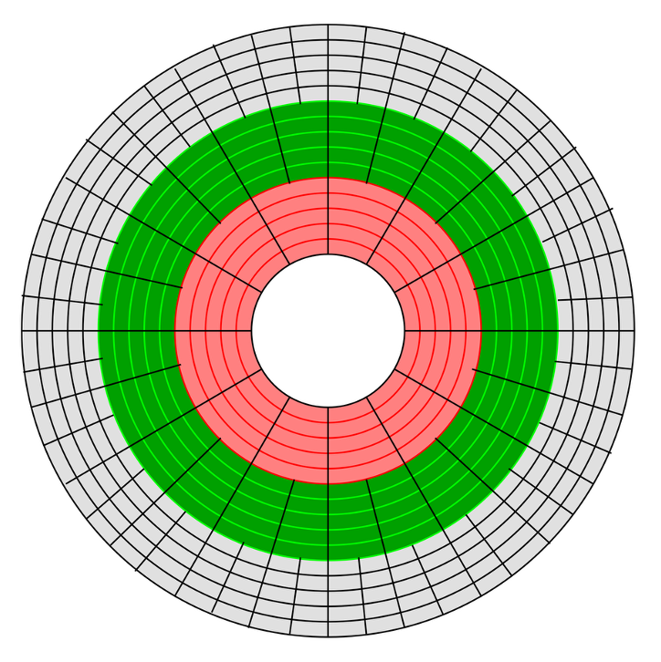{.fragment}
:::
::::

## Complication: defects
- Over time, portions of media become unusable (e.g. fail to hold charge, exhibit many errors);
- How should we handle a defect?
  - We keep additional physical space for "spares" (both tracks and sectors)

## Complication: defects (cont'd)
:::: {.columns}
::: {.column width="60%"}
- How should we handle a defect?
- [Remapping]{.alert}: move the sector to a location in the reserved spare pool
- Ongoing process, taken care of by drive firmware
- Do you see any downsides?
  - Sequential access is now broken
:::
::: {.column width="2%"}
:::
::: {.column width="38%"}
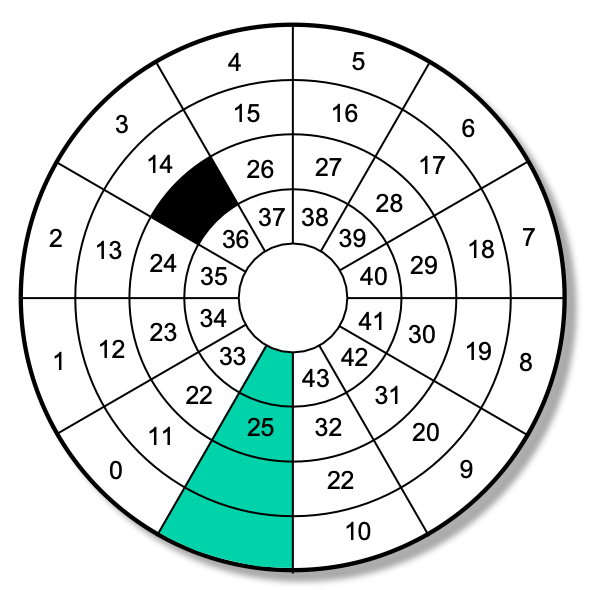{.fragment}
:::
::::

## Complication: defects (cont'd)
:::: {.columns}
::: {.column width="60%"}
- What else could we do?
  - Move everything to maintain sequential sectors (known as [slipping]{.alert})
    - This really only works on a fresh drive formatting: hard to do live
  - Other approaches?
    - Error Correcting Codes (ECC)
      - If you're curious most HDDs use Reed-Solomon

:::
::: {.column width="2%"}
:::
::: {.column width="38%"}
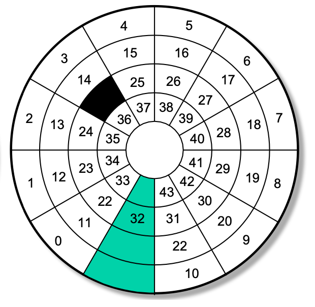{.fragment}
:::
::::

## HDD organization summary
- Luckily, the OS no longer needs to care about most of these details: taken care of by firmware on the drive itself
- We'll return to some gory details about disks in a bit (RAID), but first, disk scheduling

## {background-color="#6E404F"}
::: {.r-fit-text}
What isn't clear?

Comments? Thoughts?
:::

# Disk scheduling {background-color="#40666e"}
## Questions to consider
:::{.nonincremental}
- Why does the OS (or disk controller) bother reordering I/O requests rather than just serving them in arrival order?
- What problem does SSTF solve compared to FCFS, and what new problem does it introduce?
- How does SCAN (elevator) avoid the starvation problem of SSTF, and why is it unfair to requests that just arrived behind the head?
- What is the difference between SCAN and LOOK, and why is LOOK generally preferred?
:::

## Disk scheduling
- We know that disk performance is punitive; seek dominates
- OSes typically have many processes issuing reads/writes; I/O is bursty — queues can grow large, then drain
- This gives us an opportunity to reorder requests to reduce costly seeks
- Note: these algos used to run in the OS; drives have their own controllers now

## Disk scheduling: FCFS and SSTF
- [FCFS]{.alert}: serve requests in arrival order
  - Fair, no starvation — but makes no attempt to minimize seek time
- [SSTF]{.alert}: always service the request closest to the current head position
  - Tends to minimize average seek time
  - Con: starvation — a request far from the head may never be serviced if closer requests keep arriving

## Disk scheduling: SCAN family
- [SCAN]{.alert} (elevator): sweep in one direction servicing requests, reverse at the end
  - Solves starvation, but unfair — requests just behind the head wait a full sweep
- [C-SCAN]{.alert}: like SCAN but jump back to the start instead of reversing; more uniform wait times
- [LOOK]{.alert} / [C-LOOK]{.alert}: like SCAN/C-SCAN but turn around at the last actual request, not the disk edge
  - Less wasted movement; usually what people mean when they say "SCAN"

## Disk scheduling example
:::{.noincremental}
- Disk has 200 cylinders; head is at cylinder 50; pending requests:
  - 82, 170, 43, 140, 24, 16, 190
- What is the total head movement for FCFS, SSTF, and SCAN?
:::

:::{.notes}
FCFS (arrival order: 82→170→43→140→24→16→190):
32+88+127+97+116+8+174 = 642

SSTF (always nearest: 50→43→24→16→82→140→170→190):
7+19+8+66+58+30+20 = 208

SCAN (sweep up to 199, then back down to 16):
(199-50) + (199-16) = 149 + 183 = 332
:::

## Disk scheduling summary
- Which should we choose?
- Generally speaking, SCAN family is used
  - Good for heavy disk loads, avoid starvation
  - What if you had a system where the average queue length was 1?
- Linux has a [deadline scheduler]{.alert}
  - Separate read and write queues (prioritize reads as processes are more likely to block on read vs write)
  - Ordered queues: so they end up being serviced in a SCAN-like order
  - Also FCFS queues for both for bookkeeping
    - After a batch of actions, check to see if there are any in the FCFS queue that has aged beyond some threshold

## {background-color="#6E404F"}
::: {.r-fit-text}
What isn't clear?

Comments? Thoughts?
:::

# Storage organization {background-color="#40666e"}
## Questions to consider
:::{.nonincremental}
- Why is a single disk insufficient for many modern applications, and what two software/hardware abstractions help organize multiple disks?
- What is a RAID stripe, and how does stripe size affect throughput and internal fragmentation?
- How does RAID 0 differ from RAID 1 in terms of performance and redundancy?
- How does XOR parity allow RAID 4/5 to reconstruct data after a single disk failure?
- What is the "small write problem" in RAID 5, and why does it occur?
:::

## Storage organization
- Single disks neither have the capacity, responsiveness, throughput or reliability to be supportive of many applications we desire
  - High-bandwidth applications: multi-media, scientific computing
  - High-capacity: "big data" applications
  - High-availability: any online service
- We're limited by physics to increase capacity: bit-densities are approaching theoretical limits
- Form factor and energy limit the physical size

## Storage organization (cont'd)
- What should we do?
  - Add more disks
- Q: How do we organize multiple drives into a single logical unit of storage?
  - LVM
  - RAID

## LVM
:::: {.columns}
::: {.column width="50%"}
- Logical Volume Manager: a way of organizing/abstracting multiple block devices into a single logical unit of storage
- A [software]{.alert} translation layer
- Can provide additional features, like: encryption, snapshots, redundancy, hot-swapping, resizing
:::
::: {.column width="2%"}
:::
::: {.column width="48%"}
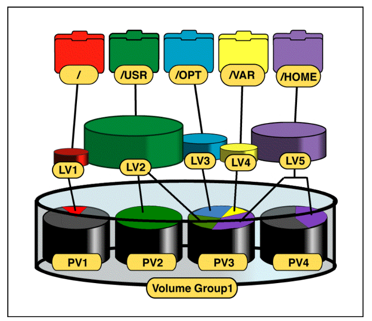
:::
::::

## RAID
- [Redundant Array of Independent Disks]{.alert}: another type of volume manager
- Often a physical organization of disks, and a hardware controller, providing a single logical view of all disks
  - (Although software controllers exist)
- Can provide: high throughput, parallel I/O, reliability and transparent management

## RAID (cont'd)
- Consider Mean-time-to-failure (MTTF)
  - e.g., 750,000 hours for a single disk
  - A data center has 1,000,000 disks
  - 1 disk failure every .75 hours (45 minutes)
- RAID gives us a way to tolerate and recover from these failures gracefully

## RAID terminology
- [Stripe]{.alert}: a set of blocks across multiple disks that are accessed together
  - How does stripe size impact system characteristics?
    - Smaller means more flexibility in size of data stored (reduced internal fragmentation); decreased maximum throughput
    - Larger means high throughput; higher internal fragmentation

- [Mirroring]{.alert}: storing identical data on multiple disks for redundancy
  - Reads are faster (can read from either disk), writes are slower (need to write to both disks)
  - Recovering from a failure is effectively instant: just read from the surviving disk
- [Parity]{.alert}: storing information that can be used to reconstruct data in case of a disk failure

## RAID levels - RAID 0
- [RAID 0]{.alert}: striping without redundancy
- logically, it just looks like one large disk
  - e.g., Two 1TB drives becomes one 2TB drive
- Pros?
  - [High Performance]{.alert}: Data is split across multiple disks, allowing for faster read and write speeds.
  - [Full Capacity Utilization]{.alert}: All disk space is used for storage, with no redundancy overhead.
- Cons?
  - [No Redundancy]{.alert}: If one disk fails, all data is lost.

## RAID levels - RAID 1
- [RAID 1]{.alert}: mirroring
- Two identical RAID sets (mirror copy of each disk)
- Individual drives within a RAID set can fail, so long as their logical counterpart survives
- Reads can be serviced by either set (e.g. whichever responds first)
- Pros?
  - [High Redundancy]{.alert}: Data is mirrored across two disks, providing a complete backup.
  - [Improved Read Performance]{.alert}: Read operations can be faster as data can be read from either disk.
- Cons?
  - [Storage Efficiency]{.alert}: Only half of the total disk space is usable, as the other half is used for mirroring.

## RAID levels - RAID 2-4
- Designate a disk as a parity disk; parity being encoded data for redundancy
  - [RAID 2]{.alert}: bit-level striping with dedicated Hamming code parity
  - [RAID 3]{.alert}: byte-level striping with dedicated parity disk
  - [RAID 4]{.alert}: block-level striping with dedicated parity disk
- Many different encoding schemes; here's a simple one:
  - A ⊕ B ⊕ C = P
  - A dies; P ⊕ B ⊕ C = A
  - All have a *write bottleneck*: only as fast as the parity drive

## RAID 4
- Pros?
  - [Good Read Performance]{.alert}: Similar to RAID 0, data is striped across disks, improving read speeds.
  - [Parity for Redundancy]{.alert}: A dedicated parity disk provides data protection in case of a single disk failure. But the overhead of parity is only 1 disk, so more efficient than RAID 1
- Cons?
  - [Write Bottleneck]{.alert}: The dedicated parity disk can become a bottleneck during write operations.
  - [Reduced Fault Tolerance]{.alert}: If the parity disk fails, the array loses all redundancy — any subsequent disk failure will cause data loss.

## RAID levels - RAID 5
- [RAID 5]{.alert}: block-level striping with distributed parity
- Like RAID 4, but with parity distributed among all disks
- only supports a single drive failure, but …
- … All drives perform in reads and writes
- Best small read, large read, large write performance
  - TERRIBLE small write performance
  - [Small write problem]{.alert}: small-writes incur a lot of I/O; e.g., a small update to a large stripe
  - Entire stripe read in, modified, new parity computed, written back out

## RAID 5
- Pros?
  - [Balanced Performance]{.alert}: Offers good read and write performance with data and parity distributed across all disks.
    - Though this depends on the workload: small writes are very bad, large writes are good
  - [Efficient Storage]{.alert}: Only one disk's worth of space is used for parity, providing better storage efficiency than RAID 1.
- Cons?
  - [Rebuild Time]{.alert}: Rebuilding the array after a disk failure can be time-consuming and impacts performance.
  - [Write Penalty]{.alert}: Write operations (small writes are the worst) are slower due to the need to update parity information.

## Additional RAID levels
- [RAID 6]{.alert}: block-level striping with double distributed parity (can tolerate two disk failures)
- [RAID 10]{.alert}: a combination of RAID 1 and RAID 0 (striping + mirroring)
- Many other levels and variations exist, each with different trade-offs in terms of performance, redundancy, and storage efficiency
  - Levels have become marketing tools, higher levels are typically some combination (often nested) of those we've talked about
    - e.g., [RAID 50]{.alert} (striping across multiple RAID 5 sets), [RAID 60]{.alert} (striping across multiple RAID 6 sets), etc.
- [Hot-spares]{.alert}: a drive in a RAID group that is blank and inactive.
Can be used to immediately rebuild a RAID should a single drive fail without waiting for humans

## Choosing a RAID level
- Depends on your needs and constraints:
  - Performance requirements (read vs write, small vs large)
  - Redundancy needs (tolerance for disk failures)
  - Storage efficiency (how much usable space do you need?)
  - Budget (cost of additional disks for redundancy)
- For example:
  - RAID 0 for high performance with no redundancy (e.g., gaming)
  - RAID 1 for critical data that requires high redundancy (e.g., financial records)
  - RAID 5 for a balance of performance and redundancy (e.g., general-purpose servers where a long rebuild time is acceptable)
  - RAID 6 for environments where data integrity is paramount and multiple disk failures are a concern (e.g., archival storage)

## {background-color="#6E404F"}
::: {.r-fit-text}
What isn't clear?

Comments? Thoughts?
:::