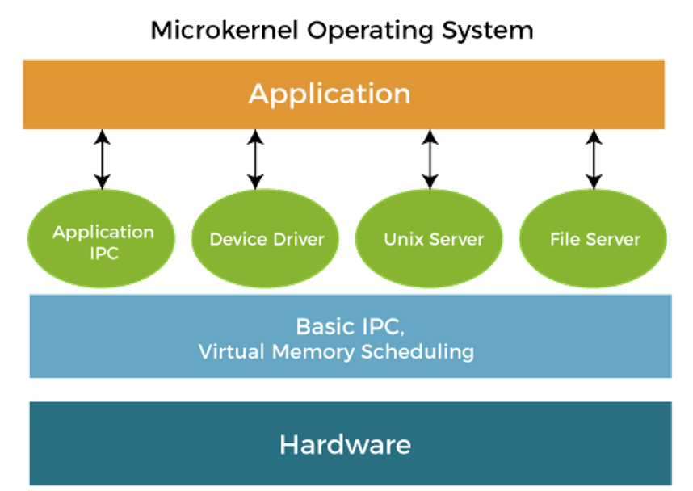
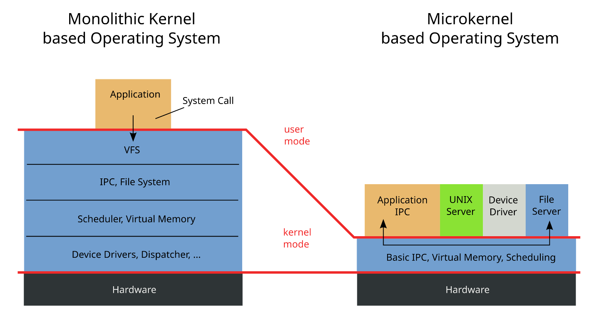

## Admin
:::{.nonincremental}
- Lab 1 due Thursday, 11:59 PM
- Assignment 1 due April 15
:::


# OS abstractions {background-color="#40666e"}

## Questions to consider
:::{.nonincremental}
- What are the main abstractions OSes provide?
- What are the abstraction challenges?
:::

## Abstractions
:::{.incremental}
- Abstractions _simplify application design_ by:
  - hiding undesirable properties,
  - adding new capabilities, and
  - organizing information
- Abstractions provide an [interface]{.alert} to application programmers that separates [policy]{.alert}—what the interface commits to accomplishing—from [mechanism]{.alert}—how the interface is implemented.
:::

## What are the abstractions?
:::{.incremental}
- CPUs
  - Processes, threads
- Memory
  - Address space
- Disk
  - Files
:::

## Example OS abstraction: file systems
:::{.incremental}
- What [undesirable properties]{.alert} do file systems hide?
  - Disks are slow!
  - Chunks of storage are actually distributed all over the disk
  - Disk storage may fail!
- What [new capabilities]{.alert} do files add?
  - Growth and shrinking
  - Organization into directories, searchability
- What [information]{.alert} do files help organize?
  - Ownership and permissions
  - Access time, modification time, type, etc.
:::

## Abstraction tradeoffs - discussion

::: {.nonincremental}
- Identify undesirable properties hidden by, new capabilities added, and info organization provided with these abstractions:
  - Process / threads
  - Address space
:::

::: {.notes}
Processes/Threads

- Hiding undesirable properties:
  - Example: The process abstraction hides the complexity of CPU scheduling and context switching. Applications don't need to manage the low-level details of how the CPU switches between different tasks. Similarly, the thread abstraction hides the intricacies of managing multiple execution paths within a single process, allowing developers to focus on the logic of concurrent tasks.
- Adding new capabilities:
  - Example: Processes provide isolation between different applications, ensuring that one misbehaving application doesn't affect others. Threads within a process allow for parallel execution of tasks, improving performance and responsiveness. Additionally, operating systems often provide inter-process communication (IPC) mechanisms, enabling processes to coordinate and share data.
- Organizing information:
  - Example: The process abstraction organizes the execution environment by encapsulating the code, data, and resources needed for a program to run. Threads further organize execution by dividing tasks within a process into smaller, manageable units. This organization helps in structuring complex applications and improving their maintainability.

Memory Address Space

- Hiding undesirable properties:
  - Example: The memory address space abstraction hides the physical memory layout from applications. Programs use virtual addresses, which the operating system maps to physical memory locations. This abstraction also hides the details of memory fragmentation and allocation, simplifying memory management for developers.
- Adding new capabilities:
  - Example: Virtual memory allows applications to use more memory than physically available by swapping data to and from disk. This capability enables larger and more complex applications to run on systems with limited physical memory. Additionally, memory protection mechanisms prevent one process from accessing the memory of another, enhancing system stability and security.
- Organizing information:
  - Example: The memory address space abstraction organizes memory into segments such as code, data, heap, and stack. This organization helps in managing different types of data efficiently and ensures that memory is used in a structured manner. For instance, the stack is used for function calls and local variables, while the heap is used for dynamic memory allocation.

:::

## Abstraction pros / cons
:::{.incremental}
- [Advantages]{.alert} of OS providing abstractions?
  - Allow applications to reuse common facilities
  - Make different devices look the same
  - Provide higher-level or more useful functionality
- [Challenges]{.alert}?
  - What are the correct abstractions?
  - How much should be exposed?
:::

## OS design requirements - what do we need?
:::{.incremental}
- [Convenience]{.alert}, abstraction of hardware resources for user programs
- [Efficiency]{.alert} of usage of CPU, memory, etc.
- [Isolation]{.alert} between multiple processes
- [Reliability]{.alert}, the OS must not fail
- Other:
  - [Security]{.alert}
  - [Mobility]{.alert}
:::

## {background-color="#6E404F"}

::: {.r-fit-text}
What isn't clear?

Comments? Thoughts?
:::


# Resource management {background-color="#40666e"}

## Questions to consider
:::{.nonincremental}
- How does the OS manage access to resources?
:::

## OS as a resource manager
:::{.incremental}
- Another view: [resource manager]{.alert} - shares resources "well"
- [Advantages]{.alert} of the OS managing resources?
  - Protect applications from one another
  - Provide efficient access to resources (cost, time, energy)
  - Provide fair access to resources
- [Challenges]{.alert}?
  - What are the correct mechanisms?
  - What are the correct policies?
:::

## Resources are managed via [services]{.alert}
:::{.incremental}
- Program Execution (loading, running, monitoring, terminating)
- Performance (optimizing resources under constraints)
- Correctness (overseeing critical operations, preventing interference)
- Fairness (access to and allocation of resources)
- Error detection & recovery (network partition & media failure)
:::

## Services (cont'd)
:::{.incremental}
- Communication (inter-process, software-to-hardware, hardware-to-hardware, system-to-system, wide-area)
- I/O: reading & writing, support for various mediums, devices, performance, and protections
- Data Organization (naming), Services (search) & Protection (access control)
- Security (isolation, enforcement, services, authentication, accounting and logging, trust)
- User interfaces (command-line, GUIs, multiple users)
:::

## Each service has [challenges]{.alert} and [tensions]{.alert}

Example 1: We have limited RAM, and we want to run more programs that can be stored.

- How do we allocate space?
- Who stays?
- Who goes?
- What if we're wrong?
- What if the system is under extremely heavy load?
- Is there a way to predict the future?

## Each service has [challenges]{.alert} and [tensions]{.alert}

Example 2: We have two processes (producer / consumer); how do they communicate?

- Message passing? Shared memory?
- How do they synchronize?
  - How do we prevent over-production? Over-consumption?
  - Context-switching?

## {background-color="#6E404F"}

::: {.r-fit-text}
What isn't clear?

Comments? Thoughts?
:::

# Boot chain {background-color="#40666e"}

## Questions to consider
:::{.nonincremental}
- What is the chain of events that takes place before you are able to run a process?
- Where do the different parts of the chain reside? How are they called?
:::

## Boot is like a relay race

- A sequence of programs
- Each stage:
  - Has slightly more power
  - Loads the next stage
  - Jumps to it

## Power-On
:::{.incremental}
- CPU resets
- Instruction pointer set to a fixed address
- Execution begins in firmware (ROM)
- [The CPU does not know what an OS is]{.alert}
:::

## Firmware (BIOS / UEFI)
:::{.incremental}
- Initializes RAM
- Initializes minimal hardware
- Finds one program to run (bootloader)
- Loads it into memory
- Jumps to it
:::

## Bootloader's job (GRUB Example)
:::{.incremental}
- Understand filesystems
- Load the kernel image
- Load the initramfs
- Jump to the kernel entry point
- Provides kernel command line args
  ```{.code}
  root=/dev/sda1
  init=/sbin/init
  console=ttyS0
  ```
:::

## What the bootloader does [not]{.alert} do
:::{.incremental}
- Does not schedule processes
- Does not manage memory long-term
- Does not run the OS
:::

## Kernel
:::{.incremental}
Think of the kernel in phases

1. Self-setup
2. Hardware abstraction
3. Userspace handoff
:::

## Kernel self-setup
:::{.incremental}
-	Sets up page tables
- Enables virtual memory
- Initializes scheduler
- Sets up interrupts
:::

:::{.fragment}
The kernel cannot rely on [anything]{.alert} yet: it is building the world.
:::

## Kernel hardware abstractions
### This is where hardware becomes an abstraction.
:::{.incremental}
- Detects hardware
- Loads drivers
- Turns devices into files:
  - `/dev/sda`
  - `/dev/tty`
- Creates kernel threads
:::

## Userspace handoff
:::{.incremental}
- Mounts the root filesystem
- Chooses one program to run
- Executes it with `execve()`
  ```{.c}
  execve("/sbin/init", ...);
  ```
:::

## Init (PID 1)
:::{.incremental}
- First userspace process
- Always PID 1
- Parent of all other processes
:::

:::{.fragment .incremental}
If PID 1 exits?

- The kernel [panics]{.alert} or shuts down
:::

## {background-color="#6E404F"}
::: {.r-fit-text}
What isn't clear?

Comments? Thoughts?
:::

# Kernel basics {background-color="#40666e"}

## Questions to consider
:::{.nonincremental}
- What are the different kernel paradigms?
- Why would you choose one over the other?
:::

## Paradigms

- The OS offers a number of services. What should go in the kernel?
  - IPC
  - VFS
  - File system
  - Scheduler
  - Virtual Memory
  - Device drivers

## Monolithic kernels
:::{.incremental}
- Oldest, very common design (Linux, Windows 9x, BSDs)
- Single piece of code in memory
- Limited [information hiding]{.alert}
  - One part of the kernel can directly access data and functions of other parts
:::

## Monolithic kernels (cont'd)
:::{.incremental}
- Q: What happens when you need something new supported (new hardware device, new system call, new filesystem)?
- [Modules]{.alert} (loadable kernel modules - LKMs) allow for flexibility, customization, support
  - Pros?
    - Memory savings
    - Flexibility
    - Minimal downtime
  - Cons?
    - (minor) fragmentation: the base kernel can be loaded contiguously in memory
    - Security ([https://github.com/m0nad/Diamorphine](https://github.com/m0nad/Diamorphine) **DO NOT USE THIS, IT'S SIMPLY TO SHOW YOU**)
:::

## Layered kernels
:::{.incremental}
- Dijkstra created the THE OS in the 60s, introducing the concept
Each inner layer is more privileged; required a trap to move down layers
- Hardware-enforcement possible
- Intel [announced](https://www.intel.com/content/www/us/en/developer/articles/technical/envisioning-future-simplified-architecture.html) in May 2024 that the new architectures will only have rings 0 and 3
:::

## Microkernels

:::: {.columns}

::: {.column width="55%" .incremental}

- Popular research area long ago, didn't win (although people remain interested in the principles)
- All non-essential components removed from the kernel, for modularization, extensibility, isolation, security, and ease of management
- A collection of OS services running in user space
- Downsides?
  - **Heavy communication costs** through message passing (marshaled through the kernel)

:::

::: {.column width="5%"}
:::

::: {.column width="40%"}
{.fragment}
:::

::::

## Monolithic vs Microkernel


## Hybrid kernels
:::{.incremental}
- Combine a monolithic core with microkernel ideas
- Small kernel handles critical services (scheduling, IPC, low-level memory)
- Other services (file systems, drivers) can run in kernel *or* user space
- Examples: macOS (XNU), Windows NT
  - XNU: Mach microkernel + BSD monolithic layer
  - Windows NT: microkernel-inspired, but most services run in kernel mode for performance
- Pragmatic compromise: [microkernel isolation where it matters, monolithic speed where it doesn't]{.alert}
:::


## {background-color="#6E404F"}

::: {.r-fit-text}
What isn't clear?

Comments? Thoughts?
:::

# Dual-mode / Syscalls {background-color="#40666e"}

## Questions to consider
:::{.nonincremental}
- How do we ensure that a user process doesn't harm others?
- How do system calls work? How do they relate to wrapper libraries like `glibc`?
:::


## Interrupts and traps
:::{.incremental}
- How does the OS regain control of the CPU?
- Two mechanisms that transfer control to the kernel:
  - [Hardware interrupts]{.alert}: asynchronous, generated by devices
    - Timer, disk I/O completion, keyboard, network
    - CPU checks for pending interrupts between instructions
  - [Software traps]{.alert}: synchronous, generated by the running program
    - System calls (intentional)
    - Exceptions: divide-by-zero, page fault, illegal instruction (unintentional)
- Both use the same basic mechanism: save state, jump to a kernel handler via an [interrupt vector table]{.alert}
:::

## Why this matters
:::{.incremental}
- Without hardware interrupts, a misbehaving process could monopolize the CPU forever
- The [timer interrupt]{.alert} is the foundation of preemptive scheduling (we'll talk about scheduling later)
  - Hardware timer fires periodically (e.g., every 1-10 ms)
  - Forces a trap into kernel mode regardless of what the process is doing
  - Kernel's scheduler decides: resume this process or switch to another?
- This is the answer to: "if the process has the CPU, who stops it?"
  - [The hardware stops it]{.alert}
:::

## Dual-mode operation
:::{.incremental}
- Dual-mode operation allows OS to protect itself and components
  - [User mode]{.alert} and [kernel]{.alert} mode
- Mode bit provided/enforced by hardware
  - Provides ability to distinguish when system is running user code or kernel code.
  - When a user is running → mode bit is "user"
  - When kernel code is executing → mode bit is "kernel"
- [System call]{.alert} changes mode to kernel, return from call resets it to user
- Some instructions are only executable in kernel mode
:::

## System calls
:::{.incremental}
- The OS offers a number of services. How do we (applications) interface with them?
  - We don't want to deal with the details, just the abstraction
  - The OS has ultimate control over these operations
- System calls are the "language" of communication with the OS
- Standards
  - Win32 (MS)
  - POSIX (nearly all Unix-based systems)
:::

## System calls (cont'd)
:::{.incremental}
- Like a function call, we push arguments onto the stack, then we call into the library that provides the system call
- Each system call has a special number, placed into a register
- Executes a TRAP instruction (switch to kernel mode)
- A logical separation of memory space
- Kernel's system call handler is invoked, once done (but may block) may be returned to the process
:::

## System calls (cont'd)
:::{.incremental}
- Table defined in the kernel: [https://github.com/torvalds/linux/blob/master/arch/x86/entry/
syscalls/syscall_32.tbl](https://github.com/torvalds/linux/blob/master/arch/x86/entry/syscalls/syscall_32.tbl)
  - Note that system call tables can differ between architectures
- You can run using the table values themselves using the `syscall()` wrapper
  - Q: why does `syscall()` exist?
  - If you're interested… There are debates [https://lwn.net/Articles/771441/](https://lwn.net/Articles/771441/)
:::

## {background-color="#6E404F"}
::: {.r-fit-text}
What isn't clear?

Comments? Thoughts?
:::

# Process basics {background-color="#40666e"}

## Questions to consider
:::{.nonincremental}
- What do processes contain?
- How does the OS run multiple processes at the same time?
- How are processes laid out in memory?
- How does the OS store information about each process?
:::

## Processes
:::{.incremental}
- Most fundamental OS abstraction
  - Processes organize information about other abstractions and represent a single thing the computer is "doing"
- When you run an executable program (passive), the OS creates a [process]{.alert} == a running program (active)
- One program can be multiple processes
:::

## Process organization

:::: {.columns}

::: {.column width="45%" .incremental}
- Unlike threads, address spaces and files, processes are not tied to a hardware component. Instead, they contain other abstractions
- Processes contain:
  - one or more [threads]{.alert},
  - an [address space]{.alert}, and
  - zero or more open [file handles]{.alert} representing files
:::

::: {.column width="5%"}
:::

::: {.column width="50%"}
{.fragment}
:::

::::

## Multiprogramming
:::{.incremental}
- Processes are the core abstraction that allows for [multiprogramming]{.alert}: the illusion of concurrency
- OS timeshares CPU across multiple processes: virtualizes CPU
- OS has a CPU scheduler that picks one of the many active processes to execute on a CPU
- Policy:
  - [which]{.alert} process to run
- Mechanism:
  - how to [context switch]{.alert} between processes
:::

## Process's view of the world
:::{.incremental}
- Own memory with consistent addressing (divorced from physical addressing)
- It has exclusivity over the CPU: It doesn't have to worry about scheduling
- Conversely, it doesn't know when it will be scheduled, so real time events require special handling
- Has some identity: `pid`, `gid`, `uid`
- Has a set of services available to it via the OS
  - Data (via file system)
  - Communication (sockets, IPC)
  - More resources (e.g., memory)
:::

## Process memory layout
:::: {.columns}

::: {.column width="48%" .incremental}
- [Text]{.alert} segment: machine instructions; shareable between identical processes; read-only
- [Data]{.alert} segment: for initialized data; e.g.,
```int count = 99;```
- [BSS]{.alert} (block started by symbol) segment: uninitialized data; e.g., `int sum[10];`
- [Heap]{.alert}: dynamic memory allocation
- [Stack]{.alert}: initial arguments and environment; stack frames
:::

::: {.column width="2%"}
:::

::: {.column width="50%"}
{.fragment}
:::

::::

## OS's view of the (process) world
:::: {.columns}

::: {.column width="38%" .incremental}
- Data for each process is held in a data structure known as a [Process Control Block]{.alert}
- Partitioned memory:
  - dedicated & shared address space
  - perhaps non-contiguous
- [Process table]{.alert} holds PCBs

:::

::: {.column width="2%"}
:::

::: {.column width="60%"}
{.fragment}
:::

::::

## {background-color="#6E404F"}
::: {.r-fit-text}
What isn't clear?

Comments? Thoughts?
:::

# Process state and scheduling {background-color="#40666e"}

## Questions to consider
:::{.nonincremental}
- What are the different process states and what causes transitions?
- What is a context switch?
- What are the two general categories of processes and how do they differ?
:::

## Process states
- As a process executes, it changes *state*
  - [New]{.alert}: The process is being created
  - [Running]{.alert}: Instructions are being executed
  - [Waiting]{.alert}: The process is waiting for some event (typically I/O or signal handling) to occur
  - [Ready]{.alert}: The process is waiting to be assigned to a processor
  - [Terminated]{.alert}: The process has finished execution

## Process state transitions


## Process state transitions (cont'd)
:::: {.columns}

::: {.column width="45%" .incremental}
- Running process can move from running to terminated (exit or killed), moved to ready (time slice up), or blocked (signaled to wait, I/O)
- Which state transitions could happen with these expensive actions?
  - Compute a new RSA key?
  - Find the largest value in a 1TB of data?
:::

::: {.column width="2%"}
:::

::: {.column width="53%"}

:::

::::

::: {.notes}
- Running to Waiting: This transition occurs when a process cannot continue executing until a specific event occurs. Here are some examples:
  - I/O Operations:
    - Example: A process needs to read data from a disk. It issues an I/O request and then moves to the Waiting state until the data is read and available.
    - Real-World Scenario: A web server process waiting for data to be read from a database.
  - Resource Availability:
    - Example: A process requires a resource (like a printer) that is currently in use by another process. It moves to the Waiting state until the resource becomes available.
    - Real-World Scenario: A document editing application waiting for access to a shared printer.
  - Inter-Process Communication (IPC):
    - Example: A process is waiting for a message from another process. It moves to the Waiting state until the message is received.
    - Real-World Scenario: A chat application waiting for a message from a server.
  - Synchronization Primitives:
    - Example: A process is waiting for a lock or semaphore to be released by another process. It moves to the Waiting state until the lock is available.
    - Real-World Scenario: A banking application waiting for a transaction lock to be released.
- Running to Ready: This transition occurs when a process is preempted by the scheduler, but it is still ready to run as soon as it gets CPU time again. Here are some examples:
  - Time Slice Expiration:
    - Example: A process has used up its allocated time slice. The scheduler preempts it and moves it to the Ready state, allowing another process to run.
    - Real-World Scenario: A video streaming application being preempted to allow a background update process to run.
  - Higher Priority Process:
    - Example: A higher priority process becomes ready to run. The scheduler preempts the current process and moves it to the Ready state.
    - Real-World Scenario: An emergency alert system preempting a running media player application.
  - Voluntary Yield:
    - Example: A process voluntarily yields the CPU, indicating it can be preempted. The scheduler moves it to the Ready state.
    - Real-World Scenario: A background data synchronization process yielding the CPU to allow a user-initiated task to run.

:::

## Process scheduling
:::{.incremental}
- [OS process scheduler]{.alert} selects among available processes for next execution on CPU core
- Goal?
  - Maximize CPU use, quickly switch processes onto CPU core
- Maintains [scheduling queues]{.alert} of processes
  - [Ready queue]{.alert}: set of all processes residing in main memory, ready and waiting to execute
  - [Wait queues]{.alert}: set of processes waiting for an event (i.e., I/O)
- Processes migrate among the various queues over their lifetime
:::

## Context switching
:::{.incremental}
- When CPU switches to another process, the system must save the state of the old process and load the saved state for the new process via a [context switch]{.alert}
- Context of a process represented in the PCB
- Context-switch time is [pure overhead]{.alert}; the system does no useful work while switching
  - The more complex the OS and the PCB → the longer the context switch
- Time dependent on hardware support
  - Some hardware provides multiple sets of registers per CPU → multiple contexts loaded at once
:::

## Context switching overhead
- On the order of microseconds on modern hardware, used to be milliseconds
- If not done intelligently, you can spend more time context-switching than actual processing
- Question: Why shouldn't processes control context switching?

::: {.notes}
- They could refuse to give up CPU (processes are greedy)
- They're intentionally isolated, and don't have enough information about other processes
- It would cause too much complication (every process would have to implement its own context switch code)
:::

## Scheduling basics
:::{.incremental}
- Scheduler usually makes the transition decisions; hides the details from the process/user
- Processes often characterized as one of two types by what state they spend most of their time in
  - [I/O bound]{.alert}: work is dependent on I/O; e.g., browser, db, media streaming
  - [CPU bound]{.alert}: work is dependent on CPU; e.g., scientific apps, cryptography
  - Why does this matter?
    - Understanding which your process is allows for optimization
      - CPU-bound? Faster CPU, parallelize.
      - I/O? Faster I/O devices, use async
- Scheduler must balance CPU- & I/O-bound processes
:::

## {background-color="#6E404F"}
::: {.r-fit-text}
What isn't clear?

Comments? Thoughts?
:::
