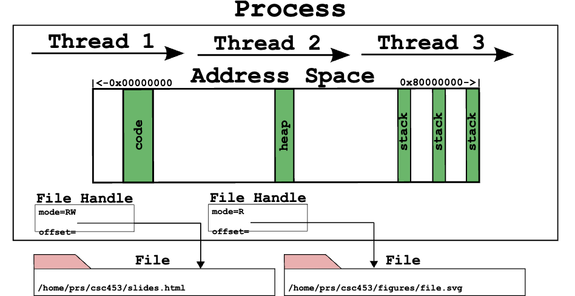
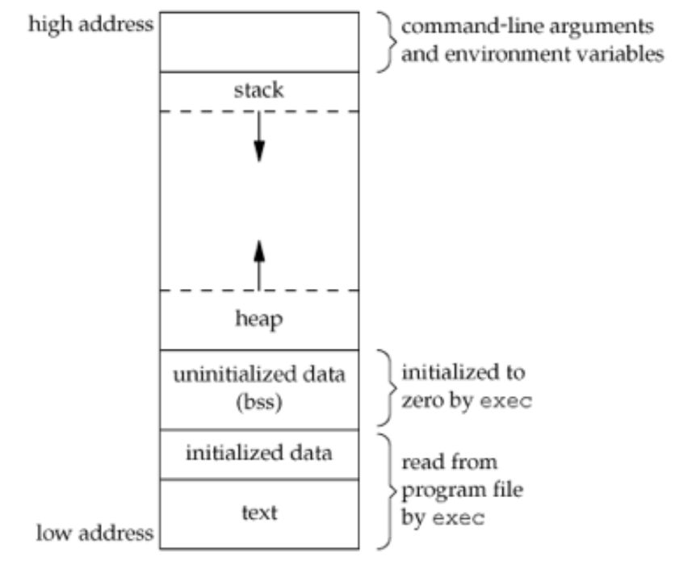
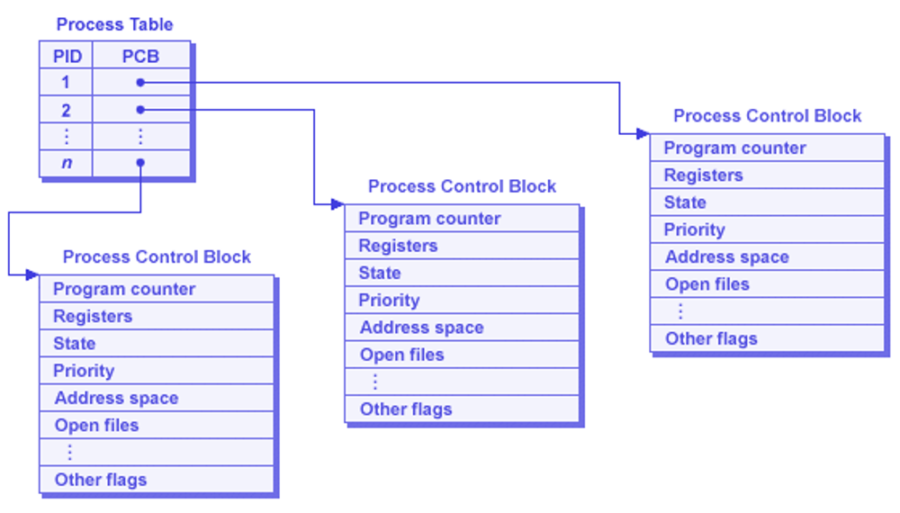
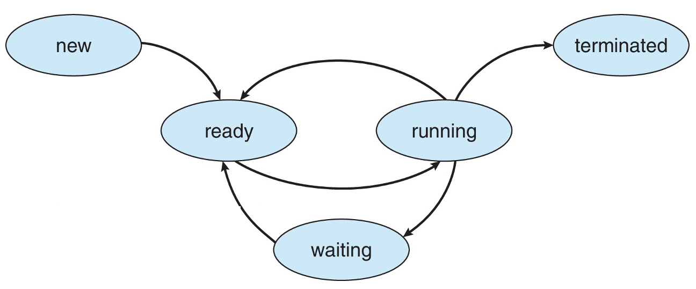
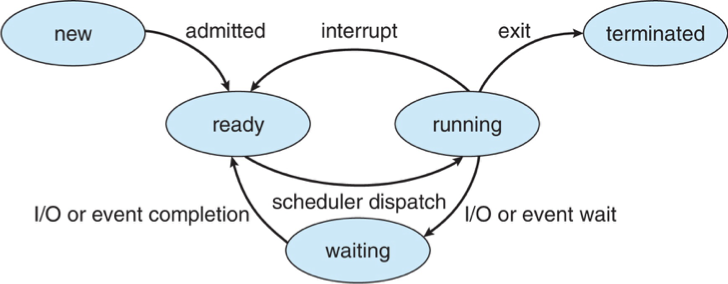
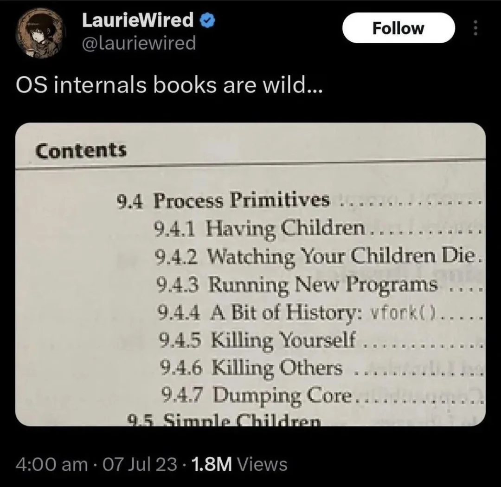

## Admin
:::{.nonincremental}
- Lab 1 due Thursday, 11:59 PM
- Quiz 2 due Monday, 11:59 PM
- Assignment 1 due April 15
:::


# Dual-mode / Syscalls {background-color="#40666e"}

## Questions to consider
:::{.nonincremental}
- How do we ensure that a user process doesn't harm others?
- How do system calls work? How do they relate to wrapper libraries like `glibc`?
:::


## Interrupts and traps
:::{.incremental}
- How does the OS regain control of the CPU?
- Two mechanisms that transfer control to the kernel:
  - [Hardware interrupts]{.alert}: asynchronous, generated by devices
    - Timer, disk I/O completion, keyboard, network
    - CPU checks for pending interrupts between instructions
  - [Software traps]{.alert}: synchronous, generated by the running program
    - System calls (intentional)
    - Exceptions: divide-by-zero, page fault, illegal instruction (unintentional)
- Both use the same basic mechanism: save state, jump to a kernel handler via an [interrupt vector table]{.alert}
:::

## Why this matters
:::{.incremental}
- Without hardware interrupts, a misbehaving process could monopolize the CPU forever
- The [timer interrupt]{.alert} is the foundation of preemptive scheduling (we'll talk about scheduling later)
  - Hardware timer fires periodically (e.g., every 1-10 ms)
  - Forces a trap into kernel mode regardless of what the process is doing
  - Kernel's scheduler decides: resume this process or switch to another?
- This is the answer to: "if the process has the CPU, who stops it?"
  - [The hardware stops it]{.alert}
:::

## Dual-mode operation
:::{.incremental}
- Dual-mode operation allows OS to protect itself and components
  - [User mode]{.alert} and [kernel]{.alert} mode
- Mode bit provided/enforced by hardware
  - Provides ability to distinguish when system is running user code or kernel code.
  - When a user is running → mode bit is "user"
  - When kernel code is executing → mode bit is "kernel"
- [System call]{.alert} changes mode to kernel, return from call resets it to user
- Some instructions are only executable in kernel mode
:::

## System calls
:::{.incremental}
- The OS offers a number of services. How do we (applications) interface with them?
  - We don't want to deal with the details, just the abstraction
  - The OS has ultimate control over these operations
- System calls are the "language" of communication with the OS
- Standards
  - Win32 (MS)
  - POSIX (nearly all Unix-based systems)
:::

## System calls (cont'd)
:::{.incremental}
- We call into the library wrapper (e.g., `glibc`) which places arguments into registers
- Each system call has a special number, placed into a register
- Executes a TRAP instruction (switch to kernel mode)
- A logical separation of memory space
- Kernel's system call handler is invoked, once done (but may block) may be returned to the process
:::

## System calls (cont'd)
:::{.incremental}
- Table defined in the kernel: [https://github.com/torvalds/linux/blob/master/arch/x86/entry/
syscalls/syscall_32.tbl](https://github.com/torvalds/linux/blob/master/arch/x86/entry/syscalls/syscall_32.tbl)
  - Note that system call tables can differ between architectures
- You can run using the table values themselves using the `syscall()` wrapper
  - Q: why does `syscall()` exist?
  - If you're interested… There are debates [https://lwn.net/Articles/771441/](https://lwn.net/Articles/771441/)
:::

## {background-color="#6E404F"}
::: {.r-fit-text}
What isn't clear?

Comments? Thoughts?
:::

# Process basics {background-color="#40666e"}

## Questions to consider
:::{.nonincremental}
- What do processes contain?
- How does the OS run multiple processes at the same time?
- How are processes laid out in memory?
- How does the OS store information about each process?
:::

## Processes
:::{.incremental}
- Most fundamental OS abstraction
  - Processes organize information about other abstractions and represent a single thing the computer is "doing"
- When you run an executable program (passive), the OS creates a [process]{.alert} == a running program (active)
- One program can be multiple processes
:::

## Process organization

:::: {.columns}

::: {.column width="45%" .incremental}
- Unlike threads, address spaces and files, processes are not tied to a hardware component. Instead, they contain other abstractions
- Processes contain:
  - one or more [threads]{.alert},
  - an [address space]{.alert}, and
  - zero or more open [file handles]{.alert} representing files
:::

::: {.column width="5%"}
:::

::: {.column width="50%"}
{.fragment}
:::

::::

## Multiprogramming
:::{.incremental}
- Processes are the core abstraction that allows for [multiprogramming]{.alert}: the illusion of concurrency
- OS timeshares CPU across multiple processes: virtualizes CPU
- OS has a CPU scheduler that picks one of the many active processes to execute on a CPU
- Policy:
  - [which]{.alert} process to run
- Mechanism:
  - how to [context switch]{.alert} between processes
:::

## Process's view of the world
:::{.incremental}
- Own memory with consistent addressing (divorced from physical addressing)
- It has exclusivity over the CPU: It doesn't have to worry about scheduling
- Conversely, it doesn't know when it will be scheduled, so real time events require special handling
- Has some identity: `pid`, `gid`, `uid`
- Has a set of services available to it via the OS
  - Data (via file system)
  - Communication (sockets, IPC)
  - More resources (e.g., memory)
:::

## Process memory layout
:::: {.columns}

::: {.column width="48%" .incremental}
- [Text]{.alert} segment: machine instructions; shareable between identical processes; read-only
- [Data]{.alert} segment: for initialized data; e.g.,
```int count = 99;```
- [BSS]{.alert} (block started by symbol) segment: uninitialized data; e.g., `int sum[10];`
- [Heap]{.alert}: dynamic memory allocation
- [Stack]{.alert}: initial arguments and environment; stack frames
:::

::: {.column width="2%"}
:::

::: {.column width="50%"}
{.fragment}
:::

::::

## OS's view of the (process) world
:::: {.columns}

::: {.column width="38%" .incremental}
- Data for each process is held in a data structure known as a [Process Control Block]{.alert}
- Partitioned memory:
  - dedicated & shared address space
  - perhaps non-contiguous
- [Process table]{.alert} holds PCBs

:::

::: {.column width="2%"}
:::

::: {.column width="60%"}
{.fragment}
:::

::::

## {background-color="#6E404F"}
::: {.r-fit-text}
What isn't clear?

Comments? Thoughts?
:::

# Process state and scheduling {background-color="#40666e"}

## Questions to consider
:::{.nonincremental}
- What are the different process states and what causes transitions?
- What is a context switch?
- What are the two general categories of processes and how do they differ?
:::

## Process states
- As a process executes, it changes *state*
  - [New]{.alert}: The process is being created
  - [Running]{.alert}: Instructions are being executed
  - [Waiting]{.alert}: The process is waiting for some event (typically I/O or signal handling) to occur
  - [Ready]{.alert}: The process is waiting to be assigned to a processor
  - [Terminated]{.alert}: The process has finished execution

## Process state transitions




## Process state transitions (cont'd)
:::: {.columns}

::: {.column width="45%" .incremental}
- Running process can move from running to terminated (exit or killed), moved to ready (time slice up), or blocked (signaled to wait, I/O)
- Which state transitions could happen with these expensive actions?
  - Compute a new RSA key?
  - Find the largest value in a 1TB of data?
:::

::: {.column width="2%"}
:::

::: {.column width="53%"}

:::

::::

::: {.notes}
- Running to Waiting: This transition occurs when a process cannot continue executing until a specific event occurs. Here are some examples:
  - I/O Operations:
    - Example: A process needs to read data from a disk. It issues an I/O request and then moves to the Waiting state until the data is read and available.
    - Real-World Scenario: A web server process waiting for data to be read from a database.
  - Resource Availability:
    - Example: A process requires a resource (like a printer) that is currently in use by another process. It moves to the Waiting state until the resource becomes available.
    - Real-World Scenario: A document editing application waiting for access to a shared printer.
  - Inter-Process Communication (IPC):
    - Example: A process is waiting for a message from another process. It moves to the Waiting state until the message is received.
    - Real-World Scenario: A chat application waiting for a message from a server.
  - Synchronization Primitives:
    - Example: A process is waiting for a lock or semaphore to be released by another process. It moves to the Waiting state until the lock is available.
    - Real-World Scenario: A banking application waiting for a transaction lock to be released.
- Running to Ready: This transition occurs when a process is preempted by the scheduler, but it is still ready to run as soon as it gets CPU time again. Here are some examples:
  - Time Slice Expiration:
    - Example: A process has used up its allocated time slice. The scheduler preempts it and moves it to the Ready state, allowing another process to run.
    - Real-World Scenario: A video streaming application being preempted to allow a background update process to run.
  - Higher Priority Process:
    - Example: A higher priority process becomes ready to run. The scheduler preempts the current process and moves it to the Ready state.
    - Real-World Scenario: An emergency alert system preempting a running media player application.
  - Voluntary Yield:
    - Example: A process voluntarily yields the CPU, indicating it can be preempted. The scheduler moves it to the Ready state.
    - Real-World Scenario: A background data synchronization process yielding the CPU to allow a user-initiated task to run.

:::
## State transition example

A running process calls `read()` on a file. **Trace its state transitions** from that moment until it gets its data back. What causes each transition?


::: {.notes}
1. **Running → Waiting**: the process calls `read()`, which traps into the kernel via a system call. The kernel issues the I/O request to the disk and moves the process to the Waiting state — there's no point giving it the CPU since it literally cannot make progress until the data arrives. The process is now blocked.

2. **Waiting → Ready**: the disk finishes reading and fires a hardware interrupt. The kernel's interrupt handler runs, sees that this I/O completion is what the blocked process was waiting for, and moves it to the Ready state. Note: it does *not* go directly to Running — the scheduler still has to pick it.

3. **Ready → Running**: the scheduler eventually selects this process (maybe immediately, maybe after other processes run), performs a context switch, and restores its CPU state. Execution resumes on the instruction right after the `read()` system call — from the process's perspective, `read()` just returned.

Common student mistakes to address:
- Confusing Waiting and Ready: Waiting means blocked on an external event; Ready means runnable but waiting for CPU time.
- Thinking the process goes directly from Waiting → Running: the scheduler always mediates.
- Not recognizing the hardware interrupt as the trigger for step 2 — students often say "when the disk is done" without connecting it to the interrupt mechanism.
:::

## Process scheduling
:::{.incremental}
- [OS process scheduler]{.alert} selects among available processes for next execution on CPU core
- Goal?
  - Maximize CPU use, quickly switch processes onto CPU core
- Maintains [scheduling queues]{.alert} of processes
  - [Ready queue]{.alert}: set of all processes residing in main memory, ready and waiting to execute
  - [Wait queues]{.alert}: set of processes waiting for an event (i.e., I/O)
- Processes migrate among the various queues over their lifetime
:::

## Context switching
:::{.incremental}
- When CPU switches to another process, the system must save the state of the old process and load the saved state for the new process via a [context switch]{.alert}
- Context of a process represented in the PCB
- Context-switch time is [pure overhead]{.alert}; the system does no useful work while switching
  - The more complex the OS and the PCB → the longer the context switch
- Time dependent on hardware support
  - Some hardware provides multiple sets of registers per CPU → multiple contexts loaded at once
:::

## Context switching overhead
- On the order of microseconds on modern hardware, used to be milliseconds
- If not done intelligently, you can spend more time context-switching than actual processing
- Question: Why shouldn't processes control context switching?

::: {.notes}
- They could refuse to give up CPU (processes are greedy)
- They're intentionally isolated, and don't have enough information about other processes
- It would cause too much complication (every process would have to implement its own context switch code)
:::

## Scheduling basics
:::{.incremental}
- Scheduler usually makes the transition decisions; hides the details from the process/user
- Processes often characterized as one of two types by what state they spend most of their time in
  - [I/O bound]{.alert}: work is dependent on I/O; e.g., browser, db, media streaming
  - [CPU bound]{.alert}: work is dependent on CPU; e.g., scientific apps, cryptography
  - Why does this matter?
    - Understanding which your process is allows for optimization
      - CPU-bound? Faster CPU, parallelize.
      - I/O? Faster I/O devices, use async
- Scheduler must balance CPU- & I/O-bound processes
:::

## {background-color="#6E404F"}
::: {.r-fit-text}
What isn't clear?

Comments? Thoughts?
:::

# Process management {background-color="#40666e"}

## Questions to consider
:::{.nonincremental}
- Which system calls are related to process management and lifecycles?
- How does the process hierarchy work?
- What are zombies and orphans? Why do zombies exist?
:::

## UNIX process APIs
:::{.incremental}
- `fork()` creates a new child process
  - All processes are created by forking from a parent
  - The `init` process is ancestor of all processes
    - Run `pstree` in a terminal to see
- `exec()` makes a process execute a given executable (effectively replaces the process)
- `exit()` terminates a process
- `wait()` causes a parent to block until child terminates
- Many variants exist of the above system calls with different arguments
:::

## What happens during a `fork()`?
:::{.incremental}
- A new process is created by making a copy of parent's memory image
- Both parent and child have unique address spaces (isolated from each other, allowing for independent processing)
- The new process is added to the OS process list and scheduled
- Parent and child start execution just after fork (with different return values)
- Parent and child execute and modify the memory data independently
:::


## New fork() design

You're designing an OS. Instead of `fork()` + `exec()`, you provide a single `spawn(program)` call that creates a new process running `program` directly. **What shell features become harder or impossible to implement?**

::: {.notes}
The key insight is that `fork()` gives the child a window of time — between `fork()` and `exec()` — where it's a copy of the parent and can reconfigure itself before becoming the new program. `spawn()` skips that window entirely.

Things that break or become much harder:

- **I/O redirection** (`ls > out.txt`): the shell currently forks, then the child closes stdout and opens the file before calling `exec()`. With `spawn()`, there's no moment to do this — you'd have to pass the desired file descriptors as arguments to `spawn()`, making the interface much more complex.
- **Pipes** (`ls | grep foo`): the shell forks twice, wires the child processes together with a pipe, then execs. Same problem — no window to set up the pipe ends before execution starts.
- **Environment manipulation** (`VAR=value command`): the child can modify its own environment between `fork()` and `exec()` without affecting the parent. With `spawn()`, the caller would need to pass the full desired environment explicitly.
- **`ulimit`, `chdir`, `nice`** before exec: same story — any per-process setup that should apply only to the child has to happen in that fork-exec window.

The broader point: `fork()` + `exec()` is a separation of "create a copy of me" from "become a different program," and that gap is where all the interesting shell plumbing lives.
:::

## Process creation
:::{.incremental}
- Different execution models
  - Parent & child may execute independently
  - Parent may wait for child
  - Child may create more children (Process hierarchies)
  - Parent may kill children
- Child often invokes `exec()` to change its memory image to a new program
- Why two steps (`fork()` then `exec()`)?
  - Allows the child to change file descriptors and other settings before `exec()`
:::

## Process destruction

{fig-align="center"}

## Process destruction (cont'd)
:::{.incremental}
- Some operating systems do not allow child to exist if its parent has terminated.  If a process terminates, then all its children must also be terminated
  - [Cascading termination]{.alert}: All children, grandchildren, etc., are terminated.
  - The termination is initiated by the operating system
- The parent process may wait for termination of a child process by using the `wait()` system call. The call returns status information and the pid of the terminated process
  ```{c}
  pid = wait(&status);
  ```
:::

## Zombies and orphans
:::: {.columns}

::: {.column width="63%" .incremental}
- If no parent waiting (did not invoke `wait()`), and process completes, process is a [zombie]{.alert}
  - Zombie = dead but not yet reaped (exit status hasn't been read)
  - Still has an entry in the process table
  - We need zombies: so the kernel can preserve a child's exit status until the parent calls `wait()`, even if the child exits first

:::

::: {.column width="2%"}
:::

::: {.column width="35%"}


:::

::::
:::{.incremental}
- If parent terminated without invoking `wait()`, process is an [orphan]{.alert}
  - Orphan = alive but parent is gone
  - `init` benevolently adopts orphans
:::

:::{.notes}
```
Child exits → zombie
Parent exits → zombie becomes orphan
init adopts it → init calls wait() → zombie disappears
```
:::

## {background-color="#6E404F"}
::: {.r-fit-text}
What isn't clear?

Comments? Thoughts?
:::

# Modern process isolation {background-color="#40666e"}

## Questions to consider
:::{.nonincremental}
- What are namespaces and cgroups?
- How do they differ from virtual machines?
- How do containers use them to isolate processes?
:::

## Isolation without full virtualization
:::{.incremental}
- [Virtual machines]{.alert} provide complete isolation by emulating entire hardware + OS
  - Heavier resource overhead (multiple OS instances)
  - Better isolation between workloads
- [Containers]{.alert} provide lightweight isolation using OS-level mechanisms
  - Share the same kernel
  - **Much lower overhead than VMs**
  - Linux kernel provides the building blocks: [namespaces]{.alert} and [cgroups]{.alert}
:::

## Namespaces: logical isolation (visibility)
:::{.incremental}
- Namespaces partition global system resources so they appear as separate isolated instances
- Each process belongs to a namespace and only sees resources in that namespace
- Types of namespaces:
  - [PID]{.alert}: process IDs (what processes can a process see?)
  - [Network]{.alert}: network interfaces, ports, routing tables
  - [Mount]{.alert}: filesystem mounts (what can a process access?)
  - [IPC]{.alert}: IPC objects, message queues
  - [UTS]{.alert}: hostname and domain name
  - [User]{.alert}: user and group IDs (who owns the process?)
:::

## Namespaces example
:::{.incremental}
- Two processes in separate PID namespaces think they are PID 1 (init)
- Each sees only processes within their own namespace
- From the host OS perspective, they have different global PIDs
- Enables the illusion that each container has its own isolated process tree
:::

## Seeing namespaces in action
:::{.incremental}
- View namespaces a process belongs to:
  ```bash
  ls -l /proc/self/ns/
  ```
- Use `unshare` to create a new PID namespace:
  ```bash
  unshare -pf --mount-proc bash      # creates new PID namespace, your shell is PID 1
  ps aux               # only sees processes in this namespace
  exit                 # back to host namespace
  ps aux               # will show all processes on the host
  ```
- Compare namespace inodes before and after (same inode = same namespace):
  ```bash
  ls -i /proc/self/ns/pid
  unshare -pf --mount-proc bash -c 'ls -i /proc/self/ns/pid'  # different inode
  ```
:::

## Cgroups: resource limits
:::{.incremental}
- [cgroups (control groups)]{.alert} limit, prioritize, and account for resource usage of process groups
- Key capabilities:
  - [CPU limits]{.alert}: restrict how much CPU time a group can use
  - [Memory limits]{.alert}: cap memory usage; OOM killer invoked if exceeded
  - [I/O limits]{.alert}: restrict disk I/O bandwidth
  - [Device access]{.alert}: restrict which devices a process can access
- All processes in a cgroup share the same resource limitations
:::

## Seeing cgroups in action
:::{.incremental}
- View what cgroup a process belongs to:
  ```bash
  cat /proc/self/cgroup
  ```
- Check your current limits:
  ```bash
  cat /proc/self/limits  # shows per-process limits (some enforced by cgroups)
  ```
- In practice, cgroups are invisible to users, kernel enforces limits automatically when a process exceeds allocated resources
:::

## Cgroups vs. namespaces
:::{.incremental}
- [Namespaces]{.alert}: about [visibility]{.alert}—what can a process see?
  - Logical isolation of resources
- [cgroups]{.alert}: about [limits]{.alert}—how much can a process use?
  - Resource accounting and enforcement
- Together: processes appear isolated AND are prevented from consuming excessive resources
:::

## Containers as a building block
:::{.incremental}
- cgroups and namespaces are [mechanisms]{.alert}, containers allow us to apply [policy]{.alert} through orchestration
- Containers (e.g. `Docker`) allow for [policy]{.alert}: that can be orchestrated by combining namespaces + cgroups + layered filesystems
- Results in lightweight, portable process isolation
- Single kernel, multiple isolated environments
- Much cheaper than VMs, [but]{.alert} with less isolation guarantees
:::

## {background-color="#6E404F"}
::: {.r-fit-text}
What isn't clear?

Comments? Thoughts?
:::