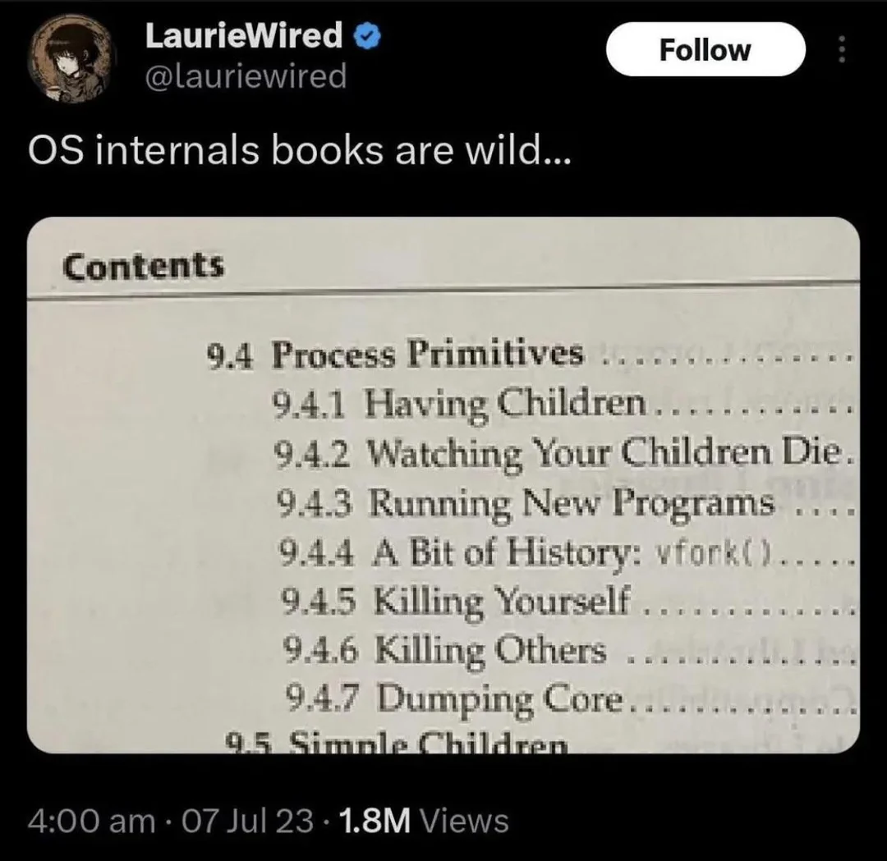

## Admin
:::{.nonincremental}
- Assignment 1 due Wednesday
- Lab 2 due Thursday, 11:59 PM
- Quiz 2 question on fork bombs...
:::

## Scheduling basics
:::{.incremental}
- Scheduler usually makes the transition decisions; hides the details from the process/user
- Processes often characterized as one of two types by what state they spend most of their time in
  - [I/O bound]{.alert}: work is dependent on I/O; e.g., browser, db, media streaming
  - [CPU bound]{.alert}: work is dependent on CPU; e.g., scientific apps, cryptography
  - Why does this matter?
    - Understanding which your process is allows for optimization
      - CPU-bound? Faster CPU, parallelize.
      - I/O? Faster I/O devices, use async
- Scheduler must balance CPU- & I/O-bound processes
:::

# Process management {background-color="#40666e"}

## Questions to consider
:::{.nonincremental}
- Which system calls are related to process management and lifecycles?
- How does the process hierarchy work?
- What are zombies and orphans? Why do zombies exist?
:::

## UNIX process APIs
:::{.incremental}
- `fork()` creates a new child process
  - All processes are created by forking from a parent
  - The `init` process is ancestor of all processes
    - Run `pstree` in a terminal to see
- `exec()` makes a process execute a given executable (effectively replaces the process)
- `exit()` terminates a process
- `wait()` causes a parent to block until child terminates
- Many variants exist of the above system calls with different arguments
:::

## What happens during a `fork()`?
:::{.incremental}
- A new process is created by making a copy of parent's memory image
- Both parent and child have unique address spaces (isolated from each other, allowing for independent processing)
- The new process is added to the OS process list and scheduled
- Parent and child start execution just after fork (with different return values)
- Parent and child execute and modify the memory data independently
:::


## New `fork()` design

You're designing an OS. Instead of `fork()` + `exec()`, you provide a single `spawn(program)` call that creates a new process running `program` directly. **What shell features become harder or impossible to implement?**

::: {.notes}
The key insight is that `fork()` gives the child a window of time — between `fork()` and `exec()` — where it's a copy of the parent and can reconfigure itself before becoming the new program. `spawn()` skips that window entirely.

Things that break or become much harder:

- **I/O redirection** (`ls > out.txt`): the shell currently forks, then the child closes stdout and opens the file before calling `exec()`. With `spawn()`, there's no moment to do this — you'd have to pass the desired file descriptors as arguments to `spawn()`, making the interface much more complex.
- **Pipes** (`ls | grep foo`): the shell forks twice, wires the child processes together with a pipe, then execs. Same problem — no window to set up the pipe ends before execution starts.
- **Environment manipulation** (`VAR=value command`): the child can modify its own environment between `fork()` and `exec()` without affecting the parent. With `spawn()`, the caller would need to pass the full desired environment explicitly.
- **`ulimit`, `chdir`, `nice`** before exec: same story — any per-process setup that should apply only to the child has to happen in that fork-exec window.

The broader point: `fork()` + `exec()` is a separation of "create a copy of me" from "become a different program," and that gap is where all the interesting shell plumbing lives.
:::

## Process creation
:::{.incremental}
- Different execution models
  - Parent & child may execute independently
  - Parent may wait for child
  - Child may create more children (Process hierarchies)
  - Parent may kill children
- Child often invokes `exec()` to change its memory image to a new program
- Why two steps (`fork()` then `exec()`)?
  - Allows the child to change file descriptors and other settings before `exec()`
:::

## Process destruction

{fig-align="center"}

## Process destruction (cont'd)
:::{.incremental}
- Some operating systems do not allow child to exist if its parent has terminated.  If a process terminates, then all its children must also be terminated
  - [Cascading termination]{.alert}: All children, grandchildren, etc., are terminated.
  - The termination is initiated by the operating system
- The parent process may wait for termination of a child process by using the `wait()` system call. The call returns status information and the pid of the terminated process
  ```{c}
  pid = wait(&status);
  ```
:::

## Zombies and orphans
:::: {.columns}

::: {.column width="63%" .incremental}
- If no parent waiting (did not invoke `wait()`), and process completes, process is a [zombie]{.alert}
  - Zombie = dead but not yet reaped (exit status hasn't been read)
  - Still has an entry in the process table
  - We need zombies: so the kernel can preserve a child's exit status until the parent calls `wait()`, even if the child exits first

:::

::: {.column width="2%"}
:::

::: {.column width="35%"}


:::

::::
:::{.incremental}
- If parent terminated without invoking `wait()`, process is an [orphan]{.alert}
  - Orphan = alive but parent is gone
  - `init` benevolently adopts orphans
:::

:::{.notes}
```
Child exits → zombie
Parent exits → zombie becomes orphan
init adopts it → init calls wait() → zombie disappears
```
:::

## {background-color="#6E404F"}
::: {.r-fit-text}
What isn't clear?

Comments? Thoughts?
:::

# Modern process isolation {background-color="#40666e"}

## Questions to consider
:::{.nonincremental}
- What are namespaces and cgroups?
- How do they differ from virtual machines?
- How do containers use them to isolate processes?
:::

## Isolation without full virtualization
:::{.incremental}
- [Virtual machines]{.alert} provide complete isolation by emulating entire hardware + OS
  - Heavier resource overhead (multiple OS instances)
  - Better isolation between workloads
- [Containers]{.alert} provide lightweight isolation using OS-level mechanisms
  - Share the same kernel
  - **Much lower overhead than VMs**
  - Linux kernel provides the building blocks: [namespaces]{.alert} and [cgroups]{.alert}
:::

## Namespaces: logical isolation (visibility)
:::{.incremental}
- Namespaces partition global system resources so they appear as separate isolated instances
- Each process belongs to a namespace and only sees resources in that namespace
- Types of namespaces:
  - [PID]{.alert}: process IDs (what processes can a process see?)
  - [Network]{.alert}: network interfaces, ports, routing tables
  - [Mount]{.alert}: filesystem mounts (what can a process access?)
  - [IPC]{.alert}: IPC objects, message queues
  - [UTS]{.alert}: hostname and domain name
  - [User]{.alert}: user and group IDs (who owns the process?)
:::

## Namespaces example
:::{.incremental}
- Two processes in separate PID namespaces think they are PID 1 (init)
- Each sees only processes within their own namespace
- From the host OS perspective, they have different global PIDs
- Enables the illusion that each container has its own isolated process tree
:::

## Seeing namespaces in action
:::{.incremental}
- View namespaces a process belongs to:
  ```bash
  ls -l /proc/self/ns/
  ```
- Use `unshare` to create a new PID namespace:
  ```bash
  unshare -pf --mount-proc bash      # creates new PID namespace, your shell is PID 1
  ps aux               # only sees processes in this namespace
  exit                 # back to host namespace
  ps aux               # will show all processes on the host
  ```
- Compare namespace inodes before and after (same inode = same namespace):
  ```bash
  ls -i /proc/self/ns/pid
  unshare -pf --mount-proc bash -c 'ls -i /proc/self/ns/pid'  # different inode
  ```
:::

## Cgroups: resource limits
:::{.incremental}
- [cgroups (control groups)]{.alert} limit, prioritize, and account for resource usage of process groups
- Key capabilities:
  - [CPU limits]{.alert}: restrict how much CPU time a group can use
  - [Memory limits]{.alert}: cap memory usage; OOM killer invoked if exceeded
  - [I/O limits]{.alert}: restrict disk I/O bandwidth
  - [Device access]{.alert}: restrict which devices a process can access
- All processes in a cgroup share the same resource limitations
:::

## Seeing cgroups in action
:::{.incremental}
- View what cgroup a process belongs to:
  ```bash
  cat /proc/self/cgroup
  ```
- Check your current limits:
  ```bash
  cat /proc/self/limits  # shows per-process limits (some enforced by cgroups)
  ```
- In practice, cgroups are invisible to users, kernel enforces limits automatically when a process exceeds allocated resources
:::

## Cgroups vs. namespaces
:::{.incremental}
- [Namespaces]{.alert}: about [visibility]{.alert}—what can a process see?
  - Logical isolation of resources
- [cgroups]{.alert}: about [limits]{.alert}—how much can a process use?
  - Resource accounting and enforcement
- Together: processes appear isolated AND are prevented from consuming excessive resources
:::

## Containers as a building block
:::{.incremental}
- cgroups and namespaces are [mechanisms]{.alert}, containers allow us to apply [policy]{.alert} through orchestration
- Containers (e.g. `Docker`) allow for [policy]{.alert}: that can be orchestrated by combining namespaces + cgroups + layered filesystems
- Results in lightweight, portable process isolation
- Single kernel, multiple isolated environments
- Much cheaper than VMs, [but]{.alert} with less isolation guarantees
:::

## {background-color="#6E404F"}
::: {.r-fit-text}
What isn't clear?

Comments? Thoughts?
:::

# Process communication {background-color="#40666e"}

## Questions to consider
:::{.nonincremental}
- What are the two main strategies for IPC?
- How do they differ?
- In what situations would you choose one over the other?
:::

## Processes give us a protection boundary
:::{.incremental}
- The operating system is responsible for isolating processes from each other
- What you do in your own process is your own business *but it shouldn't be able to crash the machine or affect other processes*, or at least processes started by other users
- Thus: safe intra-process communication is [your]{.alert} problem; safe inter-process communication is an [operating system]{.alert} problem
:::

## Why do we need IPC? What are the benefits?
:::{.incremental}
- [Data Sharing]{.alert}: IPC allows processes to share data efficiently, which is crucial for applications requiring real-time data exchange
- [Modularity]{.alert}: It promotes modularity by enabling different parts of a system to communicate, making the system easier to manage and scale
- [Resource Utilization]{.alert}: IPC can help optimize resource utilization by allowing processes to coordinate their use of shared resources
- [Concurrency]{.alert} (scalability): It supports concurrent execution of processes, improving the overall performance and responsiveness of applications
:::

## What are the disadvantages of IPC?
:::{.incremental}
- [Complexity]{.alert}: Implementing IPC can add complexity to the system, requiring careful design and management to avoid issues like deadlocks and race conditions
- [Overhead]{.alert}: IPC mechanisms can introduce overhead, potentially impacting performance, especially if the communication is frequent or involves large amounts of data
- [Security]{.alert}: Ensuring secure IPC can be challenging, as it involves protecting data from unauthorized access and ensuring the integrity of the communication
- [Debugging]{.alert}: Debugging IPC-related issues can be difficult, as problems may arise from interactions between multiple processes, making them harder to isolate and resolve
:::

## What are the two main categories of IPC?
:::{.incremental}
- [Message passing]{.alert}
  - High-level abstraction for exchanging packets of information over some interconnect
- [Shared memory]{.alert}
  - Region of memory available to different processes; writable by at least one process
:::

## Message passing
:::{.incremental}
- Kernel establishes and oversees all communication
  - Process copies data to buffer, then issue system call to request transfer
  - Kernel copies data into its memory
  - Later, process issues system call to retrieve
- Two primitives: `send()` and `recv()`
- Beyond intra-computer communication, facilitates processes over a network; link implementation is unimportant
:::

## Pros and cons of message passing?
:::{.incremental}
- Pros:
  - [Easier]{.alert} to implement and manage, especially in distributed systems
  - Provides clear boundaries between processes, enhancing security and [modularity]{.alert}
- Cons:
  - Can introduce [overhead]{.alert} due to the need for message formatting and transmission
  - May be slower compared to shared memory for large volumes of data
:::

## Shared memory
:::{.incremental}
- Kernel plays a role in establishing and attaching the address space, but does not control read/write access beyond that
- How the memory is shared, and kept consistent, is left up to the processes
:::

## Pros and cons of shared memory?
:::{.incremental}
- Pros:
  - Offers [high-speed]{.alert} data exchange, as processes can directly read and write to the shared memory
  - [Efficient]{.alert} for large volumes of data
- Cons:
  - Requires careful [synchronization]{.alert} to avoid conflicts and ensure data consistency
  - Can be more [complex]{.alert} to implement and debug
:::

## {background-color="#6E404F"}
::: {.r-fit-text}
What isn't clear?

Comments? Thoughts?
:::
