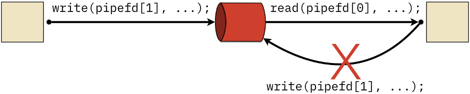
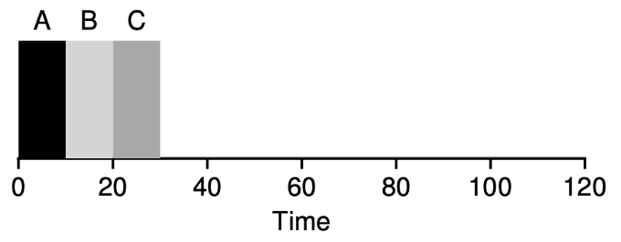
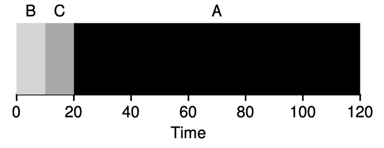

## Admin
:::{.nonincremental}
- Lab 2 due Thursday, 11:59 PM
- Exam 1 has been moved to Tuesday, April 28th
:::


# IPC mechanisms {background-color="#40666e"}

## Questions to consider
:::{.nonincremental}
- How do pipes differ from FIFOs and when would you use each?
- What considerations matter when choosing between pipes, FIFOs, and memory-mapped files?
:::

## Pipes (anonymous pipes)
:::{.incremental}
- Pipes are [unidirectional]{.alert}; one end must be designated as the reading end and the other as the writing end
- Pipes are [order preserving]{.alert}; all data read from the receiving end of the pipe will match the order in which it was written into the pipe
- Pipes have a [limited capacity]{.alert} and they use [blocking I/O]{.alert}; if a pipe is full, any additional writes to the pipe will block the process until some of the data has been read
- Pipes send data as unstructured [byte streams]{.alert}. There are no pre-defined characteristics to the data exchanged, such as a predictable message length
  {.fragment}
:::

## Pipes (cont'd)
:::{.incremental}
- Pipes create a producer-consumer buffer between two processes
- Cannot be accessed outside of the creating process (child inherits the pipe since it's a fd)
- The operating system manages a queue for each pipe to accommodate different input and output rates
- Facilitates the canonical chaining together of small UNIX utilities to do more sophisticated processing
  {.fragment}
:::

## Pipe bugs
```{.c code-line-numbers="|8"}
int pipefd[2];
pipe (pipefd);

if (fork () == 0)
  exit (0);

char buffer[10];
read (pipefd[0], buffer, sizeof (buffer));
```
:::{.incremental}
- What will happen here?
  - Parent will block indefinitely. Since the child exits without writing anything, and the parent has not closed its own write end, the read end never sees `EOF` (`EOF` is only signaled when all write ends are closed).
:::

## Named pipes (also known as FIFOs)
:::{.incremental}
- Of course there is another type that don't share the same characteristics
- Named pipes don't require a parent-child relationship
  - Creates a persistent file-like name
  - Require a reader and writer
  - Can be used for unrelated processes to communicate
:::

## Named pipes (cont'd)
:::{.incremental}
- Really a data stream (ordering, buffering, reliability, authentication all implied)
- They are **not** regular files, though they look like them
  - Once data has been read from a FIFO, the data is discarded and cannot be read again
  - Cannot broadcast: only one `read()`
  - **Not** wise to use bidirectionally, why?
:::

## Shared memory with mmap
:::: {.columns}

::: {.column width="63%" .nonincremental}

- Memory-mapped files allow for multiple processes to share read-only access to a common file. Example: `libc.so` mapped into all running C programs
- Data is accessed directly from the page cache without an extra copy into a user buffer
:::

::: {.column width="2%"}
:::

::: {.column width="35%"}

:::
::::
:::{.incremental}
- Provide extremely fast IPC data exchange. i.e., when one process writes to the region, that data is immediately accessible by the other process [without having to invoke a system call]{.alert}
- Unlike pipes, memory-mapped files create [persistent]{.alert} IPC. Once the data is written to the shared region, it can be repeatedly accessed by other processes
:::

## Memory mapped files: POSIX and System V
:::{.incremental}
- These two ultimately `mmap` a file, but do some trickery beforehand and use special files
- POSIX == named, RAM-backed file descriptors
  - ```name → fd → mmap```
  - usually backed by `tmpfs` (`/dev/shm`)
- System V shared memory
  - Predates POSIX - designed before file descriptors were a universal abstraction
  - Kernel-persistent objects, you must clean up manually
    - Process exits ≠ memory freed
:::

## POSIX vs. System V
:::{.incremental}
- POSIX is great, right!?
  - POSIX (e.g., `shm_open()`) IPC may not work in your favor in macOS
  - Some questionable engineer (obviously not a CP grad) decided to provide the header files for certain things, but they are empty stubs
    - It will compile, but could be bad
- System V is "fine"
  - `shmget()`: allocate
  - `shmat()`: attach
  - `shmdt()`: detach
  - `shmctl()`: control (destroy with IPC_RMID)
:::

## Message passing vs. shared memory
:::: {.columns}

::: {.column width="48%" .nonincremental}
A camera captures frames at 30fps and a separate process runs AI inference on each frame. **Which IPC mechanism would you use? What happens if inference is slower than capture?**

:::

::: {.column width="2%"}
:::

::: {.column width="50%"}

"Gemini, make an image in the style of a video game pitting pipes versus shared memory"
:::
::::

::: {.notes}
Shared memory is the right answer here — here's why:

- Each frame is large (e.g., 1080p = ~6MB uncompressed). Copying that through the kernel on every frame via message passing adds up fast: at 30fps that's 180MB/s of unnecessary kernel copies.
- With shared memory, the camera process writes the frame into a shared buffer and signals the inference process — no copy needed.

What happens when inference is slower than capture:
- With a pipe/message queue: frames queue up. The buffer fills, writes block, and eventually the camera process stalls — you drop frames at the source.
- With shared memory + a ring buffer: the writer can overwrite old frames. You still drop frames, but the camera keeps running and the inference process always gets the most recent frame — often the right tradeoff for real-time systems (stale data is worse than no data).

Follow-up questions:

- Who synchronizes access to the shared buffer? (Needs a mutex or semaphore — the OS doesn't help here.)
- What if you need the inference results sent back? (Probably message passing for the small result, shared memory for the frame data.)
- What changes if the camera and inference run on different machines? (Shared memory is off the table; forced into message passing over a network.)
:::

## Demo

## {background-color="#6E404F"}
::: {.r-fit-text}
What isn't clear?

Comments? Thoughts?
:::

# Scheduling {background-color="#40666e"}

## Questions to consider
:::{.nonincremental}
- What are the differences / tradeoffs between preemptive and non-preemptive scheduling algorithms?
- What are the metrics we can attempt to optimize scheduling for a given scenario?
:::

## Preemptive vs. non-preemptive scheduling
:::{.incremental}
- [Non-Preemptive]{.alert}: The scheduler only makes scheduling decisions when a process voluntarily gives up the CPU (e.g., by blocking on I/O, completing, or explicitly yielding).
- [Preemptive]{.alert}: The scheduler can interrupt a running process and move it to the ready queue at any time (based on time slices, priority changes, etc.), even while it's actively executing.
- Non-preemptive is easier to implement, but
  - … doesn't support multiprogramming very well
- Preemptive can be complicated: correctness, utilization, flexibility
  - Say a process P is preempted while in the middle of inserting an element in a data structure that another process (which is chosen by the scheduler) is going to process
:::

## Scheduling metrics
:::{.incremental}
- [CPU utilization]{.alert}: keep the CPU as busy as possible
- [Throughput]{.alert}: # of processes that complete their execution per time unit
- [Turnaround time]{.alert}: amount of time to execute a particular process
- [Waiting time]{.alert}: amount of time a process has been waiting in the ready queue
- [Response time]{.alert}: amount of time it takes from when a request was submitted until the first response is produced.
:::

## Scheduling scenarios
### Which metric would you optimize for these situations?
:::: {.columns}
::: {.column width="73%" .incremental}
- You run a data center that charges based on jobs completed
  - Max throughput: maximize the number of jobs processed per unit time
- You run GeForce Now
  - Min response time: user experience is the main concern
- You run Github Actions or Travis CI
  - Min turnaround time: developers need feedback quickly
- You run a supercomputing center
  - Maximize CPU usage: this stuff is expensive, use it efficiently
:::

::: {.column width="2%"}
:::

::: {.column width="25%" .nonincremental}
- CPU utilization
- Throughput
- Turnaround time
- Waiting time
- Response time
:::
::::

## Example: Scheduling a 911 system

You're designing a scheduler for a 911 emergency dispatch system. **Which metric matters most? Are there any metrics from the list that would be actively harmful to optimize for?**

::: {.notes}
Response time is the critical metric — a dispatcher needs to see and act on an incoming call immediately. Any delay between a call arriving and the dispatcher's screen updating is unacceptable.

What's actively harmful to optimize for:

- **Throughput**: maximizing calls handled per unit time could cause the scheduler to deprioritize long-running dispatch sessions (active incidents) in favor of shorter ones — exactly backwards.
- **CPU utilization**: keeping the CPU busy is irrelevant and potentially dangerous. If a high-priority dispatch process needs to run, the CPU should be idle rather than burning cycles on something else.
- **Turnaround time**: this measures total time from start to finish of a process, which doesn't map well onto an always-on system handling continuous events.

No single metric is universally correct — the right metric depends entirely on what the system is for. Note: real safety-critical systems often use priority scheduling with hard real-time guarantees, not the algorithms we're studying (which are designed for general-purpose throughput/fairness).
:::

## What does the OS scheduler know about a process?
:::{.incremental}
- Process characteristics that we'd like to know in order to achieve our goals
  - Processing Time (Burst Time)
  - I/O Requirements
  - Priority
  - Age
  - Dependencies
- The scheduler knows very little of the above
- In many cases we are hoping to predict the future. Easy, right?
:::

## {background-color="#6E404F"}
::: {.r-fit-text}
What isn't clear?

Comments? Thoughts?
:::

# Batch scheduling algorithms {background-color="#40666e"}

## Questions to consider
:::{.nonincremental}
- How do FCFS, SJF, and SRTF compare in terms of tradeoffs between waiting time and response time?
- Why does SJF require predicting future CPU bursts, and how can we estimate them?
- What is starvation in the context of scheduling, and how can we prevent it?
:::

## Batch scheduling: FCFS
:::: {.columns}
::: {.column width="53%" .incremental}
- First-Come, First-Served (FCFS)
- **Non-preemptive**
- Pros:
  - Easy to understand, easy to implement
- Cons?
  - Waiting time & turnaround time have high variance
  - Example: 1 long CPU-bound process and many I/O bound processes
    - Convoy effect
:::

::: {.column width="2%"}
:::

::: {.column width="45%"}


{.fragment}

:::
::::

## FCFS example
:::: {.columns}
::: {.column width="73%" .incremental}
- Calculate the average waiting time:
- Order: P1, P2, P3

- Waiting time P1 = 0; P2 = 24; P3 = 27
- Average waiting time: $(0 + 24 + 27)/3 = 17$

- Order P2, P3, P1

- Waiting time P1 = 6; P2 = 0; P3 = 3
- Average waiting time: $(6 + 0 + 3)/3 = 3$
:::

::: {.column width="2%"}
:::

::: {.column width="25%"}
    Process	Burst Time
      P1	     24
      P2 	      3
      P3	      3
:::
::::

## Okay, FCFS can be bad
### Can we think of a better algorithm to deal with the reality that jobs run for different amounts of time?

## Batch scheduling: shortest job first (SJF)
:::: {.columns}
::: {.column width="63%" .incremental}
- Ordered by length of the process's next CPU burst
- **Non-preemptive**
- Pros?
  - Optimal average waiting time among non-preemptive algorithms 
- Cons?
  - Requires knowing the future (potentially okay in some situations; examples?)
    - Scientific jobs, batch jobs
- Question: how do we know the length of the upcoming CPU burst?
  - Ask the process? Estimate? How?
:::

::: {.column width="2%"}
:::

::: {.column width="35%"}


:::
::::

## SJF: how can we predict the future?
:::{.incremental}
- We can't trust a process to tell the truth
- We can only estimate, how?
  - The past (with the hope that the process will act like it has before)
- Exponential weighted moving average:
  $$
  EWMA_t = \alpha \times x_t + (1 - \alpha) \times EWMA_{t-1}
  $$
- $\alpha = 0$? New measurement does not get taken into account
- $\alpha = 1$? History does not get taken into account
- $\alpha$ is often set to .5
:::
