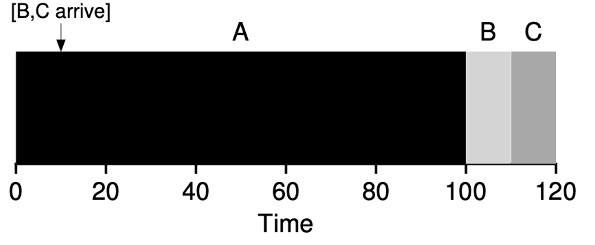
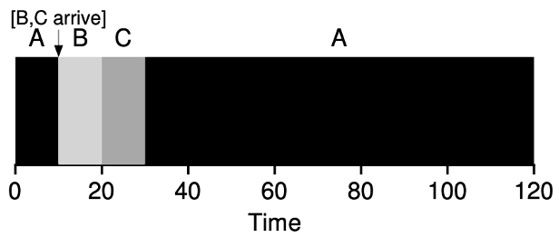
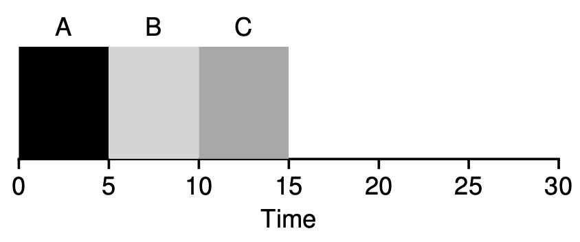
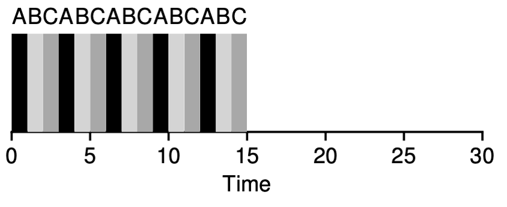
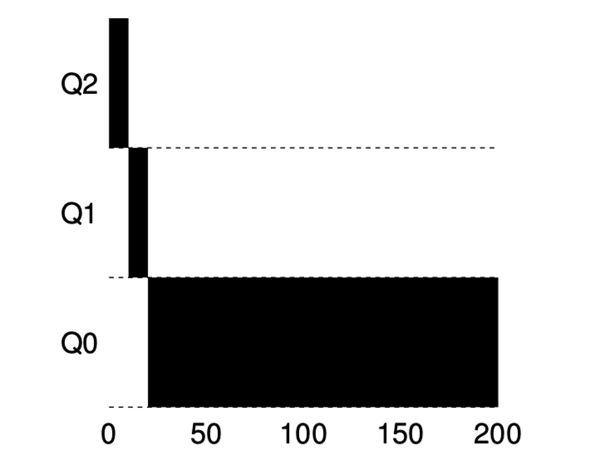
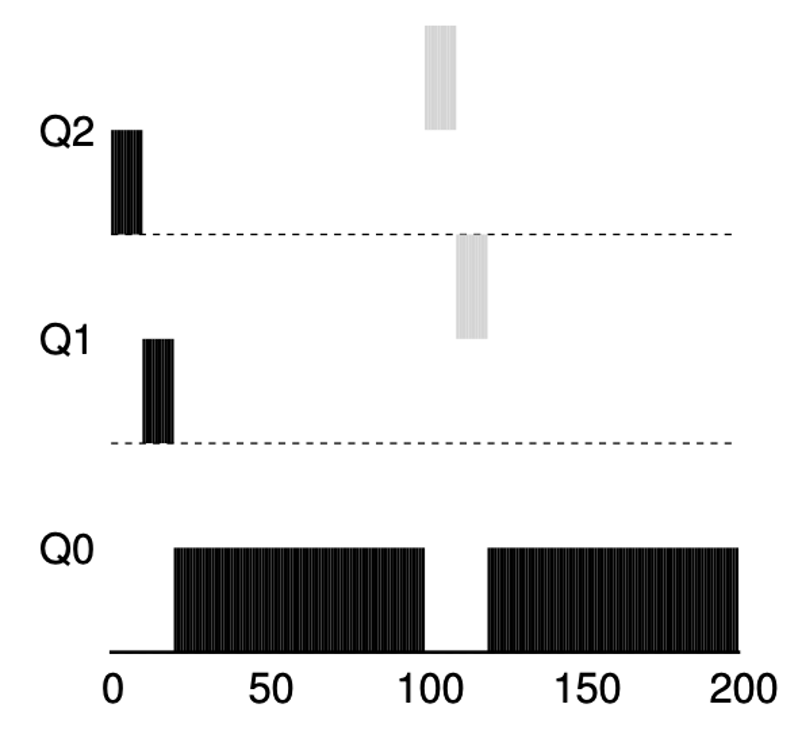
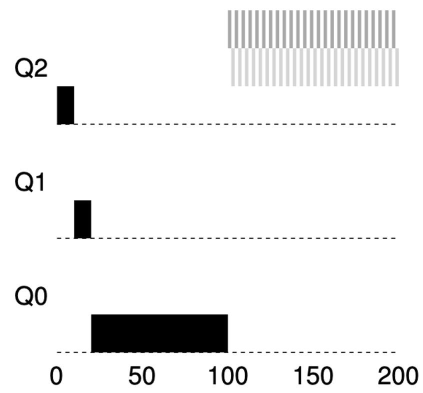
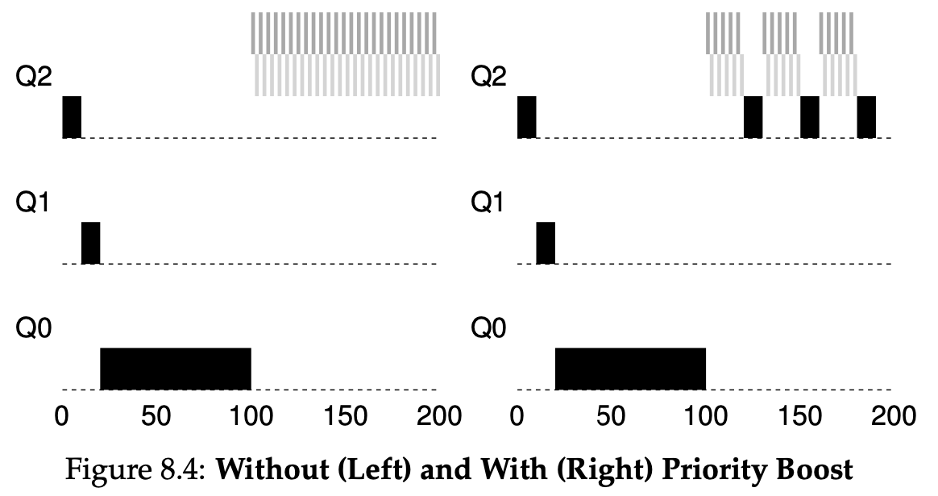

## Admin
:::{.nonincremental}
- Assignment 2 posted
- Exam 1 next Tuesday
:::

# Batch scheduling algorithms {background-color="#40666e"}

## Questions to consider
:::{.nonincremental}
- How do FCFS, SJF, and SRTF compare in terms of tradeoffs between waiting time and response time?
- Why does SJF require predicting future CPU bursts, and how can we estimate them?
- What is starvation in the context of scheduling, and how can we prevent it?
:::

## Batch scheduling: FCFS
:::: {.columns}
::: {.column width="53%" .incremental}
- First-Come, First-Served (FCFS)
- **Non-preemptive**
- Pros:
  - Easy to understand, easy to implement
- Cons?
  - Waiting time & turnaround time have high variance
  - Example: 1 long CPU-bound process and many I/O bound processes
    - Convoy effect
:::

::: {.column width="2%"}
:::

::: {.column width="45%"}

{.fragment}

:::
::::

## FCFS example
:::: {.columns}
::: {.column width="73%" .incremental}
- Calculate the average waiting time:
- Order: P1, P2, P3

- Waiting time P1 = 0; P2 = 24; P3 = 27
- Average waiting time: $(0 + 24 + 27)/3 = 17$

- Order P2, P3, P1

- Waiting time P1 = 6; P2 = 0; P3 = 3
- Average waiting time: $(6 + 0 + 3)/3 = 3$
:::

::: {.column width="2%"}
:::

::: {.column width="25%"}
    Process	Burst Time
      P1	     24
      P2 	      3
      P3	      3
:::
::::

## Okay, FCFS can be bad
### Can we think of a better algorithm to deal with the reality that jobs run for different amounts of time?

## Batch scheduling: shortest job first (SJF)
:::: {.columns}
::: {.column width="63%" .incremental}
- Ordered by length of the process's next CPU burst
- **Non-preemptive**
- Pros?
  - Optimal average waiting time among non-preemptive algorithms
- Cons?
  - Requires knowing the future (potentially okay in some situations; examples?)
    - Scientific jobs, batch jobs
- Question: how do we know the length of the upcoming CPU burst?
  - Ask the process? Estimate? How?
:::

::: {.column width="2%"}
:::

::: {.column width="35%"}

:::
::::

## SJF: how can we predict the future?
:::{.incremental}
- We can't trust a process to tell the truth
- We can only estimate, how?
  - The past (with the hope that the process will act like it has before)
- Exponential weighted moving average:
  $$
  EWMA_t = \alpha \times x_t + (1 - \alpha) \times EWMA_{t-1}
  $$
- $\alpha = 0$? New measurement does not get taken into account
- $\alpha = 1$? History does not get taken into account
- $\alpha$ is often set to .5
:::

## EWMA example
$$
EWMA_t = \alpha \times x_t + (1 - \alpha) \times EWMA_{t-1}
$$

:::{.incremental}
- Suppose $\alpha = 0.5$ and a process has had burst times: 10, 6, 4, 6, ...
- $EWMA_0 = 10$
- $EWMA_1 = 0.5 \times 6 + 0.5 \times 10 = 3 + 5 = 8$
- $EWMA_2 = 0.5 \times 4 + 0.5 \times 8 = 2 + 4 = 6$
- $EWMA_3 = 0.5 \times 6 + 0.5 \times 6 = 3 + 3 = 6$
- Recent values pull the estimate toward them, but history still matters
:::

## SJF example
:::: {.columns}
::: {.column width="73%" .incremental}
- Gantt:

- Average waiting time: $(3 + 16 + 9 + 0)/4 = 7$
- Versus FCFS: $(0 + 6 + 14 + 21)/4 = 10.25$
:::

::: {.column width="2%"}
:::

::: {.column width="25%"}
		Process	Burst Time
		  P1	      6
		  P2 	      8
		  P3	      7
          P4	      3
:::
::::

## Do you see any problems with SJF?
:::{.incremental}
- What do we do if a short process arrives after SJF has started a long running process?

- What should we do?
  - Preempt
:::

## Shortest remaining time first (SRTF)
:::: {.columns}
::: {.column width="63%" .incremental}
- **Preemptive** version of SJF
- Whenever a new process arrives in the ready queue, the decision on which process to schedule next is redone using the SJF algorithm
- [Question]{.alert}: is SRTF more optimal than SJF for any metrics?
  - Yes, average waiting time is minimized
:::

::: {.column width="2%"}
:::

::: {.column width="35%"}

:::
::::

## SRTF example
		Process      Arrival Time   Burst Time
		 P1	              0	            8
		 P2               1	            4
		 P3	              2	            9
		 P4	              3             5
:::{.incremental}
- Average waiting time = $[(0+9)+(0)+(15)+(2)]/4 = 26/4 = 6.5$

:::

## Do you see any problems with SRTF?
:::{.incremental}
- Computers aren't static. What if short jobs continuously arrive?
  - Large jobs can [starve]{.alert}
  - *Urban legend about IBM 7074 at MIT: when shut down in 1973, low-priority processes were found which had been submitted in 1967 and had not yet been run...*
:::

## Priority scheduling
:::{.incremental}
- "Shortest" algos are examples of priority scheduling
- I.e., scheduling is based on some metric of priority
- Downsides
  - If not implemented carefully, indefinite blocking / starvation
  - How do we prevent starvation?
    - [Aging]{.alert}: gradually increase the priority of processes that wait in the system for a long time
:::

## {background-color="#6E404F"}
::: {.r-fit-text}
What isn't clear?

Comments? Thoughts?
:::

# Interactive scheduling algorithms {background-color="#40666e"}

## Why batch algorithms aren't enough
:::{.incremental}
- Batch algorithms optimize for throughput, turnaround, and waiting time
- But what if a *user* is at the keyboard?
  - You click a button (e.g., while a long batch job is running) you wait 3 seconds for any response
  - A web server needs to respond to thousands of short requests, not just finish jobs quickly
- Metric to focus on: [response time]{.alert}: time from request submission to first response
- Batch algorithms ignore this entirely
:::

## Questions to consider
:::{.nonincremental}
- What are the key differences between batch and interactive scheduling algorithms?
- How does Round Robin improve response time compared to SJF, and what tradeoff does it introduce?
- Why might a system benefit from using multiple scheduling queues rather than a single algorithm?
:::

## Batch vs. interactive scheduling
:::: {.columns}

::: {.column width="48%" .nonincremental}
**Batch Scheduling**

- Optimizes for: throughput, turnaround time, waiting time
- Context: data centers, HPC, background jobs
- Users don't interact with running jobs
:::

::: {.column width="2%"}
:::

::: {.column width="50%" .nonincremental}
**Interactive Scheduling**

- Optimizes for: response time, fairness
- Context: desktop/laptop systems, servers
- Users expect quick feedback to their actions
:::

::::

## What about response time?
:::: {.columns}
::: {.column width="53%" .nonincremental}
- SRTF is good if we know job lengths and we're only worried about turnaround / waiting time
- SJF: poor response
- RR: better response
:::

::: {.column width="2%"}
:::

::: {.column width="45%"}

{.fragment}
:::
::::

## Interactive algorithm: Round Robin (RR)
:::{.incremental}
- FCFS with preemption
- Based on a [time quantum]{.alert} (time slice)
  - Typically 10-100 milliseconds
  - How do we pick a quantum?
    - Very short: a lot of context switching (need a large quantum, otherwise overhead is too much to be worth it)
    - Very long -> becomes FCFS: long wait times, long turnaround times
  - Circular queue
    - New processes are added to the tail
    - If a process doesn't complete during its quantum, context switch and added to the tail
:::

## RR example
:::: {.columns}
::: {.column width="73%" .incremental}
- Average waiting time:

$$[(10-4) + 4 + 7] = 17/3 = 5.66$$

- Pros:
  - RR is *fair*, but do we really want fair???
  - Typically, higher average turnaround than SJF, but better response
- Cons?
  - Long average waiting times

:::

::: {.column width="2%"}
:::

::: {.column width="25%"}
    Process	Burst Time
      P1        24
      P2        3
      P3        3

      Quantum = 4
:::
::::

## Gaming RR
::: {.nonincremental}
You're working on an important project and need to maximize your CPU time. You don't care about fairness (or your colleagues). **How could a programmer "cheat" RR to get more than their fair share of the CPU?**
:::

::: {.notes}
- Spin up many processes (split tasks up and fork children)
- Job A: 9 processes, Job B: 1 process → A gets 90% of CPU in RR
- This actually happens in many systems that aim for rudimentary fairness
:::

## FCFS, SJF, SRTF, RR
:::{.incremental}
- All have downsides
- Those that optimize turnaround / wait, can harm response time
- Those that optimize response time, can harm turnaround, wait

- **What should we do?**
  - Use multi-level scheduling algorithms
:::

## {background-color="#6E404F"}
::: {.r-fit-text}
What isn't clear?

Comments? Thoughts?
:::

# Multi-level scheduling algorithms {background-color="#40666e"}

## Interactive algorithms: Multi-Level Queue (MLQ)
:::{.incremental}
- We have classes of process, with different needs. Why not multiple schedulers satisfying those needs?
- Multilevel queue scheduler defined by the following parameters:
  - \# of queues
  - Scheduling algorithms for each queue
  - Method used to determine which queue a process will enter when that process needs service
  - Scheduling among the queues
:::

## MLQ
:::: {.columns}
::: {.column width="48%" .incremental}
- How do we schedule this?
  - Strict priority: low priority could starve
  - Typical: time slice among queues (e.g., real-time get 50%, system gets 30%, interactive 15%, batch 5%)
  - Each queue can implement a separate scheduling policy
- MLQ cons:
  - Starvation
  - Inflexibility
:::

::: {.column width="2%"}
:::

::: {.column width="50%"}

:::
::::

## Interactive algorithms: Multi-Level Feedback Queue (MLFQ)
:::{.incremental}
- A process can [move between the various queues]{.alert} (goal is to avoid starvation present in MLQ)
- Metrics for movement:
  - Process requirements (we serve fast processes quickly)
  - Over consumption
  - Change in priority
  - Age
:::

## MLFQ rules
:::{.incremental}
- Rule 1: If Priority(A) > Priority(B), A runs (B doesn't)
- Rule 2: If Priority(A)=Priority(B), A & B run in RR
- Rule 3: When a job enters the system, it is placed at the highest priority (the topmost queue)
- Rule 4a: If a job uses up its allotment while running, its priority is reduced (i.e., it moves down one queue)
- Rule 4b: If a job gives up the CPU (for example, by performing an I/O operation) before the allotment is up, it stays at the same priority level (i.e., its allotment is reset)

- Any problems with these???
:::

## MLFQ example: one process

## MLFQ example: two processes
:::: {.columns}
::: {.column width="48%" .nonincremental}
- Scenario 1: Perfectly fine
:::

::: {.column width="2%"}
:::

::: {.column width="50%"}

:::
::::

## MLFQ: problem with gaming
:::{.nonincremental}
**Rule 4b:** If a job gives up the CPU before its allotment expires, it stays at the same priority level (allotment is reset).

Using only this rule, describe a strategy a malicious process could use to **stay in the top-priority queue indefinitely**.

Then: what rule change would stop it?
:::

## MLFQ example: two processes
:::: {.columns}
::: {.column width="48%" .nonincremental}
- Scenario 1: Perfectly fine
- Scenario 2: programmer can game the algorithm to remain at high priority
:::

::: {.column width="2%"}
:::

::: {.column width="50%"}

:::
::::

## MLFQ example: two processes
:::: {.columns}
::: {.column width="48%" .nonincremental}
- Scenario 1: Perfectly fine
- Scenario 2: programmer can game the algorithm to remain at high priority
- Scenario 3: multiple small processes can lead to starvation
:::

::: {.column width="2%"}
:::

::: {.column width="50%"}

:::
::::

## MLFQ: solving gaming
:::: {.columns}
::: {.column width="43%" .nonincremental}
- Rule 4 (new): Once a job uses up its time allotment at a given level (regardless of how many times it has given up the CPU), its priority is reduced (i.e., it moves down one queue)
:::

::: {.column width="2%"}
:::

::: {.column width="55%"}

:::
::::

## MLFQ: how can we avoid starvation?

## MLFQ: solving starvation
:::: {.columns}
::: {.column width="43%" .nonincremental}
- Rule 5: After some time period, move all the jobs in the system to the topmost queue
  - Solves starvation
  - Bonus: if a long running process evolves to be more interactive, it gets promoted

:::

::: {.column width="2%"}
:::

::: {.column width="55%"}

:::
::::

## What scheduler should we use?
:::{.incremental}
- Ticket booking system
  - FCFS: fairness
- Print server
  - SJF could make sense
- Web server
  - RR: fairness and short response time
- General operating systems
  - MLFQ: need to handle a mix
:::

## Linux scheduling
:::{.incremental}
- Completely Fair Scheduler (CFS)
- Fair-share scheduling (see lottery and stride scheduling in the text if you want to learn more)
- Based on `vruntime` (how long any process has run): lowest `vruntime` runs next
- Divide `sched_latency` by # processes to determine a *dynamic* quantum (floor set by `min_granularity`)
  - Why do we need a floor?
:::

## Linux CFS
:::{.incremental}
- Red-Black tree includes only running (or ready) processes
- Balanced such that operations are $O(log n)$
- Very straightforward to find the next job (smallest `vruntime`) to run
- Sleeper fairness: processes waiting on I/O are given "credit" for their wait time
- [People are actively working on new features](https://www.phoronix.com/news/Linux-TIP-Time-Slice-Extension)
:::

## Controlling priority: `nice`
:::{.incremental}
- Linux lets users influence CFS priority via `nice` values: $[-20, 19]$
  - Lower = higher priority (more CPU weight), default = 0
- CFS scales `vruntime` accumulation by weight: high-nice processes accumulate `vruntime` faster, so they run less
- Examples:
  - `nice -n 19 ./video_encoder` — run encoder at lowest priority, keeps system responsive
  - `sudo nice -n -10 ./realtime_daemon` — boost a daemon (requires root for negative values)
- Try it: `top` shows NI column; `renice` adjusts a running process
:::

## {background-color="#6E404F"}
::: {.r-fit-text}
What isn't clear?

Comments? Thoughts?
:::

