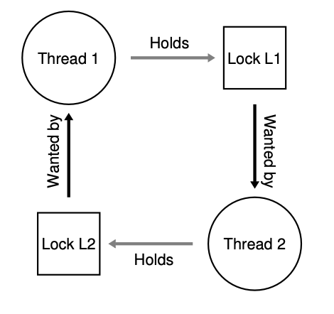
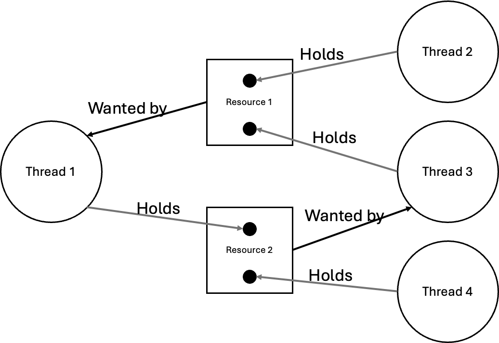
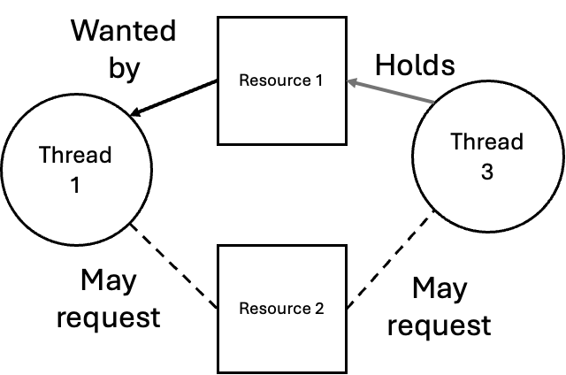
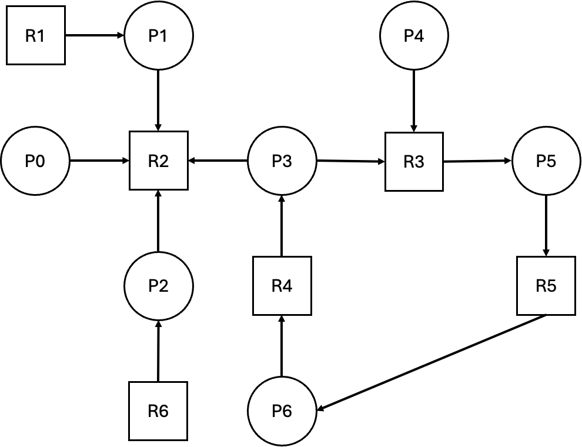
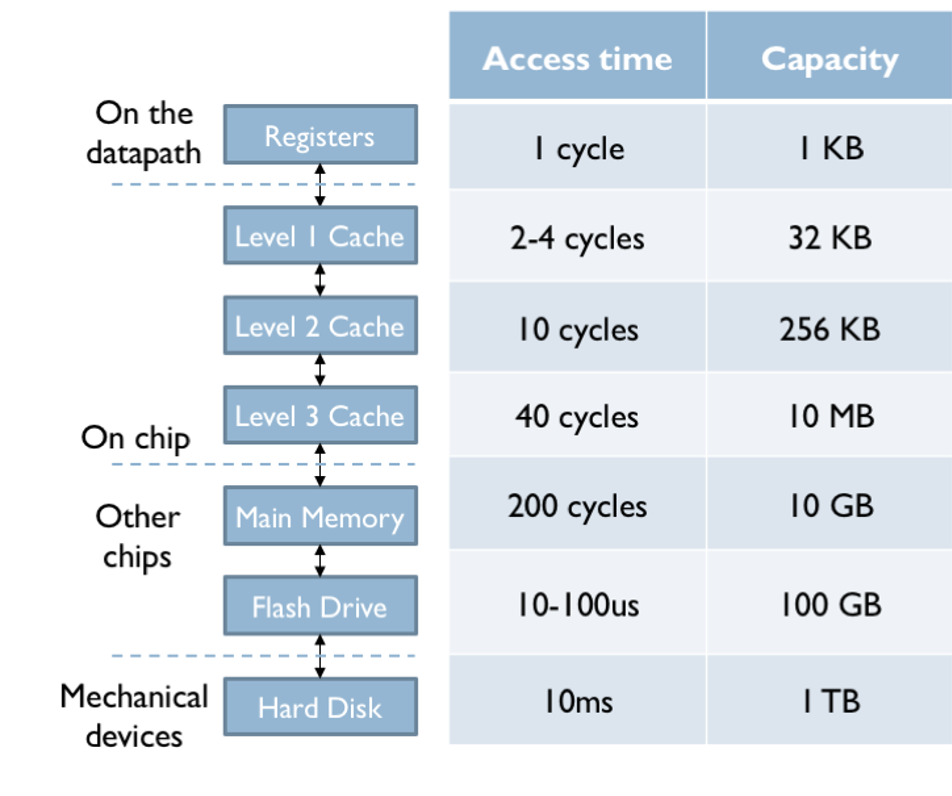

## Admin
:::{.nonincremental}
- There is a lab this week
- Assignment 2 due tonight
:::

# Deadlocks {background-color="#40666e"}

## Questions to consider
:::{.nonincremental}
- What are the four necessary conditions for deadlock, and why must all four be present simultaneously?
- How can Resource Allocation Graphs help us visualize and understand when deadlock might occur?
- Why is a cycle necessary but not sufficient for deadlock when there are multiple instances of a resource?
:::

## Deadlocks
- If we're not careful about dependencies, we might create pathologies that lead to deadlock
  - Like race conditions, may only happen sometimes, making them hard to identify and debug
- Example: Three processes, three resources of the same type, each process requires two resources to make progress
  - This can happen across a network as well, which is particularly hard to diagnose
- Can we [detect and resolve]{.alert} these situations? Can we [prevent]{.alert} them?

## Deadlock example
- Classic example: Thread1 holds lock L1 and is waiting for lock L2. Thread2 holds L2 and is waiting for L1
  ```
    Thread 1: 			            Thread 2:
    pthread_mutex_lock(L1); 		pthread_mutex_lock(L2);
    pthread_mutex_lock(L2); 		pthread_mutex_lock(L1);
  ```

## Deadlock characteristics
- Definition: A set of processes are deadlocked if each process in the set is waiting for an event that only another process in the set can cause.
  - [Resource deadlock]{.alert} is the most common (and what we'll focus on)

## Conditions for deadlock
- Four necessary conditions (simultaneous):
  - [Mutual exclusion]{.alert}: At least one resource can only be held by one process at a time; this can result in other processes waiting for that resource
  - [Hold and wait]{.alert}: A process must be holding at least one resource while waiting for other resources (held by other processes)
  - [No preemption]{.alert}: Resources can only be released voluntarily by a process; Resources cannot be revoked
  - [Circular wait]{.alert}: A set of $n$ waiting processes ${P_0, ..., P_n}$ such that $P_i$ is waiting for resources held by $P_{i+1 \bmod{n}}$
- All must be met, and some imply others: e.g. Circular wait implies hold and wait.

## Deadlock conditions
- Each condition relates to a policy that may or may not be implemented
  - Q: Can a resource be assigned to more than one process?
  - Q: Can a process request multiple resources? Over what period of time?
  - Q: Can resources be preempted, and how?

## Deadlock modeling
:::: {.columns}
::: {.column width="63%" .nonincremental}
- Resource Allocation Graphs: A directed graph, where process and resources are nodes (sometimes circles and squares respectively), and edges are resource allocations & requests
- Graph for

  ```
  Thread 1: 		          Thread 2:
  pthread_mutex_lock(L1);     pthread_mutex_lock(L2);
  pthread_mutex_lock(L2);     pthread_mutex_lock(L1);
	```


:::

::: {.column width="2%"}
:::

::: {.column width="35%"}

:::
::::
- Cycles in a graph indicate deadlock
  - When resources have only one instance: A cycle is both necessary and sufficient for deadlock
  - **If there are multiple instances: A cycle is necessary but not sufficient for a deadlock**

## Is this deadlocked?


- There is a cycle
- But no hold and wait



## {background-color="#6E404F"}
::: {.r-fit-text}
What isn't clear?

Comments? Thoughts?
:::

# Handling deadlocks {background-color="#40666e"}

## Questions to consider
:::{.nonincremental}
- What are the approaches to handling deadlock? How practical is each? How do they differ in approach?
- How does deadlock avoidance differ from deadlock prevention? What techniques do we implement for deadlock avoidance?
- What are the trade-offs between detecting/recovering from deadlock versus preventing or avoiding it, and when is detection practical?
:::

## How should the OS handle deadlocks?
- OS can [prevent]{.alert} deadlock: ensure deadlocks can never occur (by preventing one of the deadlock requirements from occurring)
- OS can [avoid]{.alert} deadlock: like prevention, but given more information about a process's resource needs
- OS can [detect]{.alert} deadlock: allow system to deadlock, detect and recover
- OS can [do nothing]{.alert}, and let applications handle it
  - [Ostrich Algorithm]{.alert}: head in sand; wait

## Deadlock prevention
:::{.nonincremental}
- Remember, we just have to break one of these to prevent deadlock
  - Mutual exclusion
  - Hold and wait
  - No preemption
  - Circular wait
:::

- Any ideas?

:::{.notes}
Example Strategies:
- Dynamic Resource Allocation: Implement algorithms that dynamically adjust resource allocation based on current system state and process priorities.
- Timeout Mechanism: Introduce timeouts for resource requests, forcing processes to release resources if they cannot acquire all necessary resources within a certain timeframe.
- Resource Hierarchies: Establish a hierarchy for resource allocation, ensuring that processes request resources in a predefined order to avoid circular wait conditions.
- Predictive Analysis: Use machine learning to predict potential deadlock scenarios based on historical data and proactively adjust resource allocation.

Follow-Up Questions:
- How does your strategy address mutual exclusion?
- Can your strategy be implemented in real-world systems? If so, how?
- What challenges might arise when implementing your strategy?
:::

## Attacking mutual exclusion
- Make resources sharable so they aren't held by only one process at a time; while some resources are preemptable (like memory, through swapping) preventing mutual exclusion is fundamentally difficult as so many resources are non-sharable: printers, files, disks, etc.
  - Spoolers can sidestep this for some resources (e.g., a print spooler accepts jobs so no one "owns" the printer directly)

## Attacking hold and wait
- When a process requests a resource, it cannot be holding any other resources
- A process must request **all** of its resources at one time
- Example, treat group of lock acquisitions like a critical section and surround with a mutex

  ```{.c}
  pthread_mutex_lock(global_lock);
  pthread_mutex_lock(L1);
  pthread_mutex_lock(L2);
  ...
  pthread_mutex_unlock(global_lock);
  ```
- See any downsides?
  - Must know all needed locks a priori
  - Will likely decrease concurrency

## Attacking no preemption
- If a process is holding some resources and requests another that cannot be immediately allocated, then all resources held are released
- Process is restarted only when it can regain its old resources plus the new
- Or, if a process requests a resource that cannot be immediately allocated, then all resources held are preempted and added to the list of available resources
- Downsides?
  - Not all resources are preempt-able
  - Starvation is possible

## Attacking circular wait
- How could you prevent by focusing on the circular wait requirement?
- Impose a total ordering of all resource types
  - For example, resource types R1, R2, ..., Rn have ordering R1 < R2 < ... < Rn
  - A process that needs multiple resources must request them in increasing order of enumeration
- Downsides?
  - May be difficult to impose a meaningful ordering
  - May lead to reduced concurrency

## Deadlock prevention summary
- Which approach is best?
  - Attacking mutual exclusion is generally not feasible
  - Attacking hold and wait is wasteful and requires prescience
  - Attacking no preemption is difficult due to non-preemptable resources
  - Attacking circular wait is practical but may reduce concurrency - often the best choice and [most used](https://github.com/torvalds/linux/blob/f286757b644c226b6b31779da95a4fa7ab245ef5/mm/filemap.c#L80-L126)

## {background-color="#6E404F"}
::: {.r-fit-text}
What isn't clear?

Comments? Thoughts?
:::

## Deadlock avoidance
- All of the prevention techniques can be heavy-handed, reducing concurrency and overall system throughput
- What if we had more information about process resource needs before allocation?
  - Could we make smarter decisions about resource allocation?
- This is the idea behind deadlock avoidance

## Avoidance via resource-allocation graph
:::: {.columns}
::: {.column width="63%"}
- Introduce the idea of a [claim edge]{.alert} (dashed line) from a process to a resource
  - Indicates that the process may request that resource in the future
- The system can maintain this graph, and only grant resources that will not create a cycle
- Any downsides / limitations?
  - Overhead of maintaining the graph and checking for cycles
  - Only applicable to single instance resources

:::
::: {.column width="2%"}
:::
::: {.column width="35%"}

:::
::::

## Deadlock avoidance in practice
- Dijkstra's Banker's algorithm is the textbook example — each process declares its max resource needs, and requests are only granted if the resulting state is "safe." Not used in practice: overhead plus the prescience requirement
- Resource-allocation graph with claim edges sees occasional use in constrained settings (e.g., embedded systems where max needs are predictable)

## Detecting and recovering from deadlock
- Allow deadlocks to occur, then detect and recover
- In some cases, recovery is pretty simple. If your machine froze once per year (maybe it does?) what would you do?
  - Reboot
- What scenarios do you think complex detection and recovery would make sense?
  - Systems with high availability requirements where manual intervention is costly or impractical
    - telecommunications systems, financial transaction systems, healthcare systems
    - critical infrastructure systems

## Detection
- Use a wait-for graph: a simplified resource-allocation graph that removes resource nodes
  - An edge from process $P_i$ to $P_j$ indicates that $P_i$ is waiting for a resource held by $P_j$
  - A cycle in this graph indicates a deadlock
  - $O(n^2)$ algorithm to search for cycles (beyond the cost of maintaining the graph itself)
  - Only applies to single instance resources

## Detection (cont'd)


## Detection (cont'd)
- For multiple instance resources, we can use an algorithm similar to the Banker's algorithm to detect deadlock
- Question: How often should we run the detection algorithm?
  - Too often: wasteful overhead
  - Not often enough: long delays before recovery
  - What if we run it when a process requests a resource?
    - Could allow us to assign blame for deadlock to the requesting process
  - Heuristically (CPU utilization, etc.)
    - Less overhead, but harder to assign blame

## Recovery options
- Process termination
  - Abort all deadlocked processes (brute force)
  - Abort one process at a time until deadlock is resolved
    - How to choose which process to abort?
      - Priority, time running, resources used, etc.
- Resource preemption
  - Temporarily take resources away from some processes and give to others until deadlock is resolved
  - Highly dependent on the resource type
  - Rollback problem - processes may need to be rolled back to a safe state before resources can be reallocated
  - Starvation problem - same victims may be chosen repeatedly

## Pick the policy
:::{.nonincremental}
- For each system below, which deadlock strategy fits best — and **why**?
  1. Flight control software on a commercial aircraft
  2. A university course-registration system during peak enrollment
  3. Your personal laptop running a browser, editor, and Slack
- For your pick, name the cost you're accepting (lost concurrency? overhead? user-visible failures?)
:::

:::{.notes}
Goals: get them to weigh contention, cost of failure, and predictability. Push back hard if anyone picks avoidance — it's almost never the right answer outside narrow embedded niches.

- (1) Prevention via strict resource/lock ordering. Failure cost is catastrophic, workloads are well-characterized, throughput is secondary. (Students may say "avoidance" — push them: who declares max needs? what's the runtime cost on every request?)
- (2) Prevention via lock ordering on DB rows, plus detection-and-recovery (most DBs do exactly this — abort one txn on cycle detection). High contention but a hung session is recoverable.
- (3) Ostrich. Deadlocks rare; reboot/kill is cheap; users won't tolerate any added overhead.

Push them on: "what changes your answer?" — e.g., what if the laptop runs medical software?
:::

## {background-color="#6E404F"}
::: {.r-fit-text}
What isn't clear?

Comments? Thoughts?
:::

# Memory Fundamentals {background-color="#40666e"}

## Questions to consider
:::{.nonincremental}
- What are the requirements for memory that the OS must accomplish?
- What abstraction should the OS provide to processes?
- Why does a memory hierarchy exist, and what forces does it create for the OS?
:::

## Memory overview
- Memory is required by all processes
- What users (developers) want:
  - Infinite space, private, fast, and cheap
- Reality: All memory is limited, only some is fast (and $$$), others are slow (but $)
  - Creates a [memory hierarchy]{.alert}
  - Small, fast, expensive (registers, cache, RAM) → Large, slow, cheap (ssd, disk, tape)
  - In order to support multiprogramming we must share and utilize memory hierarchy intelligently

## Memory hierarchy


## Memory preliminaries
- Remember: A process's code & data must both be in memory
  - CPU must fetch both as part of its instruction-execution cycle
- What memory can a CPU access directly?
  - Registers, caches, RAM
  - Therefore, any data or instruction must be in these direct access devices in order to operate on them
- In this discussion we're focusing on RAM (caches + registers are hardware problems)
- Memory is an array of words (width of memory), *kind of*

## Memory requirements
- What does the OS need to provide?
- Old days?
  - Just the OS libraries and a single process got the rest of the system memory
- Between multiple processes? Processes and the kernel?
  - [Transparency]{.alert}: we don't want processes to be aware of the virtualization.
    - They need to be presented with a simple address space
  - [Efficiency]{.alert}: memory is expensive and scarce
    - Need to be efficient in both space and time
  - [Protection / isolation]{.alert}: we need to ensure that processes can't access other process's address space (or the kernel's)

## Memory requirements (cont'd)
- From a process point of view how should we address things?
  - Abstraction, we need an **address space**
- We present an address space to processes that is their unique view of the system memory
  - Code, Heap, Stack, etc.
  - Process sees fake (virtual) addresses
  - Q: We know that heap & stack grow towards one another. How does it work when we have multiple threads?

## {background-color="#6E404F"}
::: {.r-fit-text}
What isn't clear?

Comments? Thoughts?
:::

# Memory Abstraction {background-color="#40666e"}

## Questions to consider
:::{.nonincremental}
- How can the OS provide isolation between processes?
- What are the trade-offs in when we bind virtual addresses to physical addresses?
- How can hardware help the OS manage memory efficiently?
:::

## Base and bounds
- Okay, we're going to lie to processes. How should we achieve this abstraction?
- First approach: base and bounds (or base and limit) registers
  - Base: smallest address; bounds: size of address space
  - This can help with protection / isolation
  - Where should the values be stored?
  - The CPU needs to check for every memory access
    - Stored in the PCB (we just added state that a context switch needs to account for)

## Base and bounds (cont'd)
- What will the OS need to keep track of?
  - When a process is first run
    - Need to find space for it (i.e., must be tracking free space)
  - When a process terminates
    - Return used memory to the free list
    - Clean up any data structures used to manage memory
  - On context switch?
    - CPU only has one set of base and bounds registers
  - When OS wants to relocate a process
    - Set new registers
  - When a process tries to address outside of its bound?
    - exception handlers

## Base and bounds (cont'd)
- Base and bounds is simple, but has some issues:
  - [External fragmentation]{.alert}: over time, as processes are loaded and unloaded, we can end up with slivers of memory that are not usable for new processes
  - [Relocation is expensive]{.alert}: moving a process in memory requires copying all of its data
- To address these issues, we can use more sophisticated memory management techniques, such as paging and segmentation

## Memory address binding
- When does the OS bind virtual addresses to physical addresses?
  - [Compile time]{.alert}: if we know where the process will be loaded, we can bind addresses at compile time
    - Not flexible
    - if you need to change anything, you need to recompile
  - [Load time]{.alert}: we can bind addresses when the process is loaded into memory
    - More flexible, but still not ideal
    - If you need to move the process, you need to reload it
  - [Runtime]{.alert}: we can bind addresses during execution, which allows for maximum flexibility and is the most common approach
    - Requires some help

## Runtime address binding
- To support runtime address binding, we need to use a [memory management unit (MMU)]{.alert}
  - Hardware component that translates virtual addresses to physical addresses on-the-fly
  - Can also provide protection by checking access rights and ensuring that processes cannot access memory outside of their allocated space
- The OS needs to maintain a data structure (e.g., page table) that the MMU can use for translation
- This allows processes to have a uniform address space (e.g., starting at 0 and going to "max")

## {background-color="#6E404F"}
::: {.r-fit-text}
What isn't clear?

Comments? Thoughts?
:::

